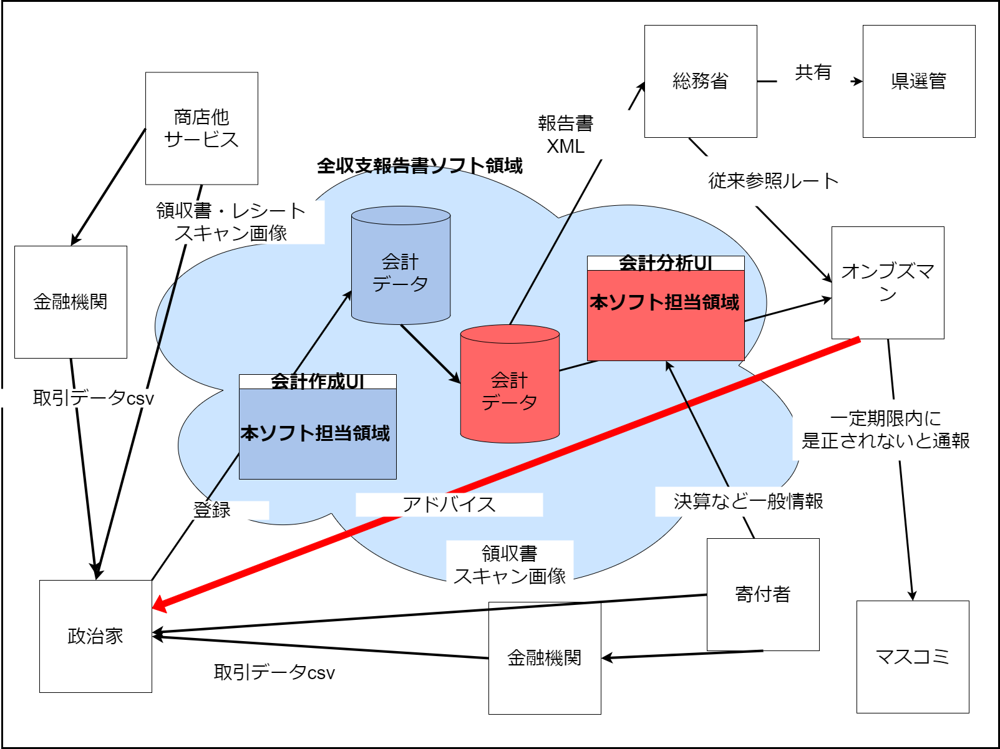
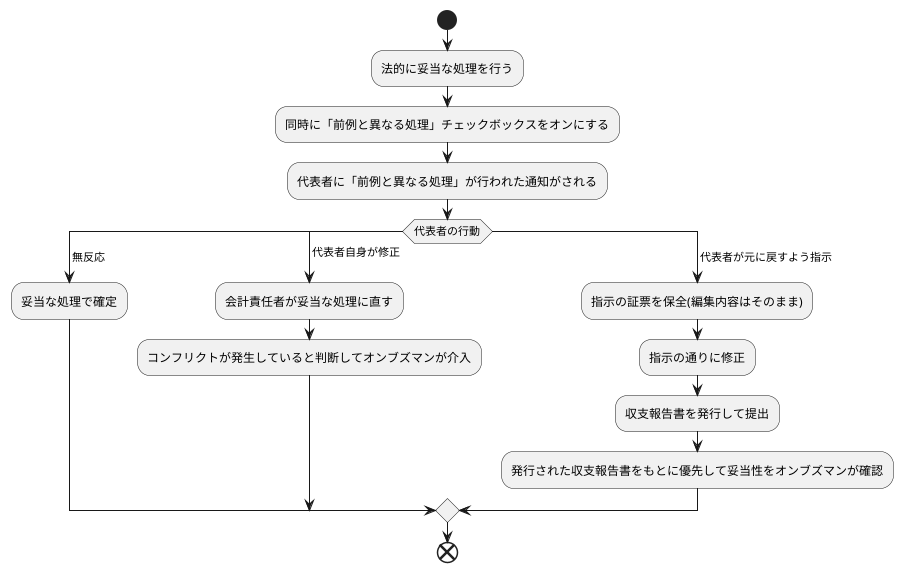

# 政治資金収支報告書・調査側ソフトウェア

## 1.目的

政治資金収支報告書の調査分析

## 2.概念図

## 3.範囲

1. このソフトウェアと連携する、政治資金収支報告書作成ソフトウェアで作成された政治資金収支報告書
a. 提出後の収支報告書(前年度)
b. 特定の項目について代表者と会計責任者など、収支報告書作成者間で意見の相違(ex.3回以上取り扱いが変わっているなど)が発生している場合のみ、作製前助言を可能とする

2. 互換XMLで取り込みできた政治資金収支報告書
a. 提出後の収支報告書(前年度)

3. 互換XMLで取り込みできた政党交付金使途報告書
a. 提出後の使途報告書(前年度)

4. その他の公開情報
a. 民間企業の決算情報等
b. 報道等各種追跡調査資料ブックマーク・保全

## 3.1 法的に妥当な処理に寄せるための有効な使い方

1. 政治家の会計責任者の勉強会または研修会で習得した、法的に妥当な処理を行う
2. その際に「前例と異なる処理」チェックボックスを有効にする
3. 「前例と異なる処理」チェックボックスが押されたことで代表者に自動で通知がされる
4. 代表者の反応
  a. 無反応の場合…そのまま(なし崩し的に)法的な妥当な処理を続ける
  b. 代表者自身が処理の変更処理を行う…5へ
  c. 代表者が会計責任者など従来処理に戻すように指示する…7へ
5. 再度、元の妥当と思われる処理を行う
6. 前例と異なる処理チェックと編集が3回なされた場合は、事務所内でコンフリクトが起きていると判断し、調査側に内容が通知され、調査側オンブズマンが意見付記という形で介入する
7. 代表者が指示したという証票を保全する
8. 代表者の指示の通りに修正する
9. そのまま政治資金収支報告書を発行・提出する
10. 「前例と異なる処理」チェックボックスが押された時の仕訳内容と、収支報告書が異なる結果で提出された場合は「仕訳内容について議論が難しい」状態と判断し、調査側に通知がされ、優先してその項目の妥当性が調査される。代表者側が正しく元の処理に戻すべき場合は会計責任者に個別に通知する。会計責任者が正しい場合は会計責任者の意見と無関係という体で改善指摘がされる。

- 4-b(代表者自身が修正).と4-c(代表者が指示する)の違いは何か？
  - →bでは代表者がその処理に自信がある、あるいは意見の相違を当たり前ととらえ、議論ができる環境という想定。代表者側の意見も一理ある可能性も十分にある。お互いのために大事(おおごと)にならないよう、相違が表に出ない、一度提出したものを変更したという履歴が残らない内に「素早く火消し」する。
  - →cでは代表者が内心「やばいかも」、「手を汚したくない」と考えている可能性を高く見積もり、より公開性と第三者の意見の比率を高くすることで、相対的に会計責任者の責任を軽くする方向性での処理を想定。

### 3.2 実際に調査をする指標

[実際の調査指標一覧](./docs/survey_indicator.md)を参照

## 4.開発環境

### 1. front側

1. Vue+Vite
a. vue/cli  5.0.8
b. vitejs/plugin-vue:4.5.2

### 2. back側

1. spring boot
2. spring batch

### 3. Database

1. MySQL

## 4.起動

### 1. front

viteを起動`npm run dev`

### 2. back

mvnからspring起動`mvn spring-boot:run`
