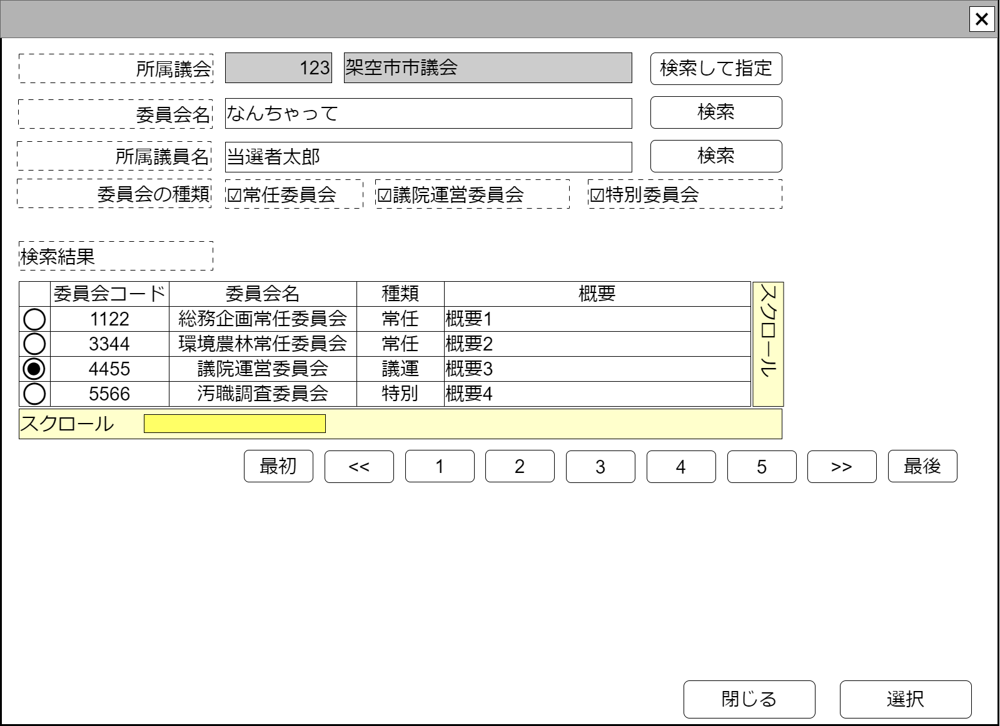

# 議会内委員会検索【コンポーネント】設計書

## 状態：仕様未確定(実装不可)

## 1.目的

個別の仕分けに対して監査意見を付記する(収入項目)

## 2. 構成コンポーネント

1. [議会検索コンポーネント](../serach_paliament/serach_paliament.md)
2. 独自フィールド

### 2.1 繰り返し項目

なし

## 3. 画面イメージ

### 3.1 画面イメージ

### 3.2 画面イメージ(項番)

## 4. フィールド要素一覧

| 番号 |                論理名                |       タイプ       | 活性／表示 |                                      内容                                      |
| ---- | ------------------------------------ | ------------------ | ---------- | ------------------------------------------------------------------------------ |
| 1    | 議会同一識別コード                   | インプットテキスト | 非活性     | 議会同一識別コードを表示すること                                               |
| 1    | 議会名称                             | インプットテキスト | 非活性     | 議会名称を表示するこ                                                           |
| 1    | 議会検索して指定ボタン               | ボタン             | 活性       | 押下時：議会検索コンポーネントを表示すること                                   |
| 1    | 検索条件議会内委員会名称             | インプットテキスト | 活性       | 議会内委員会名称会検索条件の入力を受け付けること                               |
| 1    | 議会内委員会名称で検索ボタン         | ボタン             | 活性       | 押下時：議会内委員会名称で議会選挙区を検索した結果を表示テーブルで一覧すること |
| 1    | 委員会の種類チェック(常任委員会)     | チェックボックス   | 非活性     | 常任委員会かどうかを検索条件するかどうかの入力を受け付けること                 |
| 1    | 委員会の種類チェック(議院運営委員会) | チェックボックス   | 非活性     | 議院運営委員会かどうかを検索条件するかどうかの入力を受け付けること             |
| 1    | 委員会の種類チェック(特別委員会)     | チェックボックス   | 非活性     | 特別委員会かどうかを検索条件するかどうかの入力を受け付けること                 |
| 1    | 検索条件所属議員氏名                 | インプットテキスト | 活性       | 委員会に所属する議員氏名の検索条件の入力を受け付けること                       |
| 1    | 詳細条件で検索ボタン                 | ボタン             | 活性       | 押下時：詳細な条件で議会選挙区を検索した結果を表示テーブルで一覧すること       |
| 1    | 議会内委員会検索結果テーブル         | テーブル           | 表示       | 議会内委員会検索結果が表示されること                                           |
| 1    | 検索ページングエリア                 | エリア             | 表示       | 議会内委員会検索結果のページング機能が提供されること                           |

### 4.1 議会内委員会検索結果テーブル フィールド要素一覧

| 番号 |       論理名       |    タイプ    | 活性／表示 |                                    内容                                    |
| ---- | ------------------ | ------------ | ---------- | -------------------------------------------------------------------------- |
| 1    | 行選択ラジオボタン | ラジオボタン | 活性       | 押下時：この行のデータが選択状態であることの入力を受け付けること           |
| 1    | 委員会一識別コード | ラベル       | 表示       | 変更にかかわらず選挙区が同一であることを識別するコードが表示されていること |
| 1    | 委員会名称         | ラベル       | 表示       | 議会選挙区名称が表示されていること                                         |
| 1    | 委員会の種類名称   | ラベル       | 表示       | 委員会種類名称が表示されていること                                         |
| 1    | 委員会概要         | ラベル       | 非活性     | 選挙区の概要が表示されていること                                           |

※TODO 検索結果のページングについては共通コンポーネントを作成するか、各ページで実装するか検討中のため、ソフトウェア全体で統一する挙動については[議会検索](../serach_paliament/serach_paliament.md)のページを参照すること

## 5.アクション一覧

| 番号 |            論理名            | タイプ | 活性／表示 |                                      内容                                      |
| ---- | ---------------------------- | ------ | ---------- | ------------------------------------------------------------------------------ |
| 1    | 議会検索して指定ボタン       | ボタン | 活性       | 押下時：議会検索コンポーネントを表示すること                                   |
| 1    | 議会内委員会名称で検索ボタン | ボタン | 活性       | 押下時：議会内委員会名称で議会選挙区を検索した結果を表示テーブルで一覧すること |
| 1    | 詳細条件で検索ボタン         | ボタン | 活性       | 押下時：詳細な条件で議会選挙区を検索した結果を表示テーブルで一覧すること       |
| 1    | キャンセル                   | ボタン | 活性       | 押下時：このコンポーネントを閉じること                                         |
| 1    | 選択                         | ボタン | 活性       | 押下時：選択されたデータを親画面に通知しこのコンポーネントを閉じること         |

## 6. 議会内委員会検索結果(最低限)インターフェイス

ParliamentCommissionSearchResultLeastInterface

 |       論理名       | 論理名 |   型   |                        説明(例)                        |
 | ------------------ | ------ | ------ | ------------------------------------------------------ |
 | 委員会一識別コード | ラベル | 表示   | 変更にかかわらず選挙区が同一であることを識別するコード |
 | 委員会名称         | ラベル | 表示   | 議会選挙区名称                                         |
 | 委員会の種類名称   | ラベル | 表示   | 委員会種類                                             |
 | 委員会概要         | ラベル | 非活性 | 選挙区の概要が表示されていること                       |

## 7. 連携

選択ボタンが押下された場合、親画面に指定データを通知する`emit[sendParliamentCommissionSearchResultLeastInterface(data:ParliamentCommissionSearchResultLeastInterface)]`
