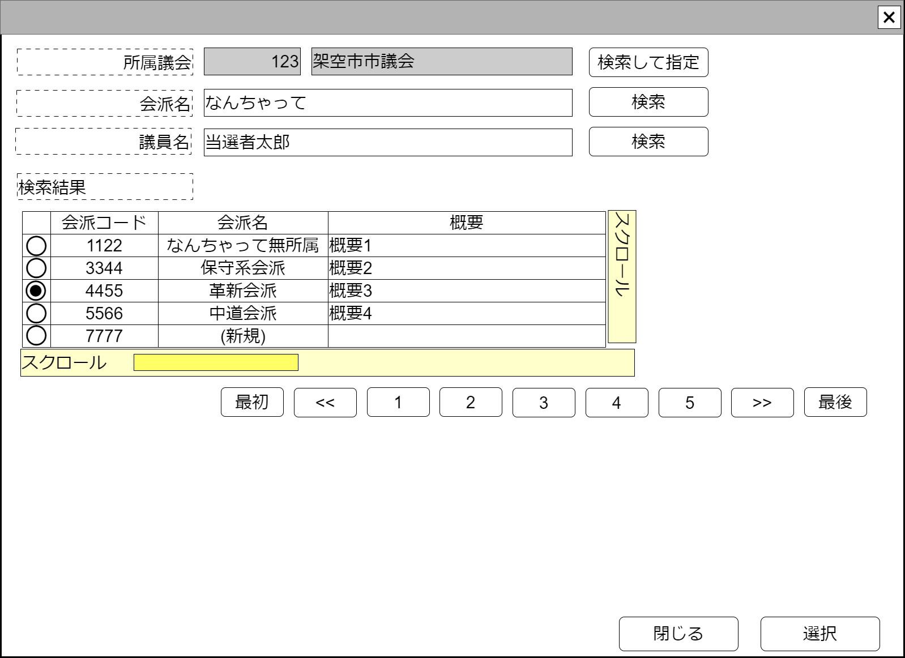

# 議会内会派検索【コンポーネント】設計書

## 状態：仕様未確定(実装不可)

## 1.目的

個別の仕分けに対して監査意見を付記する(収入項目)

## 2. 構成コンポーネント

1. 政治家表示コンポーネント
2. 独自フィールド

### 2.1 繰り返し項目

なし

## 3. 画面イメージ

### 3.1 画面イメージ

### 3.2 画面イメージ(項番)

## 4. フィールド要素一覧

| 番号 |            論理名            |       タイプ       | 活性／表示 |                                          内容                                          |
| ---- | ---------------------------- | ------------------ | ---------- | -------------------------------------------------------------------------------------- |
| 1    | 議会同一識別コード           | インプットテキスト | 非活性     | 議会同一識別コードを表示すること                                                       |
| 1    | 議会名称                     | インプットテキスト | 非活性     | 議会名称を表示するこ                                                                   |
| 1    | 議会検索して指定ボタン       | ボタン             | 活性       | 押下時：議会検索コンポーネントを表示すること                                           |
| 1    | 検索条件議会内会派名称       | インプットテキスト | 活性       | 議会内会派名称会検索条件の入力を受け付けること                                         |
| 1    | 議会内会派名称で検索ボタン   | ボタン             | 活性       | 押下時：議会内会派名称で議会選挙区を検索した結果を表示テーブルで一覧すること           |
| 1    | 検索条件所属する議員氏名     | インプットテキスト | 活性       | 会派に所属する議員の氏名検索条件の入力を受け付けること                                 |
| 1    | 所属する議員氏名で検索ボタン | ボタン             | 活性       | 押下時：会派に所属する議員の氏名で議会選挙区を検索した結果を表示テーブルで一覧すること |
| 1    | 議会内会派検索結果テーブル   | テーブル           | 表示       | 議会内会派検索結果が表示されること                                                     |
| 1    | 検索ページングエリア         | エリア             | 表示       | 議会内会派検索結果のページング機能が提供されること                                     |

### 4.1 議会内会派検索結果テーブル フィールド要素一覧

| 番号 |         論理名         |    タイプ    | 活性／表示 |                                      内容                                      |
| ---- | ---------------------- | ------------ | ---------- | ------------------------------------------------------------------------------ |
| 1    | 行選択ラジオボタン     | ラジオボタン | 活性       | 押下時：この行のデータが選択状態であることの入力を受け付けること               |
| 1    | 議会内会派一識別コード | ラベル       | 表示       | 変更にかかわらず議会内会派が同一であることを識別するコードが表示されていること |
| 1    | 議会内会派名称         | ラベル       | 表示       | 議会内会派名称が表示されていること                                             |
| 1    | 議会内会派概要         | ラベル       | 非活性     | 議会内会派の概要が表示されていること                                           |

※TODO 検索結果のページングについては共通コンポーネントを作成するか、各ページで実装するか検討中のため、ソフトウェア全体で統一する挙動については[議会検索](../serach_paliament/serach_paliament.md)のページを参照すること

## 5.アクション一覧

| 番号 |            論理名            | タイプ | 活性／表示 |                                          内容                                          |
| ---- | ---------------------------- | ------ | ---------- | -------------------------------------------------------------------------------------- |
| 1    | 議会検索して指定ボタン       | ボタン | 活性       | 押下時：議会検索コンポーネントを表示すること                                           |
| 1    | 議会内会派名称で検索ボタン   | ボタン | 活性       | 押下時：議会内会派名称で議会選挙区を検索した結果を表示テーブルで一覧すること           |
| 1    | 所属する議員氏名で検索ボタン | ボタン | 活性       | 押下時：会派に所属する議員の氏名で議会選挙区を検索した結果を表示テーブルで一覧すること |
| 1    | キャンセル                   | ボタン | 活性       | 押下時：このコンポーネントを閉じること                                                 |
| 1    | 選択                         | ボタン | 活性       | 押下時：選択されたデータを親画面に通知しこのコンポーネントを閉じること                 |

## 6. 議会内会派検索結果(最低限)インターフェイス

ParliamentFactionSearchResultLeastInterface

|          論理名          |        論理名         |   型   |                                    説明(例)                                    |
| ------------------------ | --------------------- | ------ | ------------------------------------------------------------------------------ |
| 議会内会派Id             | parliamentFactionId   | Long   | 変更にかかわらず議会内会派が同一であることを識別するコードが表示されていること |
| 議会内会派同一識別コード | parliamentFactionCode | Long   | 変更にかかわらず議会内会派が同一であることを識別するコードが表示されていること |
| 議会内会派名称           | parliamentFactionName | String | 議会内会派名称が表示されていること                                             |
| 議会内会派概要           | factionExplain        | String | 議会内会派の概要が表示されていること                                           |

## 7. 連携

選択ボタンが押下された場合、親画面に指定データを通知する`emit[sendParliamentFactionSearchResultLeastInterface(data:ParliamentFactionSearchResultLeastInterface)]`
