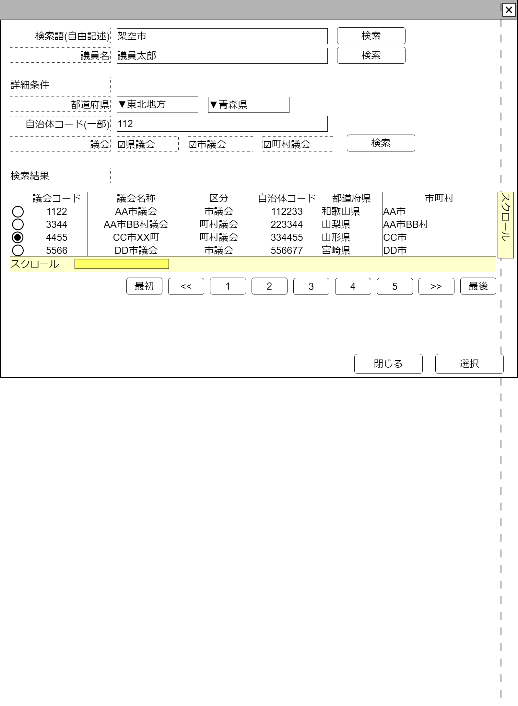

# 政治家検索【コンポーネント】設計書

## 状態：仕様未確定(実装不可)

## 1.目的

政治家の検索を行い、必要に応じて指定する

## 2. 構成コンポーネント

1. 独自フィールド

### 2.1 繰り返し項目

なし

## 3. 画面イメージ

### 3.1 画面イメージ

### 3.2 画面イメージ(項番)

## 4. フィールド要素一覧

| 番号 |                 論理名                 |       タイプ       | 活性／表示 |                                          内容                                          |
| ---- | -------------------------------------- | ------------------ | ---------- | -------------------------------------------------------------------------------------- |
| 1    | 検索条件自由記述                       | インプットテキスト | 活性       | 自由記述による検索条件の入力を受け付けること                                           |
| 1    | 自由記述検索ボタン                     | ボタン             | 活性       | 押下時：自由記述に記載された検索語に基づく検索を行い、その結果を一覧として表示すること |
| 1    | 検索条件議員氏名                       | インプットテキスト | 活性       | 議員氏名による検索条件の入力を受け付けること                                           |
| 1    | 議員氏名検索ボタン                     | ボタン             | 活性       | 押下時：議員氏名に記載された検索語に基づく検索を行い、その結果を一覧として表示すること |
| 1    | 検索条件地方フィルタ                   | セレクトボックス   | 活性       | 選択時：選択された項目に基づき都道府県セレクトボックスをフィルタすること               |
| 1    | 検索条件都道府県                       | セレクトボックス   | 活性       | 検索条件都道府県の入力を受け付けること                                                 |
| 1    | 検索条件自治体コード                   | インプットテキスト | 活性       | 検索条件都道府県コードの入力を受け付けること                                           |
| 1    | 検索条件議会の種類(県議会・広域自治体) | チェックボックス   | 活性       | 検索条件県議会であるかどうかの入力を受け付けること                                     |
| 1    | 検索条件議会の種類(市議会)             | チェックボックス   | 活性       | 検索条件県議会であるかどうかの入力を受け付けること                                     |
| 1    | 検索条件議会の種類(町村議会)           | チェックボックス   | 活性       | 検索条件県議会であるかどうかの入力を受け付けること                                     |
| 1    | 詳細条件検索ボタン                     | ボタン             | 活性       | 押下時：詳細条件にに基づく検索を行い、その結果を一覧として表示すること                 |

※TODO 検索結果のページングについては共通コンポーネントを作成するか、各ページで実装するか検討中のため、ソフトウェア全体で統一する挙動については[議会検索](../serach_paliament/serach_paliament.md)のページを参照すること

## 5. アクション一覧

| 番号 |   論理名   | タイプ | 活性／表示 |                      内容                      |
| ---- | ---------- | ------ | ---------- | ---------------------------------------------- |
| 1    | サンプル   | ボタン | 活性       | 押下時：サンプルコンポーネントを表示すること。 |
| 1    | キャンセル | ボタン | 活性       | 押下時：入力内容を破棄すること                 |
| 1    | 保存       | ボタン | 活性       | 押下時：入力内容を保存すること                 |

## 6. 政治家最低限インターフェイス

PoliticianLeastInterface

 |  論理名  |  論理名  |  型  |         説明(例)         |
 | -------- | -------- | ---- | ------------------------ |
 | サンプル | sampleId | Long | 政治家を識別する一意のId |

## 7. 連携

選択ボタンが押下された場合、親画面に指定データを通知する`emit[sendPoliticianLeastInterface(data:PoliticianLeastInterfaceInterface)]`
