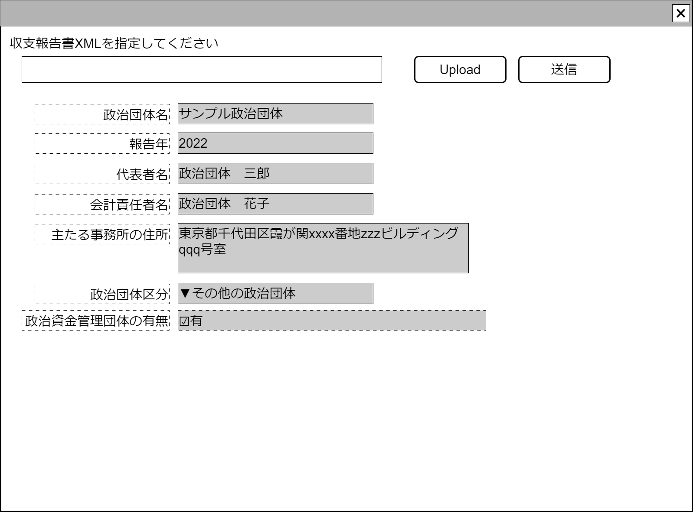

# 政治資金収支報告書XMLファイルアップロードコンポーネント設計書

## 状態：調査側でほぼ実装終了しているため設計書だけ

## 1. 目的

指定された収支報告書ファイルをアップロードして、収支報告書XML形式データで返却する

## 2. 構成コンポーネント

なし

## 3.画面イメージ

### 3.1 画面イメージ

### 3.2 画面イメージ(項番)

## 4. フィールド要素一覧

### 4.1 独自フィールド要素一覧

| 番号 |       論理名       |        タイプ        | 活性／表示 |                      内容                      |
| ---- | ------------------ | -------------------- | ---------- | ---------------------------------------------- |
| 1    | ファイル指定       | インプット(ファイル) | 活性       | アップロードするファイルを指定すること         |
| 2    | 送信               | ボタン               | -          | アクションリスト参照                           |
| 3    | 政治団体名称       | インプットテキスト   | 非活性     | 解析された政治団体名称を表示すること           |
| 4    | 報告年             | インプット数字       | 非活性     | 解析された報告年を表示すること                 |
| 5    | 団体責任者         | インプットテキスト   | 非活性     | 解析された政治団体責任者姓名を表示すること     |
| 6    | 会計責任者         | インプットテキスト   | 非活性     | 解析された政治団体会計責任者姓名を表示すること |
| 7    | 主たる事務所の住所 | インプットテキスト   | 非活性     | 解析された主たる事務所の住所を表示すること     |
| 8    | 政治団体区分       | セレクトボタン       | 非活性     | 解析された政治団体区分を表示すること           |
| 9    | 資金管理団体の有無 | チェックボックス     | 非活性     | 解析された資金管理団体の有無を表示すること     |

## 5. アクション要素一覧

| 番号 | 論理名 | タイプ | 活性／表示 |                                                                               内容                                                                                |
| ---- | ------ | ------ | ---------- | ----------------------------------------------------------------------------------------------------------------------------------------------------------------- |
| 1    | 送信   | ボタン | -          | 指定されたXMLをContorllerに渡し、政治資金収支報告書データクラスを受け取り、親画面に送信すること。かつこのコンポーネントで使用するフィールドにデータを受け渡すこと |

## 6. インターフェイス

[AllBookDto.md](親に受け渡すデータは政治資金収支報告書データクラスAllBookDto)を参照

### 6.1 内部表示変数

- 外部との連絡は元となるデータクラスを丸々渡すので、外部連絡用にインターフェイス化の必要はない

 |       論理名       |           物理名           |   型    |                                     説明(例)                                      |
 | ------------------ | -------------------------- | ------- | --------------------------------------------------------------------------------- |
 | 政治団体名称       | dantaiName                 | String  | 該当Dto.dantaiName                                                                |
 | 報告年             | submisshonYear             | Integer | 該当Dto.houkokuNen                                                                |
 | 代表者名           | organizationManagerName    | String  | 該当Dto.daihyoushaNameLastと該当Dto.daihyoushaNameFirstを連結した文字列           |
 | 会計責任者名       | organizationAccountOfficer | String  | 該当Dto.kaikeiSekinnshaNameLastと該当Dto.kaikeiSekinnshaNameFirstを連結した文字列 |
 | 主たる事務所の住所 | organizationAddress        | String  | 該当Dto.jimushoJushoと該当Dto.jimushoJushoTatemonoを連結した文字列                |
 | 政治団体区分       | organizationDantaiKbn      | String  | 該当Dto.dantaiKbn                                                                 |
 | 政治資金団体の有無 | hasOtherOrg                | Integer | 該当Dto.umuShikinKanrenDantai                                                     |

※該当DtoとはAllBookDto.AllSheet0701CoverAndOrganizationDetailsDto.Sheet070100CoverAndOrganizationDetailsDtoを指す

## 7. 連携

送信ボタンを押下時、親画面にBack側で解析された政治資金収支報告書データクラスを通知する`emit[sendBalancesheetAllData(AllBookDto)]`
