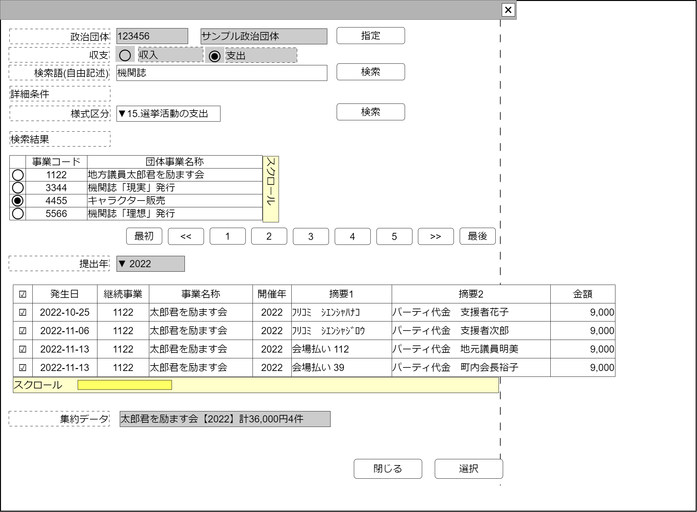

# 継続事業費用一覧要約【コンポーネント】設計書

## 状態：仕様未確定(実装不可)

## 1.目的

個別の仕分けに対して監査意見を付記する(収入項目)

## 2. 構成コンポーネント

1. [事業検索コンポーネント](./#)
2. 独自フィールド

### 2.1 繰り返し項目

なし

## 3. 画面イメージ

### 3.1 画面イメージ

### 3.2 画面イメージ(項番)

## 4. フィールド要素一覧

| 番号 |            論理名            |       タイプ       | 活性／表示 |                                              内容                                               |
| ---- | ---------------------------- | ------------------ | ---------- | ----------------------------------------------------------------------------------------------- |
| 1    | 事業検索コンポーネント       | コンポーネント     | 表示       | 事業検索コンポーネントを表示すること。                                                          |
| 1    | 検索条件提出年選択           | セレクトボックス   | 非活性     | 検索条件である提出年の入力を受け付けること                                                      |
| 1    | 事業関連収支項目一覧テーブル | テーブル           | 表示       | 提出年に該当する収支項目を表示すること。                                                        |
| 1    | 集約データ                   | インプットテキスト | 非活性     | 事業名称+"【"+提出年+"】計"+選択された収支項目取引金額合計+"円"+収支項目件数+"件"を表示すること |

### 4.1 事業関連収支項目一覧テーブル フィールド要素一覧

| 番号 |         論理名         |      タイプ      | 活性／表示 |                                       内容                                       |
| ---- | ---------------------- | ---------------- | ---------- | -------------------------------------------------------------------------------- |
| 1    | 行選択チェックボックス | チェックボックス | 活性       | 押下時：この行のデータが選択状態であることの入力を受け付けること。初期値は`true` |
| 1    | 継続事業同一識別コード | ラベル           | 表示       | 継続事業同一識別コードを表示すること                                             |
| 1    | 継続事業名称           | ラベル           | 表示       | 継続事業名称を表示すること                                                       |
| 1    | 提出年                 | ラベル           | 表示       | この項目が記載されている収支報告書の提出年を表示すること                         |
| 1    | 摘要1                  | ラベル           | 表示       | この項目の詳細を呼び出す書証の摘要を表示すること                                 |
| 1    | 摘要2                  | ラベル           | 表示       | 収支報告書に記載されている摘要を表示すること                                     |
| 1    | 金額                   | ラベル           | 表示       | 収支報告書に記載された取引金額を表示すること                                     |

## 5. アクション一覧

| 番号 |   論理名   | タイプ | 活性／表示 |                                  内容                                  |
| ---- | ---------- | ------ | ---------- | ---------------------------------------------------------------------- |
| 1    | キャンセル | ボタン | 活性       | 押下時：このコンポーネントを閉じること                                 |
| 1    | 選択       | ボタン | 活性       | 押下時：選択されたデータを親画面に通知しこのコンポーネントを閉じること |

## 6. 収支要約インターフェイス

EventDigestInterface
※セレクトボタンで使用するため、`SelectOptionInterface`を拡張していること

 |         論理名         |   論理名    |   型    |                                              説明(例)                                               |
 | ---------------------- | ----------- | ------- | --------------------------------------------------------------------------------------------------- |
 | セレクトボックスの値   | value       | String  | 未定                                                                                                |
 | イベント開始時間表示用 | text        | String  | イベント概要と収支区分に金額を乗算した値と該当件数を設定しすること。例「弁当代100人分-60000円10件」 |
 | イベント収支別区分     | shushiKbn   | Integer | イベントの収支区分。`収入:1`と`支出:-1`                                                             |
 | 取引金額               | eventAmount | Long    | 取引金額。　例：「60000」                                                                           |
 | 該当件数               | lineCount   | Long    | 該当収支項目件数。　例：「10」件                                                                    |
 | イベント概要           | eventDigest | String  | 発生イベントの概要。　例：「弁当代100人分」                                                         |

## 7. 連携

選択ボタンが押下された時、`emit[sendEventDigestInterface(data:EventDigestInterface)]`を用いて選択内容を通知すること
親画面から提出年`props{offeringYear:number}`を受信すること
親画面から収支の別`props{isIncome:number}`を受信し、子画面である継続事業検索コンポーネントにひきわたすこと
