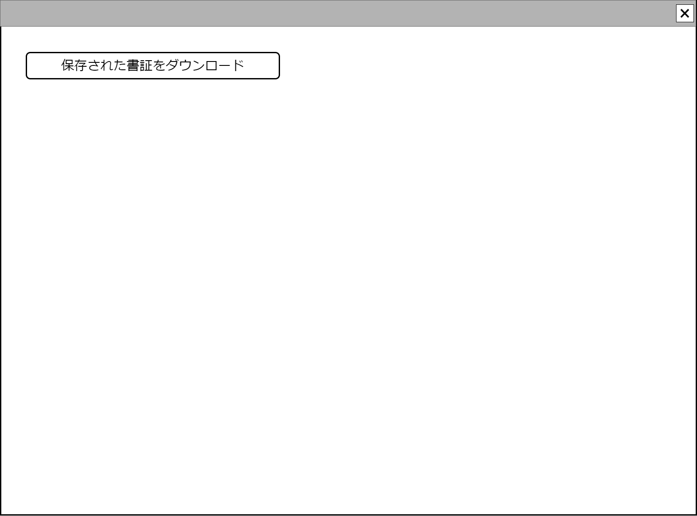

# 一般ファイルダウンロード【コンポーネント】設計書

## 状態：超簡単な仮実装完了(後、Backを起動せずfront起動だけで動作するようMock化)

## 1.目的

すでに保全された各種ファイル(拡張子不定)をダウンロードする

## 2. 構成コンポーネント

1. 独自フィールド

### 2.1 繰り返し項目

なし

## 3. 画面イメージ

### 3.1 画面イメージ

### 3.2 画面イメージ(項番)

## 4. フィールド要素一覧

| 番号 |    論理名    | タイプ | 活性／表示 |                            内容                            |
| ---- | ------------ | ------ | ---------- | ---------------------------------------------------------- |
| 1    | ダウンロード | ボタン | 活性       | 押下時：書証Idに紐づくファイルダウンロードが開始できること |

## 5. アクション一覧

| 番号 |    論理名    | タイプ | 活性／表示 |                            内容                            |
| ---- | ------------ | ------ | ---------- | ---------------------------------------------------------- |
| 1    | ダウンロード | ボタン | 活性       | 押下時：書証Idに紐づくファイルダウンロードが開始できること |

## 6. 送信用ファイル内容インターフェイス

OneFileBlobInterface

|              論理名              |      論理名       |   型   |                                  説明(例)                                   |
| -------------------------------- | ----------------- | ------ | --------------------------------------------------------------------------- |
| ファイル名                       | fileName          | String | ファイル名(例:1234.txt)                                                     |
| ファイル内容バイナリBase64文字列 | fileContentBase64 | String | Back側でbinary[]で取得後、変換されたBase64文字列(例:IyDjg57jg7zjgq/jg4Djgq) |

### 6.1 書証Dto

ShoshouInterface

|       論理名       |   論理名    |   型   |                        説明(例)                        |
| ------------------ | ----------- | ------ | ------------------------------------------------------ |
| 書証Id             | shoshouId   | String | 書証Id。ユーザId+処理時刻+ランダム文字列(16)           |
| 書証同一識別コード | shoshouCode | Long   | 変更にかかわらず、書証が同一であることを識別するコード |
| 書証区分           | shoshouKbn  | String | 書証区分                                               |

## 7. 連携

親画面から呼び出し用の書証情報SaveStrageInterfaceを`props{ saveStorageResultDto: SaveStorageResultDto}`を受け取ること
