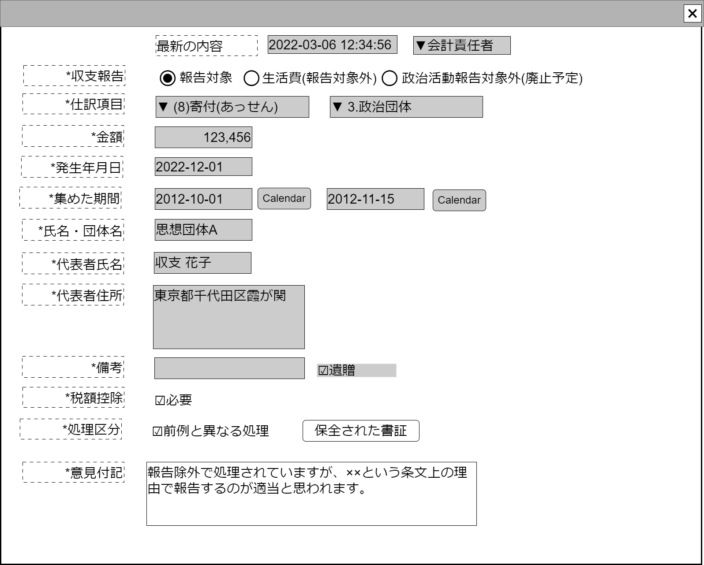

# 収支報告書収入データ編集【コンポーネント】設計書

## 状態：作成側の収支報告書収入データ編集画面の上半分がこのコンポーネントとほぼ同一であるので作成側の完成を待ってソースをもらうこと

## 1.目的

個別の仕分けに対して監査意見を付記する(収入項目)

## 2. 構成コンポーネント

1. 独自フィールド

### 2.1 繰り返し項目

なし

## 3. 画面イメージ

### 3.1 画面イメージ

### 3.2 画面イメージ(項番)

## 4. フィールド要素一覧

| 番号 |      論理名      |          タイプ          |      活性／表示      |                                         内容                                         |
| ---- | ---------------- | ------------------------ | -------------------- | ------------------------------------------------------------------------------------ |
| 1    | 処理発生時間     | インプットテキスト(日付) | 非活性               | 処理タイムスタンプを表示すること                                                     |
| 1    | 作業担当者       | インプットテキスト       | 非活性               | 作業者を団体の役割(ex.会計責任者)で表示すること                                      |
| 1    | 収支報告ボタン   | ラジオボタン             | 活性／非活性         | 収支報告選択入力を受け付けること                                                     |
| 1    | 生活費ボタン     | ラジオボタン             | 活性／非活性         | 収支報告外(生活費)選択入力を受け付けること                                           |
| 1    | 政治活動費ボタン | ラジオボタン             | 活性／非活性         | 収支報告外(政治活動費)選択入力を受け付けること                                       |
| 1    | タスク計上ボタン | ラジオボタン             | 活性／非活性         | タスク計上(データを一時保存し次回以降に確定)選択入力を受け付けること                 |
| 1    | 収支仕訳大項目   | セレクトボタン           | 活性／非活性         | 収支仕訳(大項目)選択を受け付けること                                                 |
| 1    | 収支仕訳枝項目   | セレクトボタン           | 活性 ／非活性        | 収支仕訳(枝別れ項目)選択を受け付けること                                             |
| 1    | 取引金額         | インプットテキスト       | 非活性               | 取引金額を表示すること                                                               |
| 1    | 発生日           | インプットカレンダー     | 非活性               | 発生日を表示すること                                                                 |
| 1    | 集めた期間開始日 | インプットカレンダー     | 活性 表示／非表示 | 選択された項目が期間入力を必要とする場合に表示 期間の開始日を表示すること         |
| 1    | 集めた期間終了日 | インプットカレンダー     | 活性 表示／非表示 | 選択された項目が期間入力を必要とする場合に表示 期間の終了日を表示すること         |
| 1    | 氏名・団体名称   | インプットテキスト       | 活性 表示／非表示 | 選択された項目が氏名・名称入力を必要とする場合に表示 名称を表示すること           |
| 1    | 氏名名称         | インプットテキスト       | 活性 表示／非表示 | 選択された項目が団体の名称とその氏名入力を必要とする場合に表示 氏名を表示すること |
| 1    | 団体住所         | テキストエリア           | 活性 表示／非表示 | 選択された項目が団体の住所入力を必要とする場合に表示 団体の住所を表示すること     |
| 1    | 備考             | テキストエリア           | 活性 表示／非表示 | 備考を表示すること                                                                   |
| 1    | 遺贈有無         | チェックボックス         | 活性 表示／非表示 | 値が`1:有`の場合には備考に『「遺贈」』と記入され、記入チェックがされること           |
| 1    | 税額控除有無     | チェックボックス         | 活性 表示／非表示 | 税額控除の有無入力を受け付けること                                                   |
| 1    | 前例と異なる処理 | チェックボックス         | 活性                 | この処理が前例と異なっていることの入力を受け付けること                               |
| 1    | 指示内容保全     | ボタン                   | 活性                 | アクション一覧参照                                                                   |
| 1    | 意見付記         | チェックボックス         | 活性                 | 最新の意見付記の入力を受け付けること                                                 |

※最新データと選択データの比較を行うためのコンポーネントでもあるため、各フィールド高さを指定するなどして、横に並べた時に項目配置高さが一致し、比較しやすいレイアウトを保つこと
難しい場合は比較専用コンポーネントを面倒でも作成すること

## 5.アクション一覧

### 5.1.1 報告区分変更時(収入)

a.タスク計上／報告対象であることを選択した時

- 様式区分が表示されていること
- 様式区分枝項目が表示されていること
- あっせん期間が表示されていること
- 組織名称が表示されていること
- 項目部分が表示されていること
- 団体住所部分が表示されていること
- 備考部分が表示されていること
- 寄付金控除が表示されていること
- パーティ名称が表示されていること
- パーティ日付が表示されていること

b.報告対象外(生活費、政治活動費)であることを選択した時

- 様式区分が非表示であること
- 様式区分枝項目が非表示であること
- あっせん期間が非表示であること
- 組織名称が非表示であること
- 項目部分が非表示であること
- 団体住所部分が非表示であること
- 備考部分を非表示であること
- 寄付金控除が非表示であること
- パーティ名称が非表示であること
- パーティ日付を非表示にます

### 5.2.1 様式区分変更時(収入)

a.様式区分3の場合

- 枝区分が非表示であること
- 団体名称が非表示であること
- 団体住所が非表示であること
- 項目が表示されていること
- 項目名称が「事業の種類」であること
- 寄付金控除が非表示であること
- パーティ名称が非表示であること
- パーティ日付が非表示であること

b.様式区分4の場合

- 枝区分が非表示であること
- 団体名称が非表示であること
- 団体住所が非表示であること
- 項目が表示されていること
- 項目名称を「借入した相手」であること
- 寄付金控除が非表示であること
- パーティ名称が非表示であること
- パーティ日付が非表示であること

c.様式区分5の場合

- 枝区分が非表示であること
- 団体名称が表示されていること
- 団体名称が表示されていること
- 団体名称の項目名称が「本部または支部名称」であること
- 団体住所が表示されていること
- 団体住所の項目名称が「本部または支部住所」であること
- 項目が非表示であること
- 寄付金控除が非表示であること
- パーティ名称が非表示であること
- パーティ日付が非表示であること

d.様式区分6の場合

- 枝区分が非表示であること
- 団体名称が非表示であること
- 団体住所が非表示であること
- 項目が表示されていること
- 項目の名称が表示されていること
- 項目の項目名称が「収入の摘要」であること
- 寄付金控除が非表示であること
- パーティ名称が非表示であること
- パーティ日付が非表示であること

e.様式区分7の場合

- 枝区分が表示されていること
- 団体名称が表示されていること
- 団体名称の項目名称が「団体の場合は代表者名、個人の場合は職業」であること
- 団体住所が表示されていること
- 団体住所項目名称が「寄付者自身または団体の住所」であること
- 項目が表示されていること
- 項目の項目名称が「寄付者の個人氏名または団体名称」であること
- 寄付金控除が非表示であること
- パーティ名称が非表示であること
- パーティ日付が非表示であること
- 様式枝区分に紐づく画面設定(5.3.1)を行うこと

f.様式区分8の場合

- 枝区分が表示されていること
- あっせん項目は期間の記載を表示すること
- あっせん項目名称は「寄付をあっせんした期間」であること
- 団体名称が表示されていること
- 団体名称の項目名称が「団体の場合は代表者名、個人の場合は職業」であること
- 団体住所が表示されていること
- 団体住所項目名称が「寄付あっせん者自身または団体の住所」であること
- 概要が表示されていること
- 概要項目名称が「寄付あっせん者の個人氏名または団体名称」であること
- 寄付金控除が非表示であること
- パーティ名称が非表示であること
- パーティ日付が非表示であること

g.様式区分9の場合

- 枝区分が非表示であること
- 団体名称が非表示であること
- 団体住所が非表示であること
- 項目が表示されていること
- 項目の項目名称が「政党匿名寄付を受けた場所」であること
- 寄付金控除が非表示であること
- パーティ名称が非表示であること
- パーティ日付が非表示であること

h.様式区分10の場合

- 枝区分が非表示であること
- 団体名称が表示されていること
- 団体名称の項目名称が「パーティ名称」であること
- 団体住所が表示されていること
- 団体住所項目名称が「パーティ開催場所住所」であること
- 概要が表示されていること
- 概要の項目名称が「対価を支払った人数」であること
- 寄付金控除が非表示であること
- パーティ名称が非表示であること
- パーティ日付が非表示であること

i.様式区分11の場合

- 枝区分が表示されていること
- 団体名称が表示されていること
- 団体名称項目名称が「団体の場合は代表者名、個人の場合は職業」であること
- 団体住所が表示されていること
- 団体住所が「個人または団体住所」であること
- 概要が表示されていること
- 概要項目名称が「費用を支払った氏名」であること
- 寄付金控除が非表示であること
- パーティ名称が表示されていること
- パーティ名称項目名称「開催したパーティ名称」であること
- パーティ日付が表示されていること
- パーティ日付が「パーティ開催日」であること

j.様式区分12の場合

- 枝区分が表示されていること
- あっせん項目は期間の記載が表示されていること
- あっせん項目の項目名称は「寄付をあっせんした期間」であること
- 団体名称が表示されていること
- 団体名称の項目名称が「団体の場合は代表者名、個人の場合は職業」であること
- 団体住所が表示されていること
- 団体住所項目名称が「個人または団体住所」であること
- 概要が表示されていること
- 概要項目名称が「費用を支払った氏名」であること
- 寄付金控除が非表示であること
- パーティ名称が表示されていること
- パーティ名称項目名称が「開催したパーティ名称」であること
- パーティ日付が表示されていること
- パーティ日付の項目名称が「パーティ開催日」であること

### 5.3.1 様式枝区分変更時(収入)

a.様式区分が7の場合限定で枝区分の`1:個人`を選択した場合

- 寄付金控除チェックを表示すること
- 遺贈チェックを表示すること
- 上場・外資50%チェックを非表示にすること

b.様式区分が7の場合限定で枝区分の`2:法人`を選択した場合

- 寄付金控除チェックを非表示にすること
- 遺贈チェックを非表示にすること
- 上場・外資50%チェックを表示すること

c.様式区分が7の場合限定で枝区分の`3:政治団体`を選択した場合

- 寄付金控除チェックを非表示にすること
- 遺贈チェックを非表示にすること
- 上場・外資50%チェックを非表示にすること

### 5.4.1 編集／参照識別変数(isEditable:Boolean)

a.参照(編集不可)が選択された場合

- 収支報告ボタンが非活性であること
- 生活費ボタンが非活性であること
- 政治活動費ボタンが非活性であること
- タスク計上ボタンが非活性であること
- 収支仕訳大項目が非活性であること
- 収支仕訳枝項目が非活性であること
- 取引金額が非活性であること
- 発生日が非活性であること
- 集めた期間開始日が非活性であること
- 集めた期間終了日が非活性であること
- 氏名・団体名称が非活性であること
- 氏名名称が非活性であること
- 団体住所が非活性であること
- 備考が非活性であること
- 遺贈有無が非活性であること
- 税額控除有無が非活性であること
- 前例と異なる処理 が非活性であること
- 指示内容保全が非活性であること
- 意見付記が非活性であること

b.編集が選択された場合

- 収支報告ボタンが活性であること
- 生活費ボタンが活性であること
- 政治活動費ボタンが活性であること
- タスク計上ボタンが活性であること
- 収支仕訳大項目が活性であること
- 収支仕訳枝項目が活性であること
- 取引金額が活性であること
- 発生日が活性であること
- 集めた期間開始日が活性であること
- 集めた期間終了日が活性であること
- 氏名・団体名称が活性であること
- 氏名名称が活性であること
- 団体住所が活性であること
- 備考が活性であること
- 遺贈有無が活性であること
- 税額控除有無が活性であること
- 前例と異なる処理 が活性であること
- 指示内容保全が活性であること
- 意見付記が活性であること

## 6. 収支報告書収入データBalancesheetIncomeInterface

|                    論理名                     |         物理名         |      型      |                              説明(例)                               |
| --------------------------------------------- | ---------------------- | ------------ | ------------------------------------------------------------------- |
| 収入データId                                  | incomeId               | String       | 読み込みした書証Id。例示：「111-20221101-333」                      |
| 収入データ同一識別コード                      | incomeCode             | Long         | 変更した際に同一意味の書証であることを識別するコード。例示：「333」 |
| 書証Id                                        | shoshouId              | String       | 読み込みした書証Id。例示：「111-20221101-333」                      |
| 書証識別コード                                | shoshouHistroyCode     | Long         | 変更した際に同一意味の書証であることを識別するコード。例示：「333」 |
| 書証区分                                      | shoshouKbn             | String       | 書証を区分する。書証アップロード機能参照                            |
| 参照した摘要                                  | referDigest            | String       | 書証に記載された取引概要。例示：「ﾌﾘｺﾐ ﾕｳｹﾝｼｬﾀﾛｳ」                  |
| 入力済項目編集区分                            | isEditAutoInput        | Boolean      | 自動入力部を編集しようとしているかどうか。編集している場合は`true`  |
| 収支報告区分                                  | reportKbn              | Integer      | 支出／収入                                                          |
| 様式仕訳区分                                  | yoshikiKbn             | String       | 様式仕訳区分。収入データ編集参照                                    |
| 様式仕訳枝項目区分                            | yoshikiEdaKbn          | String       | 様式仕訳枝項目区分。収入データ編集参照                              |
| 発生日                                        | accrualDate            | String       | 取引発生日                                                          |
| 取引金額                                      | amount                 | Long         | 取引した金額                                                        |
| 集めた期間開始日                              | mediationStartDate     | String       | あっせんのする場合、期間開始日                                      |
| 集めた期間終了日                              | mediationEndDate       | String       | あっせんのする場合、期間終了日                                      |
| パーティ開催日                                | partyDate              | String       | パーティ開催日                                                      |
| 氏名・団体名称                                | shimeiOrgnizationName  | String       | 氏名(職業)、または団体名称                                          |
| 項目名称                                      | itemName               | String       | 項目名称                                                            |
| 個人・団体住所                                | orgnizationAddress     | Integer      | 個人または団体住所                                                  |
| 備考                                          | biko                   | String       | 備考                                                                |
| 税額控除有無                                  | isCreditTax            | Boolean      | 税控除対象かどうか。該当する場合は`true`                            |
| 寄付が遺贈有無フラグ                          | isBequest              | Boolean      | 寄付が遺贈かどうか。該当する場合は`true`                            |
| 寄付法人が上場または外資50%超え会社有無フラグ | isPrimeListedOrForeign | Boolean      | 寄付法人が上場または外資50%超え会社有無。該当する場合は`true`       |
| 政治資金パーティ名称                          | partyName              | String       | 政治資金パーティ名称                                                |
| 意見付記                                      | note                   | String       | 仕訳に対する意見、メモ                                              |
| 前例と異なる処理フラグ                        | isDifferPrecedent      | String       | 前例と異なる処理を行った場合`true`(仕訳者の主観)                    |
| 保全書証リスト                                | storagedDocumentIdList | List<String> | この仕訳に関して指示内容等を保全した場合の書証Idリスト              |
| ユーザーId                                    | userId                 | String       | 読み込みした書証Id。例示：「111-20221101-333」                      |
| ユーザ識別コード                              | userCode               | Long         | 変更した際に同一意味の書証であることを識別するコード。例示：「333」 |
| ユーザ名称                                    | userName               | String       | 変更した際に同一意味の書証であることを識別するコード。例示：「333」 |
| ユーザ団体内役割区分                          | roleOrgCode            | Long         | 変更した際に同一意味の書証であることを識別するコード。例示：「333」 |
| ユーザ団体内役割区分名称                      | roleOrgName            | String       | 変更した際に同一意味の書証であることを識別するコード。例示：「333」 |
| 処理時間                                      | update_datetime        | Timestamp    | 処理が行われた時間のタイムスタンプ                                  |

## 7. 連携

親画面から`props{incomeDto:BalancesheetIncomeInterface}`を受け取り、`computed`を設定することで変更状態を常に親画面に通知すること
親画面から`props{isEditable:Boolean}`を受け取り、コンポーネント全体が参照用か入力用か(活性／非活性)を制御すること
