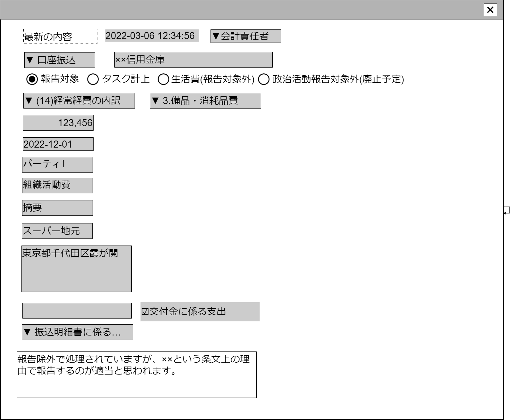

# 収支報告書支出データ編集【コンポーネント】設計書

## 状態：作成側の収支報告書支出データ編集画面の上半分がこのコンポーネントとほぼ同一であるので作成側の完成を待ってソースをもらうこと

## 1.目的

政治資金収支報告書の支出項目の入力を受け付けること

## 2. 構成コンポーネント

1. 独自フィールド

### 2.1 繰り返し項目

なし

## 3. 画面イメージ

### 3.1 画面イメージ

### 3.2 画面イメージ(項番)

## 4. フィールド要素一覧

| 番号 |           論理名           |          タイプ          |          活性／表示          |                                                              内容                                                              |
| ---- | -------------------------- | ------------------------ | ---------------------------- | ------------------------------------------------------------------------------------------------------------------------------ |
| 1    | 処理発生時間               | インプットテキスト(日付) | 非活性                       | 処理タイムスタンプを表示すること                                                                                               |
| 1    | 作業担当者                 | インプットテキスト       | 非活性                       | 作業者を団体の役割(ex.会計責任者)で表示すること                                                                                |
| 1    | 収支報告ボタン             | ラジオボタン             | 活性／非活性                 | 収支報告選択入力を受け付けること                                                                                               |
| 1    | 生活費ボタン               | ラジオボタン             | 活性／非活性                 | 収支報告外(生活費)選択入力を受け付けること                                                                                     |
| 1    | 政治活動費ボタン           | ラジオボタン             | 活性／非活性                 | 収支報告外(政治活動費)選択入力を受け付けること                                                                                 |
| 1    | タスク計上ボタン           | ラジオボタン             | 活性／非活性                 | タスク計上(データを一時保存し次回以降に確定)選択入力を受け付けること                                                           |
| 1    | 収支仕訳大項目             | セレクトボタン           | 活性                         | 収支仕訳(大項目)選択を受け付けること                                                                                           |
| 1    | 収支仕訳枝項目             | セレクトボタン           | 活性                         | 収支仕訳(枝別れ項目)選択を受け付けること                                                                                       |
| 1    | 取引金額                   | インプットテキスト       | 活性／非活性                 | 取引金額を表示すること                                                                                                         |
| 1    | 発生日                     | インプットカレンダー     | 活性／非活性                 | 発生日を表示すること                                                                                                           |
| 1    | 支出の目的                 | インプットテキスト       | 活性／非活性 表示／非表示 | 選択された仕訳項目が支出の目的を必要とする場合に表示 摘要の入力を受け付けること                                             |
| 1    | 摘要                       | インプットテキスト       | 活性／非活性 表示／非表示 | 選択された仕訳項目が摘要を必要とする場合に表示 摘要の入力を受け付けること                                                   |
| 1    | 支出を受けたものの名称     | インプットテキスト       | 活性／非活性 表示／非表示 | 選択された項目が支出を受けたものの名称入力を必要とする場合に表示 支出を受けたものの名称を表示すること                       |
| 1    | 支出を受けたものの住所     | テキストエリア           | 活性／非活性 表示／非表示 | 選択された項目が支出を受けたものの住所入力を必要とする場合に表示 支出を受けたものの名称を表示すること                       |
| 1    | 備考                       | テキストエリア           | 活性／非活性 表示／非表示 | 備考を表示すること                                                                                                             |
| 1    | 交付金に係る支出有無       | チェックボックス         | 活性／非活性 表示／非表示 | 交付金に係る支出であるかの有無入力を受け付けること                                                                             |
| 1    | 領収書を徴しがたかった支出 | セレクトボックス         | 活性／非活性 表示／非表示 | `0:選択なし`、`1:領収書を徴しがたかった支出の明細書を作成する`、`2:振込明細書に係る支出目的書を作成する`の選択を受け付けること |
| 1    | 前例と異なる処理           | チェックボックス         | 活性／非活性                 | この処理が前例と異なっていることの入力を受け付けること                                                                         |
| 1    | 指示内容保全               | ボタン                   | 活性／非活性                 | アクション一覧参照                                                                                                             |
| 1    | 意見付記                   | チェックボックス         | 活性／非活性                 | 最新の意見付記の入力を受け付けること                                                                                           |

※最新データと選択データの比較を行うためのコンポーネントでもあるため、各フィールド高さを指定するなどして、横に並べた時に項目配置高さが一致し、比較しやすいレイアウトを保つこと
難しい場合は比較専用コンポーネントを面倒でも作成すること

## 5. アクション一覧

### 5.1.1 報告区分変更時(支出)

a.タスク計上／報告対象であることを選択した時

- 様式区分が表示されていること
- 様式区分枝項目が表示されていること
- 組織名称が表示されていること
- 項目部分が表示されていること
- 団体住所部分が表示されていること
- 備考部分が表示されていること
- 交付金に係る支出が表示されていること
- 領収書を徴しがたかったもの選択が表示されていること
- パーティ名称が表示されていること
- パーティ日付が表示されていること

b.報告対象外(生活費、政治活動費)であることを選択した時

- 様式区分が非表示であること
- 様式区分枝項目が非表示であること
- 団体名称が非表示であること
- 項目名が非表示であること
- 団体住所が非表示であること
- 備考が非表示であること
- 交付金に係る支出が非表示であること
- 領収書を徴しがたかったものが非表示であること
- パーティ名称が非表示であること
- パーティ日付が非表示であること

### 5.2.1 様式区分変更時(支出)

選択肢にする項目の値は[政治資金収支報告書支出データ編集### 4.1.1 仕訳小項目一覧](../../../create_front/edit_outcome/edit_outcome.md)を参照の事

a.様式枝区分14の場合

- 様式枝区分項目を表示すること
- 様式枝区分項目を一般支出選択肢とすること

b.様式枝区分15の場合

- 様式枝区分項目を表示すること
- 様式枝区分項目を政治活動支出選択肢とすること

### 5.4.1 編集／参照識別変数(isEditable:Boolean)

a.参照(編集不可)が選択された場合

- 収支報告ボタンが非活性であること
- 生活費ボタンが非活性であること
- 政治活動費ボタンが非活性であること
- タスク計上ボタンが非活性であること
- 収支仕訳大項目が非活性であること
- 収支仕訳枝項目が非活性であること
- 取引金額が非活性であること
- 発生日が非活性であること
- 支出の目的が非活性であること
- 摘要が非活性であること
- 支出を受けたものの名称が非活性であること
- 支出を受けたものの住所が非活性であること
- 備考が非活性であること
- 交付金に係る支出有無が非活性であること
- 領収書を徴しがたかった支出が非活性であること
- 前例と異なる処理が非活性であること
- 意見付記が非活性であること

b.編集が選択された場合

- 収支報告ボタンが活性であること
- 生活費ボタンが活性であること
- 政治活動費ボタンが活性であること
- タスク計上ボタンが活性であること
- 収支仕訳大項目が活性であること
- 収支仕訳枝項目が活性であること
- 取引金額が活性であること
- 発生日が活性であること
- 支出の目的が活性であること
- 摘要が活性であること
- 支出を受けたものの名称が活性であること
- 支出を受けたものの住所が活性であること
- 備考が活性であること
- 交付金に係る支出有無が活性であること
- 領収書を徴しがたかった支出が活性であること
- 前例と異なる処理が活性であること
- 意見付記が活性であること

## 6. 政治資金収支報告書支出項目インターフェイス

AuditBalancesheetOutcomeInterface

|               論理名               |           物理名            |              型               |                                                        説明(例)                                                        |
| ---------------------------------- | --------------------------- | ----------------------------- | ---------------------------------------------------------------------------------------------------------------------- |
| 支出データId                       | outcomeId                   | String                        | 読み込みした書証Id。例示：「111-20221101-333」                                                                         |
| 支出データ同一識別コード           | outcomeCode                 | Long                          | 変更した際に同一意味の書証であることを識別するコード。例示：「333」                                                    |
| 書証Id                             | shoshouId                   | String                        | 読み込みした書証Id。例示「111-20221101-333」                                                                           |
| 書証識別コード                     | shoshouHistroyCode          | Long                          | 変更した際に同一意味の書証であることを識別するコード。例示「333」                                                      |
| 書証区分                           | shoshouKbnl                 | Integer                       | 書証を区分する。書証アップロード機能参照                                                                               |
| 参照した摘要                       | referDigest                 | String                        | 書証に記載された取引概要。例示「ﾋｷｵﾄｼ ﾕｳｹﾝｼｬﾀﾛｳ」                                                                      |
| 入力済項目編集区分                 | isEditAutoInput             | Boolean                       | 自動入力部を編集しようとしているかどうか。編集している場合は`true`                                                     |
| 収支報告区分                       | reportKbn                   | Integer                       | 支出／収入                                                                                                             |
| 様式仕訳区分                       | yoshikiKbn                  | String                        | 様式仕訳区分。支出データ編集参照                                                                                       |
| 様式仕訳枝項目区分                 | yoshikiEdaKbn               | List\<SelectOptionInterface\> | 様式仕訳枝項目区分。支出データ編集参照                                                                                 |
| 様式仕訳枝項目区分個別用選択リスト | yoshikiEdaKbnOptions        | Integer                       | 様式仕訳枝項目の選択肢設定。支出データ編集参照                                                                         |
| 取引金額                           | amount                      | Long                          | 取引した金額                                                                                                           |
| 発生日                             | accrualDate                 | String                        | 取引発生日                                                                                                             |
| 支出大項目                         | categorizeGroup             | String                        | 例示：パーティを複数回開いた場合、「○×君を応援するパーティ2021」「男性意識改革セミナー2021」などを別集計するための項目 |
| 支出項目                           | itemName                    | String                        | 項目名称                                                                                                               |
| 氏名・団体名称                     | shimeiOrgnizationName       | String                        | 個人氏名または団体名称                                                                                                 |
| 団体住所                           | orgnizationAddress          | String                        | 住所                                                                                                                   |
| 備考                               | biko                        | String                        | 備考                                                                                                                   |
| 交付金に係る支出                   | isExpendituresRelatedGrants | Boolean                       | 交付金に係る支出かどうか。かかる支出である場合は`true`                                                                 |
| 領収書を徴しがたかったもの         | notCollectReciptKbn         | Integer                       | 領収書を徴しがたかった支出かどうかを判別する。                                                                         |
| 意見付記                           | note                        | String                        | 仕訳に対する意見、メモ                                                                                                 |
| 前例と異なる処理フラグ             | isDifferPrecedent           | Boolean                       | 前例と異なる処理を行った場合は`true`                                                                                   |
| 保全書証リスト                     | storagedDocumentIdList      | List\<String\>                | この仕訳に関して指示内容等を保全した場合の書証Idリスト                                                                 |
| ユーザーId                         | userId                      | String                        | 読み込みした書証Id。例示：「111-20221101-333」                                                                         |
| ユーザ識別コード                   | userCode                    | Long                          | 変更した際に同一意味の書証であることを識別するコード。例示：「333」                                                    |
| ユーザ名称                         | userName                    | String                        | 変更した際に同一意味の書証であることを識別するコード。例示：「333」                                                    |
| ユーザ団体内役割区分               | roleOrgCode                 | Long                          | 変更した際に同一意味の書証であることを識別するコード。例示：「333」                                                    |
| ユーザ団体内役割区分名称           | roleOrgName                 | String                        | 変更した際に同一意味の書証であることを識別するコード。例示：「333」                                                    |
| 処理時間                           | update_datetime             | Timestamp                     | 処理が行われた時間のタイムスタンプ                                                                                     |

## 7. 連携

親画面から`props{outcomeDto:BalancesheetOutcomeInterface}`を受け取り、`computed`を設定することで変更状態を常に親画面に通知すること
親画面から`props{disEditable:Boolean}`を受け取り、コンポーネント全体が参照用か入力用か(活性／非活性)を制御すること
