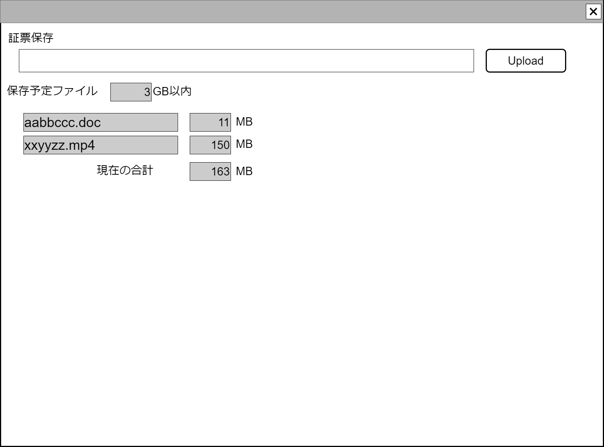

# ファイルアップロード／ストレージ保存コンポーネント設計書

## 状態：仕様未確定(実装不可)

## 1. 目的

指定されたファイルをアップロードしてサーバ側ストレージに保存する

## 2. 構成コンポーネント

なし

## 3.画面イメージ

### 3.1 画面イメージ

### 3.2 画面イメージ(項番)

## 4. フィールド要素一覧

### 4.1 独自フィールド要素一覧

| 番号 |         論理名         |        タイプ        | 活性／表示 |                                内容                                |
| ---- | ---------------------- | -------------------- | ---------- | ------------------------------------------------------------------ |
| 1    | タイトル               | ラベル               | -          | アップロードしようとするファイルがどのような目的であるかを表示する |
| 1    | ファイル指定           | インプット(ファイル) | 活性       | アップロードするファイルを指定すること                             |
| 2    | 合計ファイルサイズ制限 | リスト               | -          | アップロードしたいファイルの詳細を表示すること。下記参照           |
| 2    | 合計ファイルサイズ制限 | テキストエリア       | 非活性     | アップロード上限サイズを表示すること                               |
| 2    | 現在のファイルサイズ   | テキストエリア       | 非活性     | 現在指定されたファイルサイズの合計を表示すること                   |

### 4.2 アップロード予定ファイルリスト

| 番号 |   論理名   |       タイプ       | 活性／表示 |                      内容                      |
| ---- | ---------- | ------------------ | ---------- | ---------------------------------------------- |
| 1    | ファイル名 | インプットテキスト | 非活性     | アップロードしようとするファイルのファイル名称 |
| 1    | サイズ     | インプットテキスト | 非活性     | アップロードしようとするファイルのサイズ       |

※ TODO 必要に応じてアップロード中断のための削除を設けるか検討する

## 5. アクション要素一覧

| 番号 |       論理名       | タイプ | 活性／表示 |                                内容                                |
| ---- | ------------------ | ------ | ---------- | ------------------------------------------------------------------ |
| 1    | アップロードボタン | ボタン | 活性       | アップロードしたいローカルにあるファイル指定の入力を受け付けること |

## 6. インターフェイス

StorageFileUploadInterface

|         論理名         |         物理名          |   型   |                   説明(例)                   |
| ---------------------- | ----------------------- | ------ | -------------------------------------------- |
| 政治団体Id             | politicOrgnaizationId   | Long   | 政治家団体を識別する一意のId                 |
| 政治団体同一識別コード | politicOrgnaizationCode | Long   | 履歴にかかわらず政治家団体を識別する一意のId |
| ファイル名             | fileName                | String | アップロードされたファイル名                 |

## 7. 連携

入力内容が変更された都度、入力チェックを行い親画面に変更内容を通知する`emit[sendStorageFileUploadInterface(未定)]`
