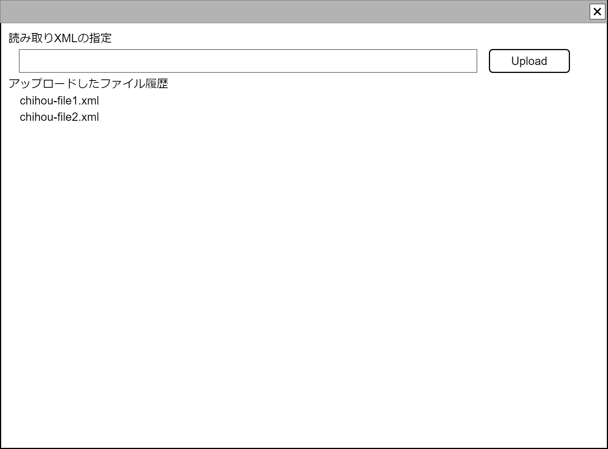

# 汎用XMLアップロード【コンポーネント】設計書

## 状態：仕様未確定(実装不可)

## 1.目的

専用の解析ロジックの必要がないXMLデータの指定アップロードを行う

## 2. 構成コンポーネント

1. 独自フィールド

### 2.1 繰り返し項目

なし

## 3. 画面イメージ

### 3.1 画面イメージ

### 3.2 画面イメージ(項番)

## 4. フィールド要素一覧

| 番号 |    論理名    |        タイプ        | 活性／表示 |                      内容                      |
| ---- | ------------ | -------------------- | ---------- | ---------------------------------------------- |
| 1    | ファイル指定 | インプット(ファイル) | 活性       | 押下時：アップロードするファイルを指定すること |

## 5. アクション一覧

フィールド要素欄で記載したため省略

## 6. 汎用XMLアップロードインターフェイス

GeneralUploadXmlInterface

 |   論理名   |   論理名    |           型            |                           説明(例)                           |
 | ---------- | ----------- | ----------------------- | ------------------------------------------------------------ |
 | XMLのDOM   | xmlData     | XMLDocument(Javascript) | DOMParserにより変換されたDOM形式(XMLDocument) のオブジェクト |
 | ファイル名 | xmlFileName | String                  | アップロードされたファイルのファイル名                       |
 | ユーザId   | userId      | Long                    | ストレージ保存するユーザId                                   |

## 7. 連携

入力内容が変更された都度、入力チェックを行い親画面に変更内容を通知する`emit[sendGeneralUploadXmlInterface(data,errorInfo)]`

## 8. エラー・例外

- DOMParserによりXMLに変換できない場合は例外であること
※業務に必要な名前空間を持つかなど、業務に必要な要件を保持しているかどうかは親画面で判断すること
