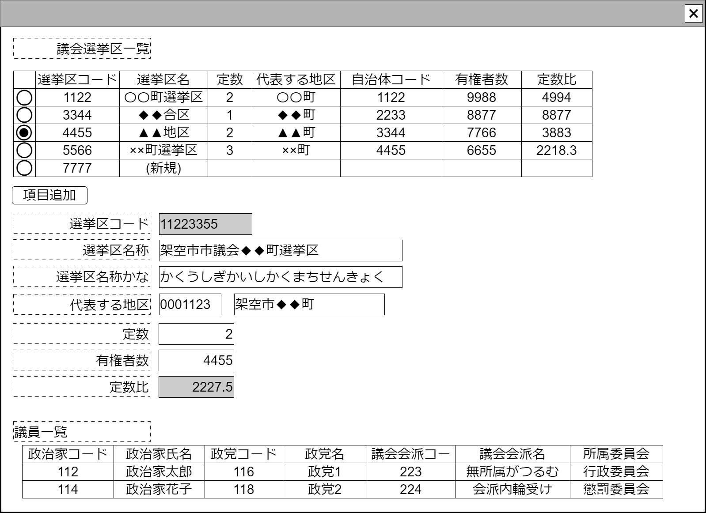

# 議会選挙区入力【コンポーネント】設計書

## 状態：仕様未確定(実装不可)

## 1.目的

個別の仕分けに対して監査意見を付記する(収入項目)

## 2. 構成コンポーネント

1. [議会選挙区選択テーブル](../#)
2. 独自フィールド
3. [議員一覧テーブル](../#)

### 2.1 繰り返し項目

なし

## 3. 画面イメージ

### 3.1 画面イメージ

### 3.2 画面イメージ(項番)

## 4. フィールド要素一覧

| 番号 |             論理名              |          タイプ          | 活性／表示 |                                          内容                                           |
| ---- | ------------------------------- | ------------------------ | ---------- | --------------------------------------------------------------------------------------- |
| 1    | 登録済選挙区テーブル            | テーブル                 | 表示       | 編集対象となる選挙区を表示すること。                                                    |
| 1    | 選挙区テーブル行追加ボタン      | ボタン                   | 活性       | 登録済選挙区テーブルに空のデータからなる行を追加すること。                              |
| 1    | 編集_選挙区同一識別コード       | インプットテキスト       | 非活性     | 編集対象となる選挙区同一識別コードを表示すること。                                      |
| 1    | 編集_選挙区名称                 | インプットテキスト       | 活性       | 編集対象となる選挙区名称の入力を受け付けること                                          |
| 1    | 編集_議員定数                   | インプットテキスト(数字) | 活性       | 編集対象となる選挙区の定数の入力を受け付けること                                        |
| 1    | 編集_代表する地区の自治体コード | インプットテキスト       | 活性       | 編集対象となる主な住所の自治体コード                                                    |
| 1    | 編集_代表する地区の名称         | インプットテキスト       | 活性       | 編集対象となる主な住所の名称                                                            |
| 1    | 編集_有権者数                   | インプットテキスト(数字) | 活性       | 編集対象となる選挙区の有権者数の入力を受け付けること                                    |
| 1    | 編集_定数比                     | インプットテキスト(数字) | 非活性     | 編集対象となる選挙区の有権者数を議員定数で割った値を小数点第2位切り捨てで表示すること。 |
| 1    | 所属議員一覧テーブル            | テーブル                 | 表示       | 選挙区で選出された議員を表示すること。                                                  |

### 4.1 登録済選挙区テーブル フィールド要素一覧

| 番号 |           論理名           |    タイプ    | 活性／表示 |                        内容                        |
| ---- | -------------------------- | ------------ | ---------- | -------------------------------------------------- |
| 1    | 行選択ラジオボタン         | ラジオボタン | 活性       | 選択対象行を指定できること                         |
| 1    | 選挙区コード               | ラベル       | 表示       | 選挙区同一識別コードを表示すること。               |
| 1    | 選挙区名称                 | ラベル       | 表示       | 選挙区名称コードを表示すること。                   |
| 1    | 選挙区定数                 | ラベル       | 表示       | 選挙区定数を表示すること                           |
| 1    | 代表する地区の自治体コード | ラベル       | 表示       | 選挙区のうち、主な地区の自治体コードを表示すること |
| 1    | 代表する地区の名称         | ラベル       | 活性       | 選挙区のうち、主な住所の名称を表示すること         |
| 1    | 有権者数                   | ラベル       | 活性       | 選挙区の有権者数を表示すること                     |
| 1    | 定数比                     | ラベル       | 非活性     | 選挙区の定数比を表示すること。                     |

## 5. アクション一覧

| 番号 |           論理名           | タイプ | 活性／表示 |                            内容                            |
| ---- | -------------------------- | ------ | ---------- | ---------------------------------------------------------- |
| 1    | 選挙区テーブル行追加ボタン | ボタン | 活性       | 登録済選挙区テーブルに空のデータからなる行を追加すること。 |

## 6. 選挙区インターフェイス

ElectionDistrictInterface

 |           論理名           |        論理名        |   型    |                   説明(例)                   |
 | -------------------------- | -------------------- | ------- | -------------------------------------------- |
 | 選挙区Id                   | electionDistrictId   | Long    | 選挙区を識別する一意のId                     |
 | 選挙区同一識別コード       | electionDistrictCode | Integer | 変更履歴にかかわらず同一識別するためのコード |
 | 選挙区名称                 | electionDistrictName | String  | 選挙区名称                                   |
 | 議員定数                   | winnerNum            | Integer | 議員定数(当選者数)                           |
 | 代表する地区の自治体コード | localGovCode         | String  | 代表する地区の自治体コード                   |
 | 代表する地区の自治体名称   | localGovName         | String  | 代表する地区の自治体名称                     |
 | 有権者数                   | voterNum             | Long    | 選挙区の有権者数                             |

※有権者の男女数など、ソフトウェアでは使用しない見込みだが、現実としては登録した方がよさそうな項目がありそうなので、特に項目変更の可能性について留意すること

## 7. 連携

入力内容が変更された都度、入力チェックを行い親画面に変更内容を通知する`emit[sendSampleTemplateInterface(data,errorInfo)]`
