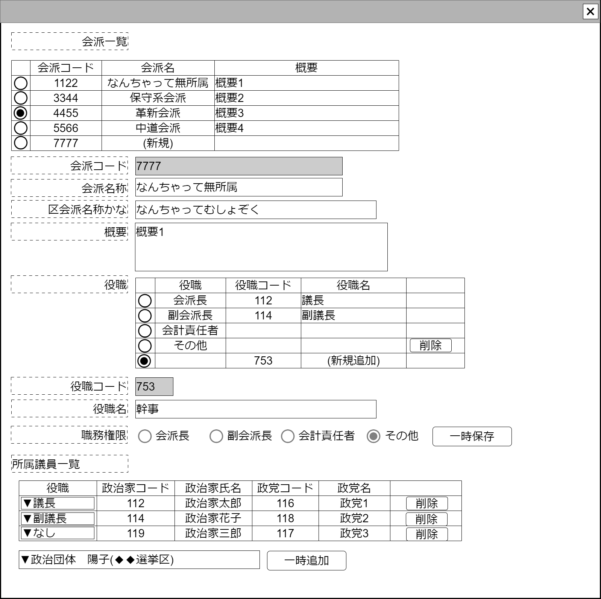

# 議会内会派入力【コンポーネント】設計書

## 状態：仕様未確定(実装不可)

## 1.目的

議会の会派情報の登録を行う

## 2. 構成コンポーネント

1. [登録済会派一覧テーブルコンポーネント](../#)
2. 独自フィールド
3. [組織役職登録コンポーネント](../../common/front/organization_post_input/organization_post_input.md)
4. [所属議論登録コンポーネント](../../common/front/organization_affiliation_input/organization_affiliation_input.md)

### 2.1 繰り返し項目

なし

## 3. 画面イメージ

### 3.1 画面イメージ

### 3.2 画面イメージ(項番)

![議会内会派入力項番(image/議会内会派入力項番.drawio.png)

## 4. フィールド要素一覧

| 番号 |         論理名          |       タイプ       | 活性／表示 |                        内容                        |
| ---- | ----------------------- | ------------------ | ---------- | -------------------------------------------------- |
| 1    | 登録済会派一覧テーブル  | テーブル           | 表示       | 登録済の議会会派を表示すること                     |
| 1    | 新規会派登録ボタン      | ボタン             | 活性       | 下記アクションリストを参照                         |
| 1    | 編集_会派同一識別コード | インプットテキスト | 非活性     | 選択された対象の会派同一識別コードを表示すること   |
| 1    | 編集_名称               | インプットテキスト | 活性       | 選択された対象の会派名称の入力を受け付けること     |
| 1    | 編集_名称かな           | インプットテキスト | 活性       | 選択された対象の会派名称かなの入力を受け付けること |
| 1    | 編集_概要               | テキストエリア     | 活性       | 選択された対象の会派の概要の入力を受け付けること   |
| 1    | 組織役職コンポーネント  | コンポーネント     | 表示       | 編集対象の組織役職を表示・編集を行うこと           |
| 1    | 所属議員コンポーネント  | コンポーネント     | 表示       | 編集対象の所属議員の表示・編集を行うこと           |

## 5. アクション一覧

| 番号 |       論理名       | タイプ | 活性／表示 |                                     内容                                     |
| ---- | ------------------ | ------ | ---------- | ---------------------------------------------------------------------------- |
| 1    | 新規会派登録ボタン | ボタン | 活性       | 押下時：登録済会派一覧テーブルに新しい行を追加し新しい行を選択状態にすること |

## 6. 議会内会派インターフェイス

ParliamentFactionInterface

 |          論理名          |          物理名           |                    型                    |                   説明(例)                   |
 | ------------------------ | ------------------------- | ---------------------------------------- | -------------------------------------------- |
 | 議会内会派Id             | parliamentFactionId       | Long                                     | 会派を識別する一意のId                       |
 | 議会内会派同一識別コード | parliamentFactionCode     | Integer                                  | 変更された会派が同であることを識別するコード |
 | 議会内会派名称           | factionName               | String                                   | 会派名称                                     |
 | 議会内会派名称かな       | factionNameKana           | String                                   | 会派名称かな                                 |
 | 議会内会派摘要           | factionExplain            | String                                   | 会派摘要                                     |
 | 議会内会派役職リスト     | listPostAllHasOrg         | List\<PostAllHasOrganizationInterface\>  | 会派に存在する役職リスト                     |
 | 議会内会派所属議員リスト | listAffuliationPolitician | List\<OrgnaizationAffiliationInterface\> | 会派に所属議員リスト                         |

## 7. 連携

親画面から`props{parliamentFactionDto:ParliamentFactionInterface}`を受け取り、`computed`を設定することで変更状態を常に親画面に通知すること
