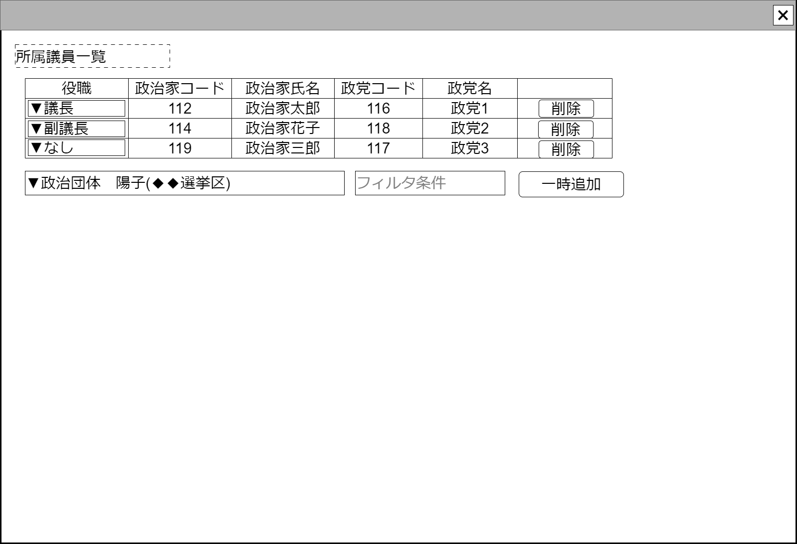

# 組織内所属議員入力【コンポーネント】設計書

## 状態：仕様未確定(実装不可)

## 1.目的

組織における所属議員の情報入力を受け付ける

## 2. 構成コンポーネント

1. 独自フィールド

### 2.1 繰り返し項目

なし

## 3. 画面イメージ

### 3.1 画面イメージ

### 3.2 画面イメージ(項番)

## 4. フィールド要素一覧

| 番号 |           論理名           |       タイプ       | 活性／表示 |                                       内容                                       |
| ---- | -------------------------- | ------------------ | ---------- | -------------------------------------------------------------------------------- |
| 1    | 登録済所属議員一覧テーブル | テーブル           | －         | 登録済の所属議員一覧を表示すること。                                             |
| 1    | 議会登録議員選択           | セレクトボックス   | 活性       | 議会に所属する議員が一覧できること                                               |
| 1    | 議会登録議員選択フィルタ   | インプットテキスト | 活性       | 議会登録議員選択をフィルタする条件を入力できること                               |
| 1    | 議会登録議員一時追加ボタン | ボタン             | 活性       | 議会登録議員選択で選択されている議員を登録済所属議員一覧テーブルに行追加すること |

### 4.1 登録済所属議員一覧テーブル フィールド要素一覧

| 番号 |      論理名      |           タイプ           | 活性／表示 |                                     内容                                     |
| ---- | ---------------- | -------------------------- | ---------- | ---------------------------------------------------------------------------- |
| 1    | 役職選択ボックス | セレクトボックス(複数選択) | 活性       | 仮登録も含め、登録済の役職リストから選任されている役職の入力を受け付けること |
| 1    | 政治家コード     | ラベル                     | 表示       | 政治家コードを表示すること                                                   |
| 1    | 政治家氏名       | ラベル                     | 表示       | 政治家氏名を表示すること                                                     |
| 1    | 政党コード       | ラベル                     | 表示       | 組織所属政治家が属する政党の同一識別コードを表示すること                     |
| 1    | 政党名称         | ラベル                     | 表示       | 組織所属政治家が属する政党の名称を表示すること                               |
| 1    | 議会会派コード   | ラベル                     | 表示       | 組織所属政治家が属する議会会派の同一識別コードを表示すること                 |
| 1    | 議会会派名称     | ラベル                     | 表示       | 組織所属政治家が属する議会会派の名称を表示すること                           |
| 1    | 削除ボタン       | ボタン                     | 活性       | 押下された行のデータが削除されること                                         |

※権力分散の観点から役職を複数選択する可能性は低いが、選任者の病気退任／不祥事等で、不意の辞職時に空席にしないで兼務を選択する場合を想定して、複数選択できると明示している。現実の問題としてそこまで細かく更新するか？と思うが将来の自動更新も視野に入れている

## 5.アクション一覧

| 番号 |           論理名           | タイプ | 活性／表示 |                                       内容                                       |
| ---- | -------------------------- | ------ | ---------- | -------------------------------------------------------------------------------- |
| 1    | 議会登録議員一時追加ボタン | ボタン | 活性       | 議会登録議員選択で選択されている議員を登録済所属議員一覧テーブルに行追加すること |
| 1    | (テーブル行)削除           | ボタン | 活性       | 押下時：自身のデータを削除するよう親画面に通知すること                           |

## 6. 組織内所属議員インターフェイス

OrgnaizationAffiliationInterface

|      論理名      |        論理名         |     型     |                           説明(例)                           |
| ---------------- | --------------------- | ---------- | ------------------------------------------------------------ |
| 選任役職リスト   | listHasPost           | List<Long> | 役職リストから選択された役職Idを格納する                     |
| 政治家Id         | politicianId          | Long       | 政治家コードを表示すること                                   |
| 政治家同一識別コード     | politicianCode        | Long       | 政治家コードを表示すること                                   |
| 政治家氏名       | politicianName        | String     | 政治家氏名を表示すること                                     |
| 政党Id           | politicPartyId        | Long       | 組織所属政治家が属する政党の同一識別コードを表示すること     |
| 政党コード       | politicPartyCode      | Long       | 組織所属政治家が属する政党の同一識別コードを表示すること     |
| 政党名称         | politicPartyName      | String     | 組織所属政治家が属する政党の名称を表示すること               |
| 議会会派Id       | politicFactionCode    | Long       | 組織所属政治家が属する議会会派の同一識別コードを表示すること |
| 議会会派コード   | politicFactionCode    | Long       | 組織所属政治家が属する議会会派の同一識別コードを表示すること |
| 議会会派名称     | politicFactionName    | String     | 組織所属政治家が属する議会会派の名称を表示すること           |
| 議会委員会Id     | politicCommissionCode | Long       | 組織所属政治家が属する議会会派の同一識別コードを表示すること |
| 議会委員会コード | politicCommissionCode | Long       | 組織所属政治家が属する議会会派の同一識別コードを表示すること |
| 議会委員会名称   | politicCommissionName | String     | 組織所属政治家が属する議会会派の名称を表示すること           |

## 7. 連携

入力内容が変更された都度、入力チェックを行い親画面に変更内容を通知する`emit[sendOrgnaizationAffiliationInterface(data,errorInfo)]`
