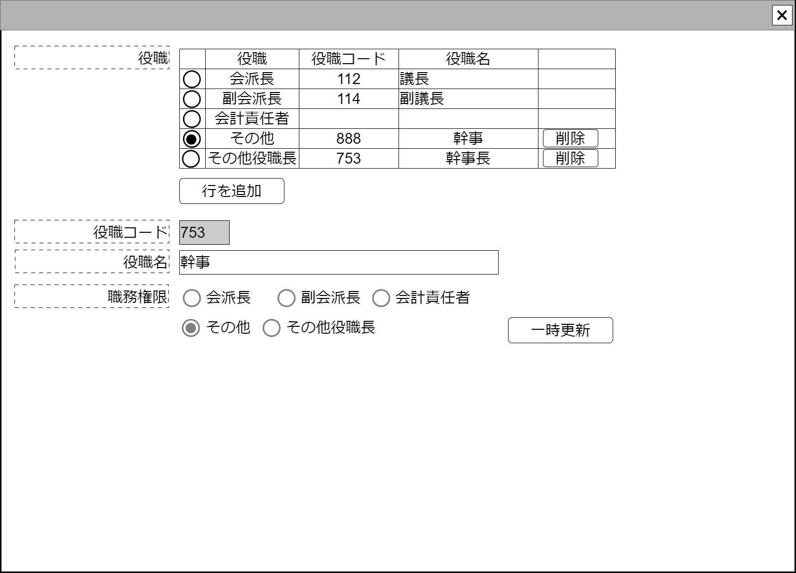

# 組織内役職【コンポーネント】設計書

## 状態：仕様未確定(実装不可)

## 1.目的

組織内に設置された役職の編集管理を行う

## 2. 構成コンポーネント

1. 独自フィールド

### 2.1 繰り返し項目

なし

## 3. 画面イメージ

### 3.1 画面イメージ

### 3.2 画面イメージ(項番)

## 4. フィールド要素一覧

| 番号 |            論理名             |       タイプ       |  活性／表示  |                                         内容                                         |
| ---- | ----------------------------- | ------------------ | ------------ | ------------------------------------------------------------------------------------ |
| 1    | 登録済役職リストテーブル      | テーブル           | -            | 登録済役職を一覧すること                                                             |
| 1    | 行追加ボタン                  | ボタン             | 活性         | 押下時：テーブルに新規に行を追加し、選択状態にすること                               |
| 1    | 編集_役職同一識別コード       | インプットテキスト | 非活性       | 役職同一識別コードを表示すること                                                     |
| 1    | 編集_役職名称                 | インプットテキスト | 活性         | 役職名称の入力を受け付けること                                                       |
| 1    | 編集_職務権限区分組織長       | ラジオボタン       | 非活性       | 役職の職務権限を表示すること                                                         |
| 1    | 編集_職務権限区分副組織長     | ラジオボタン       | 非活性       | 役職の職務権限を表示すること                                                         |
| 1    | 編集_職務権限区分その他       | ラジオボタン       | 非活性／活性 | 役職の職務権限(その他)を表示すること                                                 |
| 1    | 編集_職務権限区分その他役職長 | ラジオボタン       | 非活性／活性 | 役職の職務権限(その他の役職長)を表示すること                                         |
| 1    | 一時更新ボタン                | ボタン             | 活性         | 押下時：編集中のデータを保存し、一時データの更新が行われたことを親画面に通知すること |

### 4.1 登録済役職リスト フィールド要素一覧

| 番号 |       論理名       |    タイプ    |  活性／表示  |                                                    内容                                                    |
| ---- | ------------------ | ------------ | ------------ | ---------------------------------------------------------------------------------------------------------- |
| 1    | 行選択ボタン       | ラジオボタン | 活性         | 行選択入力を受け付けること                                                                                 |
| 1    | 役職職務権限区分   | ラベル       | 表示         | 登録済の役職の職務権限を表示すること                                                                       |
| 1    | 役職同一識別コード | ラベル       | 表示         | 登録済の役職同一識別コードを表示すること                                                                   |
| 1    | 役職名称           | ラベル       | 表示         | 登録済の役職名称の入力を表示すること                                                                       |
| 1    | 編集_職務権限区分  | ラベル       | 非活性       | 役職の職務権限を表示すること                                                                               |
| 1    | 行削除ボタン       | ボタン       | 活性／非表示 | 押下時：押下された行のデータを削除すること。役職職務権限がその他、その他役職長以外の行では非表示であること |

## 5. アクション一覧

| 番号 |     論理名     | タイプ | 活性／表示 |                                         内容                                         |
| ---- | -------------- | ------ | ---------- | ------------------------------------------------------------------------------------ |
| 1    | 行追加ボタン   | ボタン | 活性       | 押下時：テーブルに新規に行を追加し、選択状態にすること                               |
| 1    | 削除ボタン     | ボタン | 活性       | 押下時：押下されたボタンが属する行をテーブルから削除すること                         |
| 1    | 一時更新ボタン | ボタン | 活性       | 押下時：編集中のデータを保存し、一時データの更新が行われたことを親画面に通知すること |

### 5.1 行選択ボタン

共通：選択された行の情報を表示すること

a.職務権限区分が組織長・副組織長・会計責任者の場合

- 編集_職務権限区分その他ラジオボタンを非活性にすること
- 編集_職務権限区分その他役職長ラジオボタンを非活性にすること

b.職務権限区分がその他・その他組織長の場合

- 編集_職務権限区分その他ラジオボタンを活性にすること
- 編集_職務権限区分その他役職長ラジオボタンを活性にすること

## 6. 組織所持役職インターフェイス

PostAllHasOrganizationInterface

 |              論理名              |        論理名         |                型                 |                                                       説明(例)                                                       |
 | -------------------------------- | --------------------- | --------------------------------- | -------------------------------------------------------------------------------------------------------------------- |
 | 組織区分                         | organizationKbn       | Integer                           | 組織を区分する定数                                                                                                   |
 | 役職が所属する組織Id             | hasOrganizationId     | Long                              | 役職一覧を表示する組織Id。××党の役職について編集するなら××党を一意に識別するId                                       |
 | 役職が所属する組織同一識別コード | hasOrganizationCode   | Integer                           | 役職一覧を表示する組織同一識別コード。××党の役職について編集するなら××党同一識別コード                               |
 | 役職が所属する組織名称           | hasOrganizationName   | Strig                             | 役職一覧を表示する組織名称。××党の役職について編集するなら××党名称                                                   |
 | 組織長役職                       | chiefPost             | OrganizationPostInterface         | 組織長を表す役職Object。役職職務権限区分が`1:組織長`であるデータ以外を受け付けないこと                               |
 | 副組織長役職                     | subchiefPost          | OrganizationPostInterface         | 副組織長を表す役職Object。役職職務権限区分が`2:副組織長`であるデータ以外を受け付けないこと                           |
 | 会計責任者役職                   | accountingManagerPost | OrganizationPostInterface         | 会計責任者を表す役職Object。役職職務権限区分が`11:会計責任者`であるデータ以外を受け付けないこと                      |
 | 役職職務権限区分                 | listOtherPost         | List\<OrganizationPostInterface\> | その他の役職を表す役職リスト。役職職務権限区分は`90:その他役職長`、`99:その他役職`であるデータ以外を受け付けないこと |

### 6.1 組織内役職インターフェイス

OrganizationPostInterface
SelectOptionInterfaceを継承すること

 |            論理名            |        論理名        |   型    |                     説明(例)                     |
 | ---------------------------- | -------------------- | ------- | ------------------------------------------------ |
 | 組織内役職Id                 | organizationPostId   | Long    | 組織内役職を識別する一意のId                     |
 | 組織内役職同一識別コード     | organizationPostCode | Integer | 組織内役職の同一識別コード                       |
 | 組織内役職名称               | organizationPostName | String  | 組織内役職名称                                   |
 | セレクトボタンの値           | value                | String  | 組織内役職Idと同一であること                     |
 | セレクトボタンの表示テキスト | text                 | String  | 組織内役職名称organizationPostNameと同一であるこ |
 | 役職職務権限区分             | organizationPostKbn  | Integer | 役職職務権限区分                                 |

### 6.2 役職職務権限区分

|    論理名    |  値  |                                              説明                                               |
| ------------ | ---: | ----------------------------------------------------------------------------------------------- |
| 組織長       |    1 | 組織長。党なら党首、党総裁、委員会なら委員長など                                                |
| 副組織長     |    2 | 副組織長。副党首、副総裁、副リーダーなど                                                        |
| 会計責任者   |   11 | 会計責任者。                                                                                    |
| その他役職長 |   90 | 例えば組織内役職であるところの幹事が、幹事会を持っており、その幹事会の長=幹事長などの場合に選択 |
| その他役職   |   99 | その他の組織特有の役職。世話人、幹事など                                                        |

### 6.3 組織区分

|    論理名    |  値  |     説明     |
| ------------ | ---: | ------------ |
| 政治団体     |   11 | 政治団体     |
| 政治団体支部 |   12 | 政治団体支部 |
| 議会内委員会 |   21 | 議会内委員会 |
| 議会内会派   |   22 | 議会内会派   |
| 政党         |   31 | 政党         |
| 政党支部     |   32 | 政党支部     |
| 政党政策集団 |   33 | 政党政策集団 |

## 7. 連携

一時更新ボタン押された場合は通知すること`emit[sendPostAllHasOrganizationInterface(data)]`
