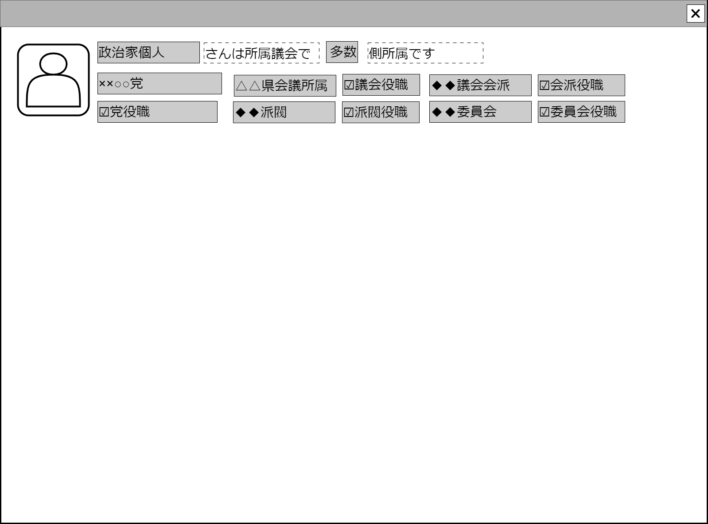

# 政治家表示【コンポーネント】設計書

## 状態：必要に応じて微修正

## 1. 目的

調査しようとする政治家について調査において考慮すべき属性を表示すること

## 2. 構成コンポーネント

なし

## 3. 画面イメージ

### 3.1 画面イメージ

### 3.2 画面イメージ(項番)

## 4. フィールド要素一覧

| 番号 |       論理名       |       タイプ       | 活性／表示 |                                                          内容                                                          |
| ---- | ------------------ | ------------------ | ---------- | ---------------------------------------------------------------------------------------------------------------------- |
| 2    | 政治家アイコン     | イメージ           | 非活性     | 固定アイコン(実際の政治家の写真に入れ替える機能は、調査操作での調査対象への抽象度を下げる要因となるので実装しないこと) |
| 2    | 政治家姓名         | インプットテキスト | 非活性     | 政治家姓名                                                                                                             |
| 3    | 多数派テキスト     | インプットテキスト | 非活性     | 値1:「多数」、値0:「少数」※TODO 安定多数などの項目が増えることも想定して2項値にしない。決定次第修正する               |
| 3    | 政党名称           | インプットテキスト | 非活性     | 政党名「自由民主党」                                                                                                   |
| 3    | 議会名称           | インプットテキスト | 非活性     | 議会名の表示「××市議会」                                                                                               |
| 3    | 議会役職有無       | チェックボックス   | 非活性     | 議会役職についており、役職権限を持つ場合はtrue                                                                         |
| 3    | 議会会派名称       | インプットテキスト | 非活性     | 議会会派名称「無所属の集合体」                                                                                         |
| 3    | 議会会派役職有無   | チェックボックス   | 非活性     | 会派役職についており、役職権限を持つ場合はtrue                                                                         |
| 3    | 党役職有無         | チェックボックス   | 非活性     | 党の役職についており、役職権限を持つ場合はtrue                                                                         |
| 3    | 党派閥名称         | インプットテキスト | 非活性     | 党派閥名称「××氏を議長に推薦するグループ」                                                                             |
| 3    | 等派閥役職有無     | チェックボックス   | 非活性     | 党派閥役職についており、役職権限を持つ場合はtrue                                                                       |
| 3    | 議会委員会名称     | インプットテキスト | 非活性     | 所属する議会委員会の名称「行政委員会」                                                                                 |
| 3    | 議会委員会役職有無 | チェックボックス   | 非活性     | 委員会役職についており、役職権限を持つ場合はtrue                                                                       |

## 6. アクション要素一覧

なし

## 6. 政治家表示インターフェース

政治家を概要表示するときに表示する満たすべき要素。

PoliticianViewInterface

 |       論理名       |          論理名           |   型    |                                                                    説明(例)                                                                     |
 | ------------------ | ------------------------- | ------- | ----------------------------------------------------------------------------------------------------------------------------------------------- |
 | 政治家Id           | politicianId              | Long    | 政治家を識別する一意のId                                                                                                                        |
 | 政治家姓名         | pliticianName             | String  | 政治家姓名                                                                                                                                      |
 | 多数派区分         | majorityKbn               | Integer | 値1:「多数」、値0:「少数」※TODO 安定多数などの項目が増えることも想定して2項値にしない。決定次第修正する                                        |
 | 多数派テキスト     | majorityText              | String  | 値1:「多数」、値0:「少数」                                                                                                                      |
 | 政党Id             | politicPartyId            | Long    | 政党を識別する一意のId                                                                                                                                      |
 | 政党名称           | politicPartyName          | String  | 政党名「国会に直接民主制を促進する会」                                                                                                          |
 | 政党役職有無       | hasPostPoliticParty       | Boolean | 党の役職についており、役職権限を持つ場合はtrue                                                                                                  |
 | 議会Id             | parliamentId              | Long    | 地方議会については地方自治体番号のような既存統一番号の使用が望ましい                                                                                |
 | 議会名称           | parliamentName            | String  | 議会名の表示「なんとか市議会」                                                                                                                  |
 | 議会役職有無       | hasPostParliament         | Boolean | 議会役職についており、役職権限を持つ場合はtrue                                                                                                  |
 | 議会会派Id         | parliamentSectId          | String  | 議会会派名称「無所属の集合体」                                                                                                                  |
 | 議会会派名称       | parliamentSectName        | String  | 議会会派名称「無所属の集合体」                                                                                                                  |
 | 議会会派役職有無   | hasPostParliamentSect     | Boolean | 会派役職についており、役職権限を持つ場合はtrue                                                                                                  |
 | 党派閥名称Id       | partySectId               | String  | 党派閥名称を一意に識別するId                                                                                                    |
 | 党派閥名称         | partySectName             | String  | 党派閥名称「田中氏を議長に推薦するグループ」                                                                                                    |
 | 等派閥役職有無     | hasPostPartySect          | Boolean | 党派閥役職についており、役職権限を持つ場合はtrue                                                                                                |
 | 議会委員会Id       | committeePaliamentId      | String  | 議会委員会Id。地方議会では常設委員会については一定の拘束があるようなので、枝番化(ex.議会Idが「12345」なら「12345_001など」)が望ましいと思われる |
 | 議会委員会名称     | committeePaliamentName    | String  | 所属する議会委員会の名称「行政委員会」                                                                                                          |
 | 議会委員会役職有無 | hasPostCommitteePaliament | Boolean | 委員会役職についており、役職権限を持つ場合はtrue                                                                                                |

## 7. 連携

入力内容が変更された都度、入力チェックを行い親画面に変更内容を通知する`emit[sendPoliticianViewInterface(data,errorInfo)]`
