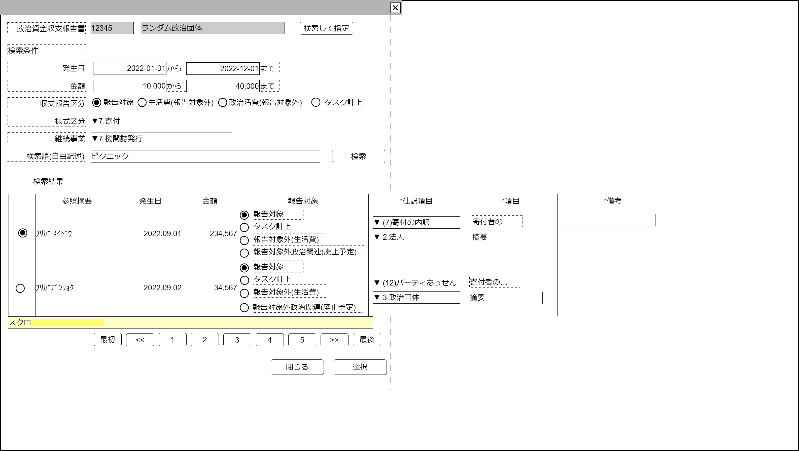

# 収支報告書収入項目検索【コンポーネント】設計書

## 状態：仕様未確定(実装不可)

## 1.目的

指定された政治資金収支報告書の収入項目を検索し、必要に応じて選択する

## 2. 構成コンポーネント

1. [政治資金収支報告書コンポーネント](../_search_political_balancesheet/search_political_balancesheet.md)
2. 独自フィールド

### 2.1 繰り返し項目

なし

## 3. 画面イメージ

### 3.1 画面イメージ

### 3.2 画面イメージ(項番)

## 4. フィールド要素一覧

| 番号 |                論理名                |          タイプ          | 活性／表示 |                                内容                                |
| ---- | ------------------------------------ | ------------------------ | ---------- | ------------------------------------------------------------------ |
| 1    | 政治資金収支報告書検索コンポーネント | コンポーネント           | 表示       | 押下時：政治資金収支報告書検索コンポーネントを表示すること         |
| 1    | 検索条件発生日開始                   | インプットテキスト(日付) | 活性       | 発生日の検索条件(開始日)の入力を受け付けること                     |
| 1    | 検索条件発生日終了                   | インプットテキスト(日付) | 活性       | 発生日の検索条件(終了日)の入力を受け付けること                     |
| 1    | 検索条件取引金額下限                 | インプットテキスト(数値) | 活性       | 取引金額の検索条件(下限)の入力を受け付けること                     |
| 1    | 検索条件取引金額上限                 | インプットテキスト(数値) | 活性       | 取引金額の検索条件(上限)の入力を受け付けること                     |
| 1    | 検索条件報告区分(報告)               | ラジオボタン             | 活性       | 収支報告区分の検索条件(報告)の入力を受け付けること                 |
| 1    | 検索条件報告区分(生活費)             | ラジオボタン             | 活性       | 収支報告区分の検索条件(生活費)の入力を受け付けること               |
| 1    | 検索条件報告区分(政治活動費)         | ラジオボタン             | 活性       | 収支報告区分の検索条件(政治活動費)の入力を受け付けること           |
| 1    | 検索条件報告区分(タスク計上)         | ラジオボタン             | 活性       | 収支報告区分の検索条件(タスク計上)の入力を受け付けること           |
| 1    | 検索条件様式区分                     | セレクトボックス         | 活性       | 様式区分の検索条件の入力を受け付けること                           |
| 1    | 検索条件継続事業                     | セレクトボックス         | 活性       | 継続事業の検索条件の入力を受け付けること                           |
| 1    | 検索ボタン                           | ボタン                   | 活性       | 押下時：検索を行いその結果を表示すること                           |
| 1    | 収入項目検索結果テーブル             | テーブル                 | 表示       | 政治資金収支報告書収入項目検索結果が表示されること                 |
| 1    | 検索ページングエリア                 | エリア                   | 表示       | 政治資金収支報告書収入項目検索結果のページング機能が提供されること |

### 4.1 政治資金収支報告書収入項目テーブル フィールド要素一覧

| 番号 |       論理名       |    タイプ    | 活性／表示 |                                      内容                                      |
| ---- | ------------------ | ------------ | ---------- | ------------------------------------------------------------------------------ |
| 1    | 行選択ラジオボタン | ラジオボタン | 活性       | 押下時：この行のデータが選択状態であることの入力を受け付けること               |
| 1    | 参照摘要           | ラベル       | 表示       | 仕訳項目を呼び出すキーとなる参照摘要を表示すること                             |
| 1    | 発生日             | ラベル       | 表示       | この仕訳項目の発生日を表示すること                                             |
| 1    | 取引金額           | ラベル       | 表示       | この仕訳項目の取引金額を表示すること                                           |
| 1    | 収支報告区分       | ラベル       | 表示       | この仕訳項目の報告区分を表示すること                                           |
| 1    | 様式区分           | ラベル       | 表示       | この仕訳項目の様式区分を表示すること                                           |
| 1    | 様式区分枝項目     | ラベル       | 表示       | この仕訳項目の様式区分枝項目を表示すること                                     |
| 1    | 摘要の説明         | ラベル       | 表示       | この仕訳項目の摘要がどのような項目であるか、様式区分に紐づく説明を表示すること |
| 1    | 摘要               | ラベル       | 表示       | この仕訳項目の摘要を表示すること                                               |
| 1    | 備考               | ラベル       | 表示       | この仕訳項目の備考を表示すること                                               |

※TODO 検索結果のページングについては共通コンポーネントを作成するか、各ページで実装するか検討中のため、ソフトウェア全体で統一する挙動については[議会検索](../serach_paliament/serach_paliament.md)のページを参照すること

## 5. アクション一覧

| 番号 |                 論理名                 | タイプ | 活性／表示 |                                           内容                                           |
| ---- | -------------------------------------- | ------ | ---------- | ---------------------------------------------------------------------------------------- |
| 1    | 政治資金収支報告書を検索して指定ボタン | ボタン | 活性       | 押下時：政治資金収支報告書検索コンポーネントを表示すること                               |
| 1    | 検索ボタン                             | ボタン | 活性       | 押下時：入力された検索条件で政治資金収支報告書を検索した結果を表示テーブルで一覧すること |
| 1    | キャンセル                             | ボタン | 活性       | 押下時：このコンポーネントを閉じること                                                   |
| 1    | 選択                                   | ボタン | 活性       | 押下時：選択されたデータを親画面に通知しこのコンポーネントを閉じること                   |

## 6. 収支報告書収入最低限インターフェイス

BalancesheetIncomeLeastInterface

|          論理名          |       物理名       |   型    |                              説明(例)                               |
| ------------------------ | ------------------ | ------- | ------------------------------------------------------------------- |
| 収入データId             | incomeId           | String  | 読み込みした書証Id。例示：「111-20221101-333」                      |
| 収入データ同一識別コード | incomeCode         | Long    | 変更した際に同一意味の書証であることを識別するコード。例示：「333」 |
| 書証Id                   | shoshouId          | String  | 読み込みした書証Id。例示：「111-20221101-333」                      |
| 書証識別コード           | shoshouHistroyCode | Long    | 変更した際に同一意味の書証であることを識別するコード。例示：「333」 |
| 書証区分                 | shoshouKbn         | String  | 書証を区分する。書証アップロード機能参照                            |
| 参照した摘要             | referDigest        | String  | 書証に記載された取引概要。例示：「ﾌﾘｺﾐ ﾕｳｹﾝｼｬﾀﾛｳ」                  |
| 収支報告区分             | reportKbn          | Integer | 支出／収入                                                          |
| 様式仕訳区分             | yoshikiKbn         | String  | 様式仕訳区分。収入データ編集参照                                    |
| 様式仕訳枝項目区分       | yoshikiEdaKbn      | String  | 様式仕訳枝項目区分。収入データ編集参照                              |
| 発生日                   | accrualDate        | String  | 取引発生日                                                          |
| 取引金額                 | amount             | Long    | 取引した金額                                                        |
| 項目名称                 | itemName           | String  | 項目名称                                                            |
| 個人・団体住所           | orgnizationAddress | Integer | 個人または団体住所                                                  |
| 備考                     | biko               | String  | 備考                                                                |

## 7. 連携

選択ボタンが押下れた時に検索内容の中から指定された内容を通知する`emit[sendBalancesheetIncomeLeastInterface(data:BalancesheetIncomeLeastInterface)]`
