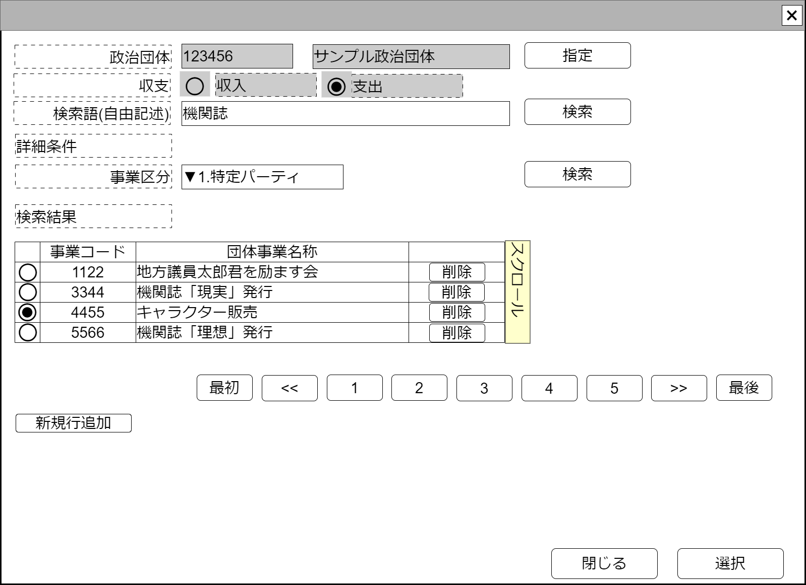

# 継続事業検索【コンポーネント】設計書

## 状態：仕様未確定(再利用可能レベルまで実装可能)

## 1.目的

継続事業を検索し、選択された値を通知する
編集可能時には行追加、行削除を行えるようにする

## 2. 構成コンポーネント

1. [政治団体検索コンポーネント](../search_politic_orgnization/search_politic_orgnization.md)
2. 独自フィールド

### 2.1 繰り返し項目

なし

## 3. 画面イメージ

### 3.1 画面イメージ

### 3.2 画面イメージ(項番)

## 4. フィールド要素一覧

| 番号 |           論理名           |       タイプ       |      活性／表示      |                                         内容                                         |
| ---- | -------------------------- | ------------------ | -------------------- | ------------------------------------------------------------------------------------ |
| 1    | 政治団体同一識別コード     | インプットテキスト | 非活性               | 政治団体同一識別コードを表示すること                                                 |
| 1    | 政治団体名称               | インプットテキスト | 非活性               | 政治団体名称を表示すること                                                           |
| 1    | 政治団体検索               | ボタン             | 活性                 | 押下時：政治団体検索コンポーネントを表示すること                                     |
| 1    | 収支の別ラジオボタン(収入) | ラジオボタン       | 活性                 | 収支の別の入力を受け付けること                                                       |
| 1    | 収支の別ラジオボタン(支出) | ラジオボタン       | 活性                 | 収支の別の入力を受け付けること                                                       |
| 1    | 検索条件政治団体名称       | インプットテキスト | 活性                 | 検索条件となる政治団体名称の入力を受け付けること                                     |
| 1    | 政治団体名称検索           | ボタン             | 活性                 | 押下時：政治団体名称で検索した結果を一覧すること                                     |
| 1    | 検索条件事業区分選択       | セレクトボックス   | 活性                 | 検索条件様式区分の入力を受け付けること                                               |
| 1    | 政治団体詳細検索           | ボタン             | 活性                 | 押下時：政治団体を詳細な検索条件(事業区分)で検索した結果を一覧すること               |
| 1    | 継続事業検索結果テーブル   | テーブル           | 表示                 | 継続事業検索結果が表示されること                                                     |
| 1    | 検索ページングエリア       | エリア             | 表示                 | 継続事業検索結果のページング機能が提供されること                                     |
| 1    | 新規行追加                 | ボタン             | 活性 表示／非表示 | 押下時：継続事業検索結果テーブルの最終に新しい行を追加し、その行を選択状態とすること |

### 4.1 継続事業検索結果テーブル　フィールド要素一覧

| 番号 |         論理名         |    タイプ    |      活性／表示      |                                                       内容                                                       |
| ---- | ---------------------- | ------------ | -------------------- | ---------------------------------------------------------------------------------------------------------------- |
| 1    | 行選択ラジオボタン     | ラジオボタン | 活性                 | 押下時：この行のデータが選択状態であることの入力を受け付けること 編集可能時には選択された値を即時送信すること |
| 1    | 継続事業同一識別コード | ラベル       | 表示                 | 継続事業同一識別コードを表示すること                                                                             |
| 1    | 継続事業名称           | ラベル       | 表示                 | 継続事業名称を表示すること                                                                                       |
| 1    | 行削除                 | ボタン       | 活性 表示／非表示 | 押下時：押下された行を削除すること                                                                               |

※TODO 検索結果のページングについては共通コンポーネントを作成するか、各ページで実装するか検討中のため、ソフトウェア全体で統一する挙動については[議会検索](../serach_paliament/serach_paliament.md)のページを参照すること

## 5. アクション一覧

| 番号 |      論理名      | タイプ | 活性／表示 |                                         内容                                         |
| ---- | ---------------- | ------ | ---------- | ------------------------------------------------------------------------------------ |
| 1    | キャンセル       | ボタン | 活性       | 押下時：このコンポーネントを閉じること                                               |
| 1    | 選択             | ボタン | 活性       | 押下時：選択されたデータを親画面に通知しこのコンポーネントを閉じること               |
| 1    | 政治団体検索     | ボタン | 活性       | 押下時：政治団体検索コンポーネントを表示すること                                     |
| 1    | 政治団体名称検索 | ボタン | 活性       | 押下時：政治団体名称で検索した結果を一覧すること                                     |
| 1    | 新規行追加       | ボタン | 活性       | 押下時：継続事業検索結果テーブルの最終に新しい行を追加し、その行を選択状態とすること |

### 5.X 編集許可フラグ

a. 編集許可フラグが`許可:true`のとき

- 新規行追加ボタンを表示すること
- 行削除ボタンを表示すること
- キャンセルボタンを非表示すること
- 選択ボタンを非表示すること

b. 編集許可フラグが`不許可:false`のとき

- 新規行追加ボタンを非表示にすること
- 行削除ボタンを非表示にすること
- キャンセルボタンを表示すること
- 選択ボタンを表示すること

## 6. 継続事業インターフェイス

ContinueBuissinessInterface

SelectOptionIntefaceを継承すること。*は継承している値

 |            論理名            |         論理名         |   型    |                     説明(例)                     |
 | ---------------------------- | ---------------------- | ------- | ------------------------------------------------ |
 | 継続事業Id                   | continueBuissinessId   | Long    | 継続事業を識別する一意のId。                     |
 | 継続事業同一識別コード       | continueBuissinessCode | Integer | 継続事業の変更に対応するための同一識別コード。   |
 | 事業区分                     | buissinessKbn          | Integer | `1:特定パーティ開催`、`2:機関誌発行`、`3:その他` |
 | 継続事業名称                 | buissinessName         | String  | 共通事業名称                                     |
 | セレクトボタンの値           | value                  | String  | *セレクトボタンの値。(継続事業Id)                |
 | セレクトボタンの表示テキスト | text                   | String  | *セレクトボタンの表示テキスト(継続事業名称)      |

※TODO 事業区分については未分明のため修正を行う

## 7. 連携

- キャンセルイベント送信を`emit(sendCancelSearchContinueBuissiness)`ですること
- 選択イベント送信を`emit(sendContinueBuissinessInterface,selectedDto)`ですること
- 親コンポーネントから編集許可フラグ`props{isEditavble:boolean}`を受け取り、編集できる場合と編集できない場合の状態が選択できること
- 親画面から収支の別`props{isIncome:number}`を受信すること

### 7.1 政治団体検索コンポーネント

- コンポーネントからのキャンセルイベント受信を`recieveCancelSearchPoliticOrganization()`ですること
- コンポーネントからの選択イベント受信を`recievePoliticOrganizationInterface(selectedDto)`ですること
- コンポーネントに編集許可フラグ`isEditavble`に`false`を設定し、検索コンポーネントでの編集を禁止すること
