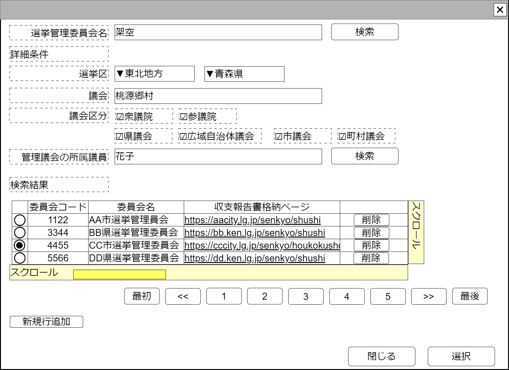

# 選挙管理委員会検索【コンポーネント】設計書

## 状態：仕様未確定(実装不可)

## 1.目的

選挙管理委員会を検索し、必要に応じて選択する

## 2. 構成コンポーネント

1. 独自フィールド

### 2.1 繰り返し項目

なし

## 3. 画面イメージ

### 3.1 画面イメージ

### 3.2 画面イメージ(項番)

## 4. フィールド要素一覧

| 番号 |               論理名               |       タイプ       | 活性／表示 |                                           内容                                           |
| ---- | ---------------------------------- | ------------------ | ---------- | ---------------------------------------------------------------------------------------- |
| 1    | 検索条件選挙管理委員会名称         | インプットテキスト | 活性       | 検索条件選挙管理委員会名称の入力を受け付けること                                         |
| 1    | 選挙管理委員会名称による検索ボタン | ボタン             | 活性       | 選挙管理委員会名称を検索条件として選挙管理委員会を検索した場合の結果の一覧を表示すること |
| 1    | 検索条件地方フィルタ               | セレクトボックス   | 活性       | 選択時：検索条件都道府県選択のフィルタを行うこと                                         |
| 1    | 検索条件都道府県選択               | セレクトボックス   | 活性       | 都道府県条件で検索をする場合の検索条件の入力を受け付けること                             |
| 1    | 検索条件議会名称                   | インプットテキスト | 活性       | 検索条件議会名称の入力を受け付けること                                                   |
| 1    | 検索条件議会区分(衆議院)           | チェックボックス   | 活性       | 検索条件議会区分の入力を受け付けること                                                   |
| 1    | 検索条件議会区分(参議院)           | チェックボックス   | 活性       | 検索条件議会区分の入力を受け付けること                                                   |
| 1    | 検索条件議会区分(県議会)           | チェックボックス   | 活性       | 検索条件議会区分の入力を受け付けること                                                   |
| 1    | 検索条件議会区分(広域自治体)       | チェックボックス   | 活性       | 検索条件議会区分の入力を受け付けること                                                   |
| 1    | 検索条件議会区分(市議会)           | チェックボックス   | 活性       | 検索条件議会区分の入力を受け付けること                                                   |
| 1    | 検索条件議会区分(町村議会)         | チェックボックス   | 活性       | 検索条件議会区分の入力を受け付けること                                                   |
| 1    | 検索条件所属議員の氏名             | インプットテキスト | 活性       | 検索条件管理議会に所属する議員の入力を受け付けること                                     |
| 1    | 詳細条件による検索ボタン           | ボタン             | 活性       | 都道府県、団体区分を検索条件として政治団体を検索した場合の結果の一覧を表示すること       |
| 1    | 選挙管理委員会検索結果テーブル     | テーブル           | 表示       | 選挙管理委員会検索結果が表示されること                                                   |
| 1    | 検索ページングエリア               | エリア             | 表示       | 選挙管理委員会検索結果のページング機能が提供されること                                   |

※TODO 検索結果のページングについては共通コンポーネントを作成するか、各ページで実装するか検討中のため、ソフトウェア全体で統一する挙動については[議会検索](../serach_paliament/serach_paliament.md)のページを参照すること

### 4.1 選挙管理委員会検索結果テーブル フィールド要素一覧

| 番号 |            論理名             |    タイプ    | 活性／表示 |                                                           内容                                                            |
| ---- | ----------------------------- | ------------ | ---------- | ------------------------------------------------------------------------------------------------------------------------- |
| 1    | 行選択ラジオボタン            | ラジオボタン | 活性       | 押下時：この行のデータが選択状態であることの入力を受け付けること                                                          |
| 1    | 選挙管理委員会同一識別コード  | ラベル       | 表示       | 変更にかかわらず政治団体が同一であることを識別するコード                                                                  |
| 1    | 選挙管理委員会名称            | ラベル       | 表示       | 政治団体名称                                                                                                              |
| 1    | 収支報告書格納ページ最上位URL | ラベル       | 表示       | 委員会内の政治資金収支報告書が格納されているの最上位ページ(法律で公開が義務付けられている提出年すべてにアクセスできる)URL |

### 4.2 議会区分定数

 |       論理名       |  値  |   テキスト   |
 | ------------------ | ---: | ------------ |
 | 衆議院             |    1 | 論理名に同じ |
 | 参議院             |    2 | 論理名に同じ |
 | 県議会             |   11 | 論理名に同じ |
 | 広域自治体議会(区) |   12 | 論理名に同じ |
 | 市議会             |   21 | 論理名に同じ |
 | 町村議会           |   31 | 論理名に同じ |

## 5. アクション一覧

| 番号 |               論理名               | タイプ | 活性／表示 |                                           内容                                           |
| ---- | ---------------------------------- | ------ | ---------- | ---------------------------------------------------------------------------------------- |
| 1    | 選挙管理委員会名称による検索ボタン | ボタン | 活性       | 選挙管理委員会名称を検索条件として選挙管理委員会を検索した場合の結果の一覧を表示すること |
| 1    | 詳細条件による検索ボタン           | ボタン | 活性       | 都道府県、団体区分を検索条件として政治団体を検索した場合の結果の一覧を表示すること       |
| 1    | キャンセル                         | ボタン | 活性       | 押下時：このコンポーネントを閉じること                                                   |
| 1    | 選択                               | ボタン | 活性       | 押下時：選択されたデータを親画面に通知しこのコンポーネントを閉じること                   |

## 6. 政治団体検索結果(最低限)インターフェイス

ElectionCommitionLeastInterface

SelectOptionIntefaceを継承すること。*は継承している値

|            論理名             |         論理名          |   型   |                                                         説明(例)                                                          |
| ----------------------------- | ----------------------- | ------ | ------------------------------------------------------------------------------------------------------------------------- |
| 選挙管理委員会Id              | electionCommitionId     | Long   | 政治団体Id                                                                                                                |
| 選挙管理委員会同一識別コード  | electionCommitionCode   | Long   | 変更にかかわらず政治団体が同一であることを識別するコード                                                                  |
| 選挙管理委員会名称            | electionCommitionName   | String | 政治団体名称                                                                                                              |
| 収支報告書格納ページ最上位URL | officialBalancesheetUrl | String | 委員会内の政治資金収支報告書が格納されているの最上位ページ(法律で公開が義務付けられている提出年すべてにアクセスできる)URL |
| セレクトボタンの値            | value                   | String | *セレクトボタンの値。(選挙管理委員会Id)                                                                                   |
| セレクトボタンの表示テキスト  | text                    | String | *セレクトボタンの表示テキスト(選挙管理委員会名称)                                                                         |

## 7. 連携

選択ボタンが押下された場合、親画面に指定データを通知する`emit[sendElectionCommitionLeastInterface(data:ElectionCommitionLeastInterface)]`
