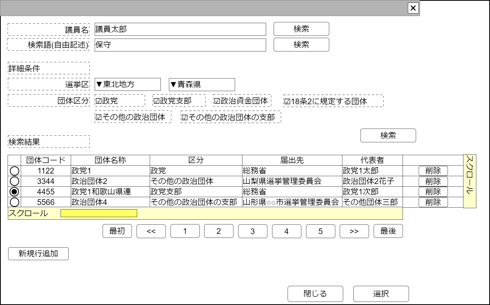

# 政治団体検索【コンポーネント】設計書

## 状態：仕様未確定(実装不可)

## 1.目的

政治団体の検索を行い、必要に応じて指定する

## 2. 構成コンポーネント

1. 独自フィールド

### 2.1 繰り返し項目

なし

## 3. 画面イメージ

### 3.1 画面イメージ

### 3.2 画面イメージ(項番)

## 4. フィールド要素一覧

| 番号 |                   論理名                   |       タイプ       | 活性／表示 |                                        内容                                        |
| ---- | ------------------------------------------ | ------------------ | ---------- | ---------------------------------------------------------------------------------- |
| 1    | 検索条件議員名                             | インプットテキスト | 活性       | 議員名で政治団体の検索をする場合の検索条件の入力を受け付けること                   |
| 1    | 議員名による検索ボタン                     | ボタン             | 活性       | 議員名を検索条件として政治団体を検索した場合の結果の一覧を表示すること             |
| 1    | 検索条件団体名称                           | インプットテキスト | 活性       | 団体名称で政治団体の検索をする場合の検索条件の入力を受け付けること                 |
| 1    | 団体名による検索ボタン                     | ボタン             | 活性       | 団体名称を検索条件として政治団体を検索した場合の結果の一覧を表示すること           |
| 1    | 検索条件地方フィルタ                       | セレクトボックス   | 活性       | 選択時：検索条件都道府県選択のフィルタを行うこと                                   |
| 1    | 検索条件都道府県選択                       | セレクトボックス   | 活性       | 都道府県条件で検索をする場合の検索条件の入力を受け付けること                       |
| 1    | 検索条件団体区分(政党)                     | チェックボックス   | 活性       | 検索条件として団体区分が政党であるかどうかの入力を受け付けること                   |
| 1    | 検索条件団体区分(政党支部)                 | チェックボックス   | 活性       | 検索条件として団体区分が政党支部であるかどうかの入力を受け付けること               |
| 1    | 検索条件団体区分(政治資金団体)             | チェックボックス   | 活性       | 検索条件として団体区分が政治資金団体であるかどうかの入力を受け付けること           |
| 1    | 検索条件団体区分(18条2の1項に規定する団体) | チェックボックス   | 活性       | 検索条件として団体区分が18条2に規定する団体であるかどうかの入力を受け付けること    |
| 1    | 検索条件団体区分(その他の政治団体)         | チェックボックス   | 活性       | 検索条件として団体区分がその他の政治団体であるかどうかの入力を受け付けること       |
| 1    | 検索条件団体区分(その他の政治団体支部)     | チェックボックス   | 活性       | 検索条件として団体区分がその他の政治団体支部であるかどうかの入力を受け付けること   |
| 1    | 詳細条件による検索ボタン                   | ボタン             | 活性       | 都道府県、団体区分を検索条件として政治団体を検索した場合の結果の一覧を表示すること |
| 1    | 政治団体検索結果テーブル                   | テーブル           | 表示       | 政治団体検索結果が表示されること                                                   |
| 1    | 検索ページングエリア                       | エリア             | 表示       | 政治団体検索結果のページング機能が提供されること                                   |

### 4.1 政治資金収支報告書検索結果テーブル フィールド要素一覧

| 番号 |         論理名         |      タイプ      | 活性／表示 |                                         内容                                         |
| ---- | ---------------------- | ---------------- | ---------- | ------------------------------------------------------------------------------------ |
| 1    | 行選択ラジオボタン     | ラジオボタン     | 活性       | 押下時：この行のデータが選択状態であることの入力を受け付けること                     |
| 1    | 政治団体同一識別コード | ラベル           | 表示       | 変更にかかわらず政治団体が同一であることを識別するコードが表示されていること         |
| 1    | 政治団体名称           | ラベル           | 表示       | 政治団体名称が表示されていること                                                     |
| 1    | 政治団体区分           | セレクトボックス | 非活性     | 政治団体区分が表示されていること                                                     |
| 1    | 届先選挙管理委員会     | ラベル           | 表示       | 政治団体に紐づく政治資金収支報告書が提出されている選挙管理委員会が表示されていること |
| 1    | 代表者氏名             | ラベル           | 表示       | 代表者氏名が表示されていること                                                       |

※TODO 検索結果のページングについては共通コンポーネントを作成するか、各ページで実装するか検討中のため、ソフトウェア全体で統一する挙動については[議会検索](../serach_paliament/serach_paliament.md)のページを参照すること

## 5 アクション一覧

| 番号 |          論理名          | タイプ | 活性／表示 |                                        内容                                        |
| ---- | ------------------------ | ------ | ---------- | ---------------------------------------------------------------------------------- |
| 1    | 議員名による検索ボタン   | ボタン | 活性       | 議員名を検索条件として政治団体の検索した場合の結果の一覧を表示すること             |
| 1    | 団体名による検索ボタン   | ボタン | 活性       | 団体名称を検索条件として政治団体の検索した場合の結果の一覧を表示すること           |
| 1    | 詳細条件による検索ボタン | ボタン | 活性       | 都道府県、団体区分を検索条件として政治団体の検索した場合の結果の一覧を表示すること |
| 1    | キャンセル               | ボタン | 活性       | 押下時：このコンポーネントを閉じること                                             |
| 1    | 選択                     | ボタン | 活性       | 押下時：選択されたデータを親画面に通知しこのコンポーネントを閉じること             |

## 6. 政治団体検索結果(最低限)インターフェイス

PoliticOrgnaizationLeastInterface

SelectOptionIntefaceを継承すること。*は継承している値

 |              論理名              |         論理名          |   型    |                                     説明(例)                                     |
 | -------------------------------- | ----------------------- | ------- | -------------------------------------------------------------------------------- |
 | 政治団体Id                       | politicOrgnaizationId   | Long    | 政治団体Id                                                                       |
 | 政治団体同一識別コード           | politicOrgnaizationCode | Long    | 変更にかかわらず政治団体が同一であることを識別するコード                         |
 | 政治団体名称                     | politicOrgnaizationName | String  | 政治団体名称                                                                     |
 | 政治団体区分                     | organizationDantaiKbn   | Integer | 政治団体区分                                                                     |
 | 届先選挙管理委員会Id             | electionCommissionId    | Long    | 政治団体に紐づく政治資金収支報告書が提出されている選挙管理委員会Id               |
 | 届先選挙管理委員会同一識別コード | electionCommissionCode  | Long    | 政治団体に紐づく政治資金収支報告書が提出されている選挙管理委員会の同一識別コード |
 | 届先選挙管理委員会名称           | electionCommissionName  | String  | 政治団体に紐づく政治資金収支報告書が提出されている選挙管理委員会名称             |
 | 代表者氏名                       | delegate                | String  | 代表者氏名                                                                       |
 | セレクトボタンの値               | value                   | String  | *セレクトボタンの値。(政治団体Id)                                                |
 | セレクトボタンの表示テキスト     | text                    | String  | *セレクトボタンの表示テキスト(政治団体名称)                                      |

## 7. 連携

選択ボタンが押下された場合、親画面に指定データを通知する`emit[sendPoliticOrgnaizationLeastInterface(data:PoliticOrgnaizationLeastInterface)]`
