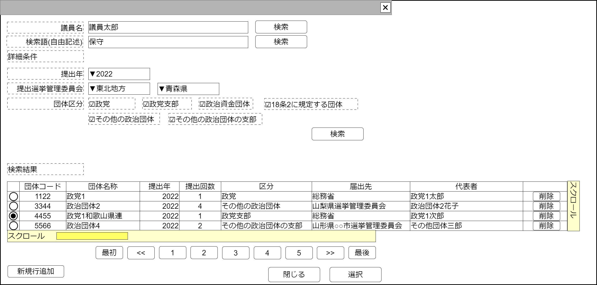

# 政治資金収支報告書検索【コンポーネント】設計書

## 状態：仕様未確定(実装不可)

## 1.目的

政治資金収支報告を検索し、選択された値を通知する
編集可能時には行追加、行削除を行えるようにする

## 2. 構成コンポーネント

1. 独自フィールド

### 2.1 繰り返し項目

なし

## 3. 画面イメージ

### 3.1 画面イメージ

### 3.2 画面イメージ(項番)

## 4. フィールド要素一覧

| 番号 |                 論理名                 |       タイプ       | 活性／表示 |                                    内容                                     |
| ---- | -------------------------------------- | ------------------ | ---------- | --------------------------------------------------------------------------- |
| 1    | 検索条件議員氏名                       | インプットテキスト | 活性       | 検索条件議員氏名の入力を受け付けること                                      |
| 1    | 議員氏名検索ボタン                     | ボタン             | 活性       | 押下時：議員氏名を検索条件として検索結果を表示すること                      |
| 1    | 検索条件自由記述                       | インプットテキスト | 活性       | 検索条件を議員氏名の入力を受け付けること                                    |
| 1    | 自由記述検索ボタン                     | ボタン             | 活性       | 押下時：議員氏名を検索条件として検索結果を表示すること                      |
| 1    | 検索条件提出年                         | セレクトボックス   | 活性       | 検索条件提出年の入力を受け付けること                                        |
| 1    | 検索条件選挙管理委員会(地方)選択       | セレクトボックス   | 活性       | 選択時：都道府県セレクトボックスを選択された項目でフィルタすること          |
| 1    | 検索条件選挙管理委員会(都道府県)選択   | セレクトボックス   | 活性       | 検索条件都道府県(収支報告書提出選挙管理委員会)を受け付けること              |
| 1    | 検索条件団体区分(政党)選択             | チェックボックス   | 活性       | 検索条件に団体区分が政党であることを含む入力を受け付けること                |
| 1    | 検索条件団体区分(政党支部)選択         | チェックボックス   | 活性       | 検索条件に団体区分が政党支部であることを含む入力を受け付けること            |
| 1    | 検索条件団体区分(政治資金管理団体)選択 | チェックボックス   | 活性       | 検索条件に団体区分が政治資金管理団体であることを含む入力を受け付けること    |
| 1    | 検索条件団体区分(18条の2)選択          | チェックボックス   | 活性       | 検索条件に団体区分が18条2に該当する団体であることを含む入力を受け付けること |
| 1    | 検索条件団体区分(その他の団体)選択     | チェックボックス   | 活性       | 検索条件に団体区分がその他の団体であることを含む入力を受け付けること        |
| 1    | 検索条件団体区分(その他の団体支部)選択 | チェックボックス   | 活性       | 検索条件に団体区分がその他の団体の支部であることを含む入力を受け付けること  |
| 1    | 詳細条件検索ボタン                     | ボタン             | 活性       | 押下時：入力された検索詳細条件による検索結果を表示すること                  |
| 1    | 政治資金収支報告書検索結果テーブル     | テーブル           | 表示       | 政治資金収支報告書検索結果が表示されること                                  |
| 1    | 検索ページングエリア                   | エリア             | 表示       | 政治資金収支報告書検索結果のページング機能が提供されること                  |

TODO 自由記述検索の検索条件として使える項目は未決定であるため、決定次第修正する

### 4.1 政治資金収支報告書テーブル フィールド要素一覧

| 番号 |       論理名       |    タイプ    | 活性／表示 |                                  内容                                  |
| ---- | ------------------ | ------------ | ---------- | ---------------------------------------------------------------------- |
| 1    | 行選択ラジオボタン | ラジオボタン | 活性       | 押下時：この行のデータが選択状態であることの入力を受け付けること 編集可能時には選択された値を即時送信すること       |
| 1    | 政治団体コード     | ラベル       | 表示       | 政治資金収支報告書を提出している政治団体の同一識別コードを表示すること |
| 1    | 政治団体名称       | ラベル       | 表示       | 政治資金収支報告書を提出している政治団体の名称を表示すること           |
| 1    | 報告書提出年       | ラベル       | 表示       | 収支報告書の提出年を表示すること                                       |
| 1    | 提出回数           | ラベル       | 表示       | 収支報告書の提出回数を表示すること                                     |
| 1    | 政治団体区分       | ラベル       | 表示       | 政治資金収支報告書を提出している政治団体の団体区分を表示すること       |
| 1    | 届出選挙管理委員会 | ラベル       | 表示       | 提出している選挙管理委員会名称を表示すること                           |
| 1    | 代表者             | ラベル       | 表示       | この収支報告書の代表者を表示すること                                   |
| 1    | 支援する政治家     | ラベル       | 表示       | この収支報告書を提出した団体が支援する政治家を表示すること             |

※TODO 検索結果のページングについては共通コンポーネントを作成するか、各ページで実装するか検討中のため、ソフトウェア全体で統一する挙動については[議会検索](../serach_paliament/serach_paliament.md)のページを参照すること

## 5. アクション一覧

| 番号 |       論理名       | タイプ | 活性／表示 |                                  内容                                  |
| ---- | ------------------ | ------ | ---------- | ---------------------------------------------------------------------- |
| 1    | 議員氏名検索ボタン | ボタン | 活性       | 押下時：議員氏名を検索条件として検索結果を表示すること                 |
| 1    | 自由記述検索ボタン | ボタン | 活性       | 押下時：議員氏名を検索条件として検索結果を表示すること                 |
| 1    | 詳細条件検索ボタン | ボタン | 活性       | 押下時：入力された検索詳細条件による検索結果を表示すること             |
| 1    | キャンセル         | ボタン | 活性       | 押下時：このコンポーネントを閉じること                                 |
| 1    | 選択               | ボタン | 活性       | 押下時：選択されたデータを親画面に通知しこのコンポーネントを閉じること |

### 5.X 編集許可フラグ

a. 編集許可フラグが`許可:true`のとき

- 新規行追加ボタンを表示すること
- 行削除ボタンを表示すること
- キャンセルボタンを非表示すること
- 選択ボタンを非表示すること

b. 編集許可フラグが`不許可:false`のとき

- 新規行追加ボタンを非表示にすること
- 行削除ボタンを非表示にすること
- キャンセルボタンを表示すること
- 選択ボタンを表示すること

## 6. 政治資金収支報告書最低限インターフェイス

PoliticalBalancesheetLeastInterface

SelectOptionIntefaceを継承すること。*は継承している値

|              論理名              |           論理名            |   型    |                            説明(例)                            |
| -------------------------------- | --------------------------- | ------- | -------------------------------------------------------------- |
| 政治資金収支報告書Id             | politicsBalancesheetId      | Long    | 政治資金収支報告書を識別する一意のId                           |
| 政治資金収支報告書同一識別コード | politicsBalancesheetCode    | Integer | 変更履歴にかかわらず政治資金収支報告書を識別する同一識別コード |
| 政治資金収支報告書名称           | politicsBalancesheetName    | String  | 政治資金収支報告書名称                                         |
| 政治団体Id                       | politicsOrganizationId      | Long    | 政治団体を識別する一意のId                                     |
| 政治団体同一識別コード           | politicsOrganizationCode    | Integer | 変更履歴にかかわらず政治団体を識別する同一識別コード           |
| 政治団体名称                     | politicsOrganizationName    | String  | 政治団体名称                                                   |
| 提出年                           | submissionYear              | Integer | 政治資金収支報告書提出年                                       |
| 提出回数                         | submissionTimes             | Integer | 政治資金収支報告書提出回数                                     |
| 政治団体区分                     | politicsOrganizationKbn     | Integer | 政治団体区分                                                   |
| 政治団体区分名称                 | politicsOrganizationKbnName | String  | 政治団体区分に紐づく名称                                       |
| 選挙管理委員会id                 | electionCommissionId        | Long    | 選挙管理委員会を位置に識別するId                               |
| 選挙管理委員会同一識別コード     | electionCommissionCode      | Integer | 選挙管理委員会同一識別コード                                   |
| 選挙管理委員会名称               | electionCommissionName      | String  | 選挙管理委員会名称                                             |
| 団体代表者氏名                   | delegateName                | String  | 政治団体の代表者氏名氏名                                       |
| 団体が支援する政治家氏名         | 物理名                      | String  | 政治団体が支援する政治家氏名                                   |
| セレクトボタンの値               | value                       | String  | *セレクトボタンの値。(政治資金収支報告書Id)     fc               |
| セレクトボタンの表示テキスト     | text                        | String  | *セレクトボタンの表示テキスト(政治資金収支報告書名称)          |

## 7. 連携

入力内容が変更された都度、入力チェックを行い親画面に変更内容を通知する`emit[sendPoliticalBalancesheetLeastInterface(data:PoliticalBalancesheeeastInterface)]`
