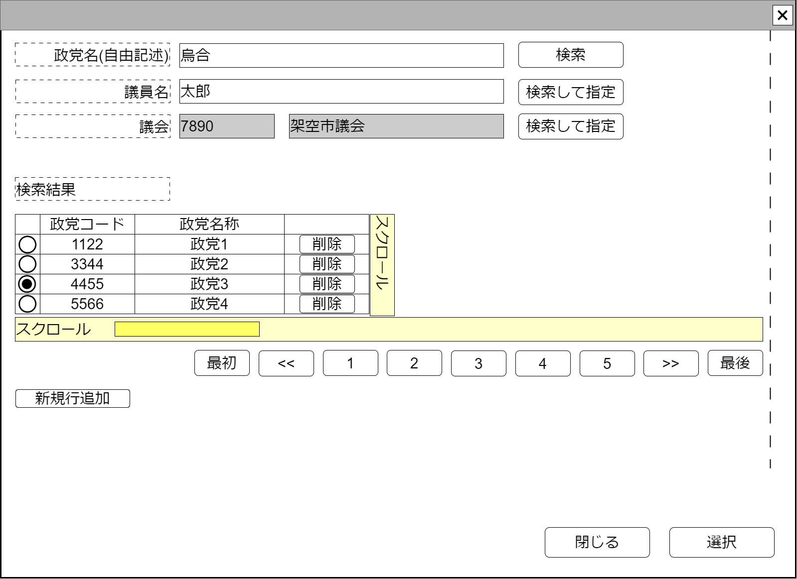

# 政党検索【コンポーネント】設計書

## 状態：仕様未確定(再利用可能なレベルまで実装可能)

## 1.目的

政党を検索し、選択された値を通知する
編集可能時には行追加、行削除を行えるようにする

## 2. 構成コンポーネント

1. [議会検索コンポーネント](../serach_paliament/serach_paliament.md)
2. 独自フィールド

### 2.1 繰り返し項目

なし

## 3. 画面イメージ

### 3.1 画面イメージ

### 3.2 画面イメージ(項番)

## 4. フィールド要素一覧

| 番号 |          論理名          |       タイプ       |      活性／表示      |                                       内容                                       |
| ---- | ------------------------ | ------------------ | -------------------- | -------------------------------------------------------------------------------- |
| 1    | 検索条件政党名入力       | インプットテキスト | 活性                 | 検索条件である政党名の自由記述の入力を受け付けること                             |
| 1    | 検索(政党名)             | ボタン             | 活性                 | 押下時：政党名で検索処理を行うこと                                               |
| 1    | 検索条件議員名入力     | インプットテキスト | 活性                 | 検索条件である議員名の自由記述の入力を受け付けること                             |
| 1    | 検索(議員名)             | ボタン             | 活性                 | 押下時：議員名に紐づく政党検索処理を行うこと                                           |
| 1    | 議会同一識別コード       | インプットテキスト | 非活性               | 検索条件である議会同一識別コードを表示すること                                   |
| 1    | 議会名称                 | インプットテキスト | 非活性               | 検索条件である議会名称を表示すること                                             |
| 1    | 議会検索ボタン           | ボタン             | 活性                 | 押下時：議会検索コンポーネントを表示すること                                     |
| 1    | 議会検索結果一覧テーブル | テーブル           | 表示                 | 政党検索結果を一覧すること                                                       |
| 1    | 検索ページングエリア     | エリア             | 表示                 | 政党検索結果のページング機能が提供されること                                     |
| 1    | 新規行追加               | ボタン             | 活性 表示／非表示 | 押下時：政党検索結果テーブルの最終に新しい行を追加し、その行を選択状態とすること |

### 4.1 議会検索結果テーブル　フィールド要素一覧

| 番号 |       論理名       |    タイプ    |      活性／表示      |                                                       内容                                                       |
| ---- | ------------------ | ------------ | -------------------- | ---------------------------------------------------------------------------------------------------------------- |
| 1    | 行選択ラジオボタン | ラジオボタン | 活性                 | 押下時：この行のデータが選択状態であることの入力を受け付けること 編集可能時には選択された値を即時送信すること |
| 1    | 政党同一識別コード | ラベル       | 表示                 | 政党同一識別コードを表示すること                                                                                 |
| 1    | 政党名称           | ラベル       | 表示                 | 政党名称を表示すること                                                                                           |
| 1    | 行削除             | ボタン       | 活性 表示／非表示 | 押下時：押下された行を削除すること                                                                               |

## 5. アクション一覧

| 番号 |      論理名      | タイプ | 活性／表示 |                                         内容                                         |
| ---- | ---------------- | ------ | ---------- | ------------------------------------------------------------------------------------ |
| 1    | キャンセル       | ボタン | 活性       | 押下時：このコンポーネントを閉じること                                               |
| 1    | 選択             | ボタン | 活性       | 押下時：選択されたデータを親画面に通知しこのコンポーネントを閉じること               |
| 1    | 政治検索         | ボタン | 活性       | 押下時：政治団体検索コンポーネントを表示すること                                     |
| 1    | 検索語政党検索   | ボタン | 活性       | 押下時：政党名称で検索した結果を一覧すること                                         |
| 1    | 検索語議員名検索 | ボタン | 活性       | 押下時：議員名に紐づく政党名を検索した結果を一覧すること                             |
| 1    | 議会検索ボタン   | ボタン | 活性       | 押下時：議会検索コンポーネントを表示すること                                         |
| 1    | (議会指定)       | ボタン | 活性       | 議会指定時：議会に所属する議員検索結果を表示すること                                 |
| 1    | 新規行追加       | ボタン | 活性       | 押下時：継続事業検索結果テーブルの最終に新しい行を追加し、その行を選択状態とすること |

### 5.X 編集許可フラグ

a. 編集許可フラグが`許可:true`のとき

- 新規行追加ボタンを表示すること
- 行削除ボタンを表示すること
- キャンセルボタンを非表示すること
- 選択ボタンを非表示すること

b. 編集許可フラグが`不許可:false`のとき

- 新規行追加ボタンを非表示にすること
- 行削除ボタンを非表示にすること
- キャンセルボタンを表示すること
- 選択ボタンを表示すること

## 6. 政党最低限情報インターフェイス

PoliticalPartyLeastInterface

 |  論理名  |  論理名  |  型  |         説明(例)         |
 | -------- | -------- | ---- | ------------------------ |
 | 政党Id | sampleId | Long | 政治家を識別する一意のId |
 | 政党同一識別コード | politicalPartyCode | Integer | 変更にかかわらず、政党を同一識別するコード |
 | 政党名称 | politicalParty | String | 政党名称 |

## 7. 連携

- キャンセルイベント送信を`emit(sendCancelSearchPoliticalParty)`ですること
- 選択イベント送信を`emit(sendPoliticalPartyLeastInterface,selectedDto)`ですること
- 親コンポーネントから編集許可フラグ`props{isEditavble:boolean}`を受け取り、編集できる場合と編集できない場合の状態が選択できること

### 7.1 議会検索コンポーネント

- コンポーネントからのキャンセルイベント受信を`recieveCancelSearchParliament()`ですること
- コンポーネントからの選択イベント受信を`recieveParliamentInterface(selectedDto)`ですること
- コンポーネントに編集許可フラグ`isEditavble`に`false`を設定し、検索コンポーネントでの編集を禁止すること
