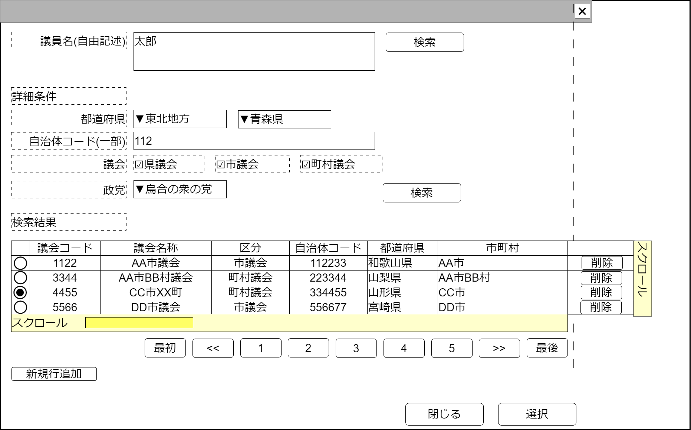

# 政治家検索【コンポーネント】設計書

## 状態：仕様未確定(再利用可能なレベルまで実装可能)

## 1.目的

継続事業を検索し、選択された値を通知する
編集可能時には行追加、行削除を行えるようにする

## 2. 構成コンポーネント

1. 独自フィールド

### 2.1 繰り返し項目

なし

## 3. 画面イメージ

### 3.1 画面イメージ

### 3.2 画面イメージ(項番)

## 4. フィールド要素一覧

| 番号 |                 論理名                 |       タイプ       |      活性／表示      |                                          内容                                          |
| ---- | -------------------------------------- | ------------------ | -------------------- | -------------------------------------------------------------------------------------- |
| 1    | 検索条件自由記述                       | インプットテキスト | 活性                 | 自由記述による検索条件の入力を受け付けること                                           |
| 1    | 自由記述検索ボタン                     | ボタン             | 活性                 | 押下時：自由記述に記載された検索語に基づく検索を行い、その結果を一覧として表示すること |
| 1    | 検索条件議員氏名                       | インプットテキスト | 活性                 | 議員氏名による検索条件の入力を受け付けること                                           |
| 1    | 議員氏名検索ボタン                     | ボタン             | 活性                 | 押下時：議員氏名に記載された検索語に基づく検索を行い、その結果を一覧として表示すること |
| 1    | 検索条件地方フィルタ                   | セレクトボックス   | 活性                 | 選択時：選択された項目に基づき都道府県セレクトボックスをフィルタすること               |
| 1    | 検索条件都道府県                       | セレクトボックス   | 活性                 | 検索条件都道府県の入力を受け付けること                                                 |
| 1    | 検索条件自治体コード                   | インプットテキスト | 活性                 | 検索条件都道府県コードの入力を受け付けること                                           |
| 1    | 検索条件議会の種類(県議会・広域自治体) | チェックボックス   | 活性                 | 検索条件県議会であるかどうかの入力を受け付けること                                     |
| 1    | 検索条件議会の種類(市議会)             | チェックボックス   | 活性                 | 検索条件県議会であるかどうかの入力を受け付けること                                     |
| 1    | 検索条件議会の種類(町村議会)           | チェックボックス   | 活性                 | 検索条件県議会であるかどうかの入力を受け付けること                                     |
| 1    | 検索条件政党                           | セレクトボックス   | 活性                 | 検索条件政党の入力を受け付けること                                                     |
| 1    | 詳細条件検索ボタン                     | ボタン             | 活性                 | 押下時：詳細条件にに基づく検索を行い、その結果を一覧として表示すること                 |
| 1    | 政治家検索結果テーブル                 | テーブル           | 表示                 | 政治家検索結果が表示されること                                                         |
| 1    | 検索ページングエリア                   | エリア             | 表示                 | 政治家検索結果のページング機能が提供されること                                         |
| 1    | 新規行追加                             | ボタン             | 活性 表示／非表示 | 押下時：政治家検索結果テーブルの最終に新しい行を追加し、その行を選択状態とすること     |

※TODO 検索結果のページングについては共通コンポーネントを作成するか、各ページで実装するか検討中のため、ソフトウェア全体で統一する挙動については[議会検索](../serach_paliament/serach_paliament.md)のページを参照すること

### 4.1 政治家検索結果テーブル　フィールド要素一覧

| 番号 |        論理名        |    タイプ    |      活性／表示      |                                                       内容                                                       |
| ---- | -------------------- | ------------ | -------------------- | ---------------------------------------------------------------------------------------------------------------- |
| 1    | 行選択ラジオボタン   | ラジオボタン | 活性                 | 押下時：この行のデータが選択状態であることの入力を受け付けること 編集可能時には選択された値を即時送信すること |
| 1    | 政治家同一識別コード | ラベル       | 表示                 | 継続事業同一識別コードを表示すること                                                                             |
| 1    | 政治家名称           | ラベル       | 表示                 | 継続事業名称を表示すること                                                                                       |
| 1    | 所属議会名称         | ラベル       | 表示                 | 所属議会名称                                                                                                     |
| 1    | 所属政党名称         | ラベル       | 表示                 | 所属政党名称                                                                                                     |
| 1    | 行削除               | ボタン       | 活性 表示／非表示 | 押下時：押下された行を削除すること                                                                               |

## 5. アクション一覧

| 番号 |       論理名       | タイプ | 活性／表示 |                                        内容                                        |
| ---- | ------------------ | ------ | ---------- | ---------------------------------------------------------------------------------- |
| 1    | キャンセル         | ボタン | 活性       | 押下時：このコンポーネントを閉じること                                             |
| 1    | 選択               | ボタン | 活性       | 押下時：選択されたデータを親画面に通知しこのコンポーネントを閉じること             |
| 1    | 政治家自由記述検索 | ボタン | 活性       | 政治家を自由記述された検索語で検索された結果を一覧すること                         |
| 1    | 政治家詳細検索     | ボタン | 活性       | 押下時：詳細条件で検索した結果を一覧すること                                       |
| 1    | 新規行追加         | ボタン | 活性       | 押下時：政治家検索結果テーブルの最終に新しい行を追加し、その行を選択状態とすること |

### 5.X 編集許可フラグ

a. 編集許可フラグが`許可:true`のとき

- 新規行追加ボタンを表示すること
- 行削除ボタンを表示すること
- キャンセルボタンを非表示すること
- 選択ボタンを非表示すること

b. 編集許可フラグが`不許可:false`のとき

- 新規行追加ボタンを非表示にすること
- 行削除ボタンを非表示にすること
- キャンセルボタンを表示すること
- 選択ボタンを表示すること

## 6. 政治家最低限情報インターフェイス

PoliticianLeastInterface

 |         論理名         |      論理名      |   型    |                     説明(例)                     |
 | ---------------------- | ---------------- | ------- | ------------------------------------------------ |
 | 政治家Id               | politicianId     | Long    | 政治家を識別する一意のId                         |
 | 政治家同一識別コード   | politicianCode   | Integer | 変更にかかわらず、政治家を同一と識別するコード   |
 | 政治家名称             | politicianName   | String  | 政治家名称                                       |
 | 所属議会Id             | parilamentId     | Long    | 所属議会を識別する一意のId                       |
 | 所属議会同一識別コード | parilamentCode   | Integer | 変更にかかわらず、所属議会を同一と識別するコード |
 | 所属議会名称           | parilamentName   | String  | 所属議会名称                                     |
 | 所属政党Id             | politicPartyId   | Long    | 所属政党を識別する一意のId                       |
 | 所属政党同一識別コード | politicPartyCode | Integer | 変更にかかわらず、所属政党を同一と識別するコード |
 | 所属政党名称           | politicPartyName | String  | 所属政党名称                                     |

## 7. 連携

- キャンセルイベント送信を`emit(sendCancelSearchPolitician)`ですること
- 選択イベント送信を`emit(sendPoliticianLeastInterface,selectedDto)`ですること
- 親コンポーネントに編集許可フラグ`isEditavble`を受け取り、編集できる場合と編集できない場合の状態が選択できること
