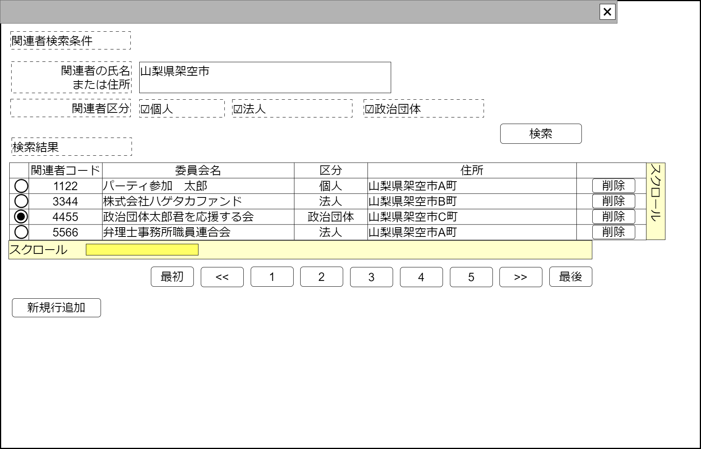

# 関連者検索【コンポーネント】設計書

## 状態：仕様未確定(再利用可能なレベルまで実装可能)

作成側と共通のため、作成できた時点で作成側の進行状況を確認し、調査側が先行している場合はソースを渡すこと
(作成側が先行している場合はソースをもらうこと)

## 1.目的

収入項目(itemName)と紐づく関連者を検索し、選択された値を通知する
編集可能時には行追加、行削除を行えるようにする

## 2. 構成コンポーネント

1. 独自フィールド

### 2.1 繰り返し項目

なし

## 3. 画面イメージ

### 3.1 画面イメージ

### 3.2 画面イメージ(項番)

## 4. フィールド要素一覧

| 番号 |             論理名             |       タイプ       |      活性／表示      |                                        内容                                        |
| ---- | ------------------------------ | ------------------ | -------------------- | ---------------------------------------------------------------------------------- |
| 1    | 検索条件関連者の氏名または住所 | インプットテキスト | 活性                 | 関連者の氏名または(かつ)住所の検索条件の入力を受け付ける事                         |
| 1    | 関連者区分個人チェック         | チェックボックス   | 活性／非活性         | 関連者区分が個人である(または非該当)という条件の入力を受け付ける事                 |
| 1    | 関連者区分法人チェック         | チェックボックス   | 活性／非活性         | 関連者区分が法人である(または非該当)という条件の入力を受け付ける事                 |
| 1    | 関連者区分政治団体チェック     | チェックボックス   | 活性／非活性         | 関連者区分が政治団体である(または非該当)という条件の入力を受け付ける事             |
| 1    | 関連者検索結果テーブル         | テーブル           | 表示                 | 検索された結果が一覧で表示されていること                                           |
| 1    | 検索ページングエリア           | エリア             | 表示                 | 関連者検索結果のページング機能が提供されること                                     |
| 1    | 新規行追加                     | ボタン             | 活性 表示／非表示 | 押下時：関連者検索結果テーブルの最終に新しい行を追加し、その行を選択状態とすること |

### 4.1  関連者検索結果テーブル フィールド要素一覧

| 番号 |        論理名        |    タイプ    |      活性／表示      |                                                内容                                                |
| ---- | -------------------- | ------------ | -------------------- | -------------------------------------------------------------------------------------------------- |
| 1    | 行選択ラジオボタン   | ラジオボタン | 活性                 | 押下時：押下された行が選択されたことを通知すること 編集可能時には選択された値を即時送信すること |
| 1    | 関連者同一識別コード | ラベル       | 表示                 | 関連者同一識別コードを表示すること                                                                 |
| 1    | 関連者名称           | ラベル       | 表示                 | 関連者名称を表示すること                                                                           |
| 1    | 関連者区分名称       | ラベル       | 表示                 | 関連者区分に紐づく名称を表示すること                                                               |
| 1    | 関連者住所           | ラベル       | 表示                 | 関連者の住所を表示すること                                                                         |
| 1    | 行削除               | ボタン       | 活性 表示／非表示 | 押下時：押下された行を削除すること                                                                 |

## 5. アクション一覧

| 番号 |       論理名       |    タイプ    | 活性／表示 |                        内容                        |
| ---- | ------------------ | ------------ | ---------- | -------------------------------------------------- |
| 1    | 行選択ラジオボタン | ラジオボタン | 活性       | 押下時：押下された行が選択されたことを通知すること |

※TODO 検索結果のページングについては共通コンポーネントを作成するか、各ページで実装するか検討中のため、ソフトウェア全体で統一する挙動については[議会検索](../serach_paliament/serach_paliament.md)のページを参照すること

### 5.X 編集許可フラグ

a. 編集許可フラグが`許可:true`のとき

- 新規行追加ボタンを表示すること
- 行削除ボタンを表示すること
- キャンセルボタンを非表示すること
- 選択ボタンを非表示すること

b. 編集許可フラグが`不許可:false`のとき

- 新規行追加ボタンを非表示にすること
- 行削除ボタンを非表示にすること
- キャンセルボタンを表示すること
- 選択ボタンを表示すること

## 6. 関連者インターフェイス

RelationPersonInterface

|        論理名        |             論理名             |    型    |                                                     説明(例)                                                     |
| -------------------- | ------------------------------ | -------- | ---------------------------------------------------------------------------------------------------------------- |
| 関連者Id             | relationPersonId               | Long     | 関連者を識別する一意のId                                                                                         |
| 関連者同一識別コード | relationPersonCode             | Long     | 変更にかかわらず、関連者を同一であると識別する同一識別コード                                                     |
| 項目名称             | itemName                       | Long     | 収支報告書に表示する項目名称                                                                                     |
| 個人・団体住所       | orgnizationAddress             | Integer  | 個人または団体住所                                                                                               |
| 氏名・団体名称       | shimeiOrgnizationName          | String   | 氏名(職業)、または団体名称                                                                                       |
| 関連者区分           | relationPersonKbn              | Integer  | 関連者区分                                                                                                       |
| 摘要                 | relationPersonDigest           | String   | 例示：「ﾌﾘｺﾐ ｾｲｼﾞﾀﾞﾝﾀｲ ｻﾌﾞﾛｳ」                                                                                   |
| 各種PayId            | relationPersonFinancialPayId   | String   | 例示：「政治団体　三郎」                                                                                         |
| 各種Payコード        | relationPersonFinancialPayCode | String   | 例示：「政治団体　三郎」                                                                                         |
| 各種Pay名称          | relationPersonFinancialPayName | String   | 例示：「2次元コード専用Pay」                                                                                     |
| 金融機関コード       | relationPersonFinancialOrgCode | String   | 例示：「0002」                                                                                                   |
| 金融機関名称         | relationPersonFinancialOrgName | String   | 例示：「首都圏市民銀行」※TODO 金融機関コードから名称を取得出来るAPIが利用できれば取得する(該当フィールド非活性) |
| 支店コード           | relationPersonBranchCode       | String   | 例示：「123」                                                                                                    |
| 支店名称             | relationPersonBranchName       | String   | 例示：「番町皿屋敷支店」※TODO 金融機関コードから名称を取得出来るAPIが利用できれば取得する(該当フィールド非活性) |
| 口座種別区分         | relationPersonAccountType      | String   | 口座区分。下記参照                                                                                               |
| 口座番号             | relationPersonAccountNo        | String   | 例示：「1233」                                                                                                   |
| 口座名義人           | relationPersonAccountHasName   | String   | 例示：「ｾｲｼﾞﾀﾞﾝﾀｲ ｻﾌﾞﾛｳ」                                                                                        |
| 電話番号・市外局番   | relationPersonTel1             | Integer  | 例示：「123」                                                                                                    |
| 電話番号・局番       | relationPersonTel2             | Integer  | 例示：「4567」                                                                                                   |
| 電話番号・番号       | relationPersonTel3             | Integer  | 例示：「080」                                                                                                    |
| 郵便番号・前         | relationPersonPostal1          | Integerl | 例示：「123」                                                                                                    |
| 郵便番号・後         | relationPersonPostal2          | Integer  | 例示：「456x」                                                                                                   |
| 住所                 | relationPersonAddressPost      | String   | 例示：「東京都千代田区霞が関」                                                                                   |
| 住所番地             | relationPersonAddressBlock     | String   | 例示：「10番地100号」                                                                                            |
| 住所建物             | relationPersonAddressBuiding   | Stringl  | 例示：「成金ビル 401号室」                                                                                       |

## 7. 連携

- 親画面から関連者区分個人チェックの活性／非活性を設定する値を`props{disabledRelationKbnPerson:boolean}`で受け取ること
- 親画面から関連者区分法人チェックの活性／非活性を設定する値を`props{disabledRelationKbnCorporation:boolean}`で受け取ること
- 親画面から関連者区分政治団体チェックの活性／非活性を設定する値を`props{disabledRelationKbnPoliticalOrg:boolean}`で受け取ること
- キャンセルイベント送信を`emit(sendCancelSearchRelationPerson)`ですること
- 選択イベント送信を`emit(sendRelationPersonInterface,selectedDto)`ですること
- 親コンポーネントから編集許可フラグ`props{isEditavble:boolean}`を受け取り、編集できる場合と編集できない場合の状態が選択できること
