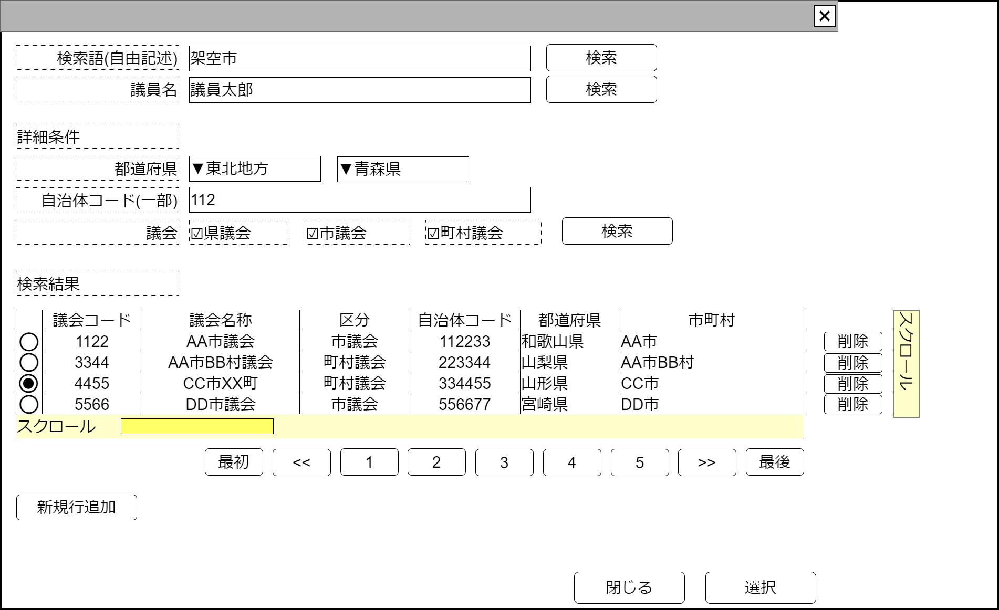

# 議会検索【コンポーネント】設計書

## 状態：仕様未確定(再利用可能なレベルまで実装可能)

## 1.目的

議会を検索し、選択された値を通知する
編集可能時には行追加、行削除を行えるようにする

## 2. 構成コンポーネント

1. 独自フィールド

### 2.1 繰り返し項目

なし

## 3. 画面イメージ

### 3.1 画面イメージ

### 3.2 画面イメージ(項番)

## 4. フィールド要素一覧

| 番号 |          論理名           |       タイプ       |      活性／表示      |                                        内容                                        |
| ---- | ------------------------- | ------------------ | -------------------- | ---------------------------------------------------------------------------------- |
| 1    | 検索条件_自由記述         | インプットテキスト | 活性                 | 自由記述で議会を検索する際の検索条件の入力を受け付けること                         |
| 1    | 検索条件_議員氏名         | インプットテキスト | 活性                 | 議員氏名(一部)で議会を検索する際の検索条件の入力を受け付けること                   |
| 1    | 検索条件補助_地方         | セレクトボックス   | 活性                 | 地方名が選択肢であり、都道府県セレクトボックスのフィルタ条件の入力を受け付けること |
| 1    | 検索条件_都道府県         | セレクトボックス   | 活性                 | 都道府県の検索絞込条件の入力を受け付けること                                       |
| 1    | 検索条件_地方自治体コード | インプットテキスト | 活性                 | 地方自治体コード(一部)で議会を検索する際の検索条件の入力を受け付けること           |
| 1    | 検索条件_議会区分県       | チェックボックス   | 活性                 | 議会区分を検索条件とするときの入力を受け付けること。都道府県議会を含むときは`true` |
| 1    | 検索条件_議会区分市       | チェックボックス   | 活性                 | 議会区分を検索条件とするときの入力を受け付けること。市議会を含むときは`true`       |
| 1    | 検索条件_議会区分町村     | チェックボックス   | 活性                 | 議会区分を検索条件とするときの入力を受け付けること。町村議会を含むときは`true`     |
| 1    | 検索実行ボタン            | ボタン             | 活性                 | 押下時：上記指定条件で議会検索が行われること                                       |
| 1    | 議会検索結果テーブル      | テーブル           | 表示                 | 議会検索結果が表示されること                                                       |
| 1    | 検索ページングエリア      | エリア             | 表示                 | 議会検索結果のページング機能が提供されること                                       |
| 1    | 新規行追加                | ボタン             | 活性 表示／非表示 | 押下時：議会検索結果テーブルの最終に新しい行を追加し、その行を選択状態とすること   |

### 4.1 議会検索結果テーブル フィールド要素一覧

| 番号 |       論理名       |      タイプ      |      活性／表示      |                                                       内容                                                       |
| ---- | ------------------ | ---------------- | -------------------- | ---------------------------------------------------------------------------------------------------------------- |
| 1    | 行選択ラジオボタン | ラジオボタン     | 活性                 | 押下時：この行のデータが選択状態であることの入力を受け付けること 編集可能時には選択された値を即時送信すること |
| 1    | 議会同一識別コード | ラベル           | 表示                 | 変更にかかわらず議会が同一であることを識別するコードが表示されていること                                         |
| 1    | 議会名称           | ラベル           | 表示                 | 議会名称が表示されていること                                                                                     |
| 1    | 議会区分           | セレクトボックス | 非活性               | 議会区分が表示されていること                                                                                     |
| 1    | 自治体コード       | ラベル           | 表示                 | 自治体コードが表示されていること                                                                                 |
| 1    | 都道府県名称       | ラベル           | 表示                 | 都道府県が表示されていること                                                                                     |
| 1    | 市町村名称         | ラベル           | 表示                 | 自治体名称が表示されていること                                                                                   |
| 1    | 行削除             | ボタン           | 活性 表示／非表示 | 押下時：押下された行を削除すること                                                                               |

### 4.2 検索結果ページングエリア フィールド要素一覧

| 番号 |            論理名            | タイプ | 活性／表示 |                                                                                          内容                                                                                           |
| ---- | ---------------------------- | ------ | ---------- | --------------------------------------------------------------------------------------------------------------------------------------------------------------------------------------- |
| 1    | 最初のページに移行するボタン | ボタン | 活性       | 押下時：ページング項目が1から始まるようにし、検索結果は1ページ目を表示すること                                                                                                          |
| 1    | 前の5ページに移行するボタン  | ボタン | 活性       | 押下時：現検索結果表示が7ページ目である場合、ページング項目を2,3,4,5,6とし、2ページ目を検索結果として表示すること                                                                       |
| 1    | 検索結果表示ボタンA          | ボタン | 活性       | 押下時：ボタンタイトルとなったページを検索項目とし、ページング項目を検索結果を表示したページから始めること。ボタンタイトルが3なら3ページを検索結果表示、ページングは3,4,5,6,7であること |
| 1    | 検索結果表示ボタンB          | ボタン | 活性       | 押下時：ボタンタイトルとなったページを検索項目とし、ページング項目を検索結果を表示したページから始めること。ボタンタイトルが3なら3ページを検索結果表示、ページングは3,4,5,6,7であること |
| 1    | 検索結果表示ボタンC          | ボタン | 活性       | 押下時：ボタンタイトルとなったページを検索項目とし、ページング項目を検索結果を表示したページから始めること。ボタンタイトルが3なら3ページを検索結果表示、ページングは3,4,5,6,7であること |
| 1    | 検索結果表示ボタンD          | ボタン | 活性       | 押下時：ボタンタイトルとなったページを検索項目とし、ページング項目を検索結果を表示したページから始めること。ボタンタイトルが3なら3ページを検索結果表示、ページングは3,4,5,6,7であること |
| 1    | 検索結果表示ボタンE          | ボタン | 活性       | 押下時：ボタンタイトルとなったページを検索項目とし、ページング項目を検索結果を表示したページから始めること。ボタンタイトルが3なら3ページを検索結果表示、ページングは3,4,5,6,7であること |
| 1    | 後の5ページに移行するボタン  | ボタン | 活性       | 押下時：現検索結果表示が3ページ目である場合、ページング項目を4,5,6,7,8とし、8ページ目を検索結果として表示すること                                                                       |
| 1    | 最後のページに移行するボタン | ボタン | 活性       | 押下時：ページングの最終が最終ページであるとし、検索結果は最終ページ目を表示すること                                                                                                    |

## 5. アクション一覧

| 番号 |       論理名       |      タイプ      | 活性／表示 |                                               内容                                               |
| ---- | ------------------ | ---------------- | ---------- | ------------------------------------------------------------------------------------------------ |
| 1    | 検索条件補助_地方  | セレクトボックス | 活性       | 選択時：都道府県セレクトボックスを選択された地方でフィルタすること                               |
| 1    | 行選択ラジオボタン | ラジオボタン     | 活性       | 押下時：選択された行の議会データが親コンポーネントに通知される、コンポーネントが非表示になること |

### 5.X 編集許可フラグ

a. 編集許可フラグが`許可:true`のとき

- 新規行追加ボタンを表示すること
- 行削除ボタンを表示すること
- キャンセルボタンを非表示すること
- 選択ボタンを非表示すること

b. 編集許可フラグが`不許可:false`のとき

- 新規行追加ボタンを非表示にすること
- 行削除ボタンを非表示にすること
- キャンセルボタンを表示すること
- 選択ボタンを表示すること

## 6. 議会(検索)最低限インターフェイス

PaliamentLeastInterface

SelectOptionIntefaceを継承すること。*は継承している値

|            論理名            |     論理名     |   型    |                       説明(例)                       |
| ---------------------------- | -------------- | ------- | ---------------------------------------------------- |
| 議会Id                       | parliamentId   | Long    | 議会を識別する一意のId                               |
| 議会同一識別コード           | parliamentCode | Integer | 議会が変更にかかわらず同一であることを識別するコード |
| 議会名称                     | parliamentName | String  | 議会名称                                             |
| 議会区分                     | parliamentKbn  | Integer | 議会区分が表示されていること                         |
| 自治体コード                 | localGovCode   | String  | 自治体コードが表示されていること                     |
| 地方自治体名称               | localGovName   | String  | 都道府県が表示されていること                         |
| 都道府県名称                 | todoufukenName | String  | 都道府県が表示されていること                         |
| 市町村名称                   | shichouson     | String  | 自治体名称が表示されていること                       |
| セレクトボタンの値           | value          | String  | *セレクトボタンの値。(議会Id)                        |
| セレクトボタンの表示テキスト | text           | String  | *セレクトボタンの表示テキスト(議会名称)              |

## 7. 連携

- キャンセルイベント送信を`emit(sendCancelPaliament)`ですること
- 選択イベント送信を`emit(sendPaliamentLeastInterface,selectedDto)`ですること
- 親コンポーネントから編集許可フラグ`props{isEditavble:boolean}`を受け取り、編集できる場合と編集できない場合の状態が選択できること
