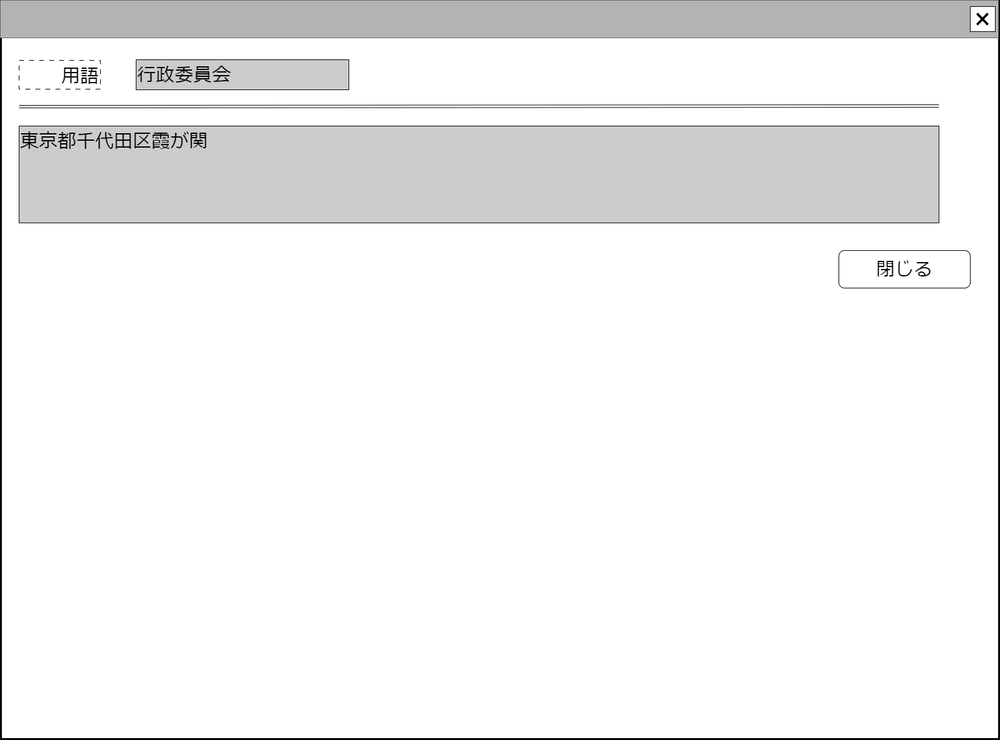

# 用語ヘルプコンポーネント

## 状態：必要に応じて微修正

## 1. 目的

用語のヘルプを提供する

## 2. 構成コンポーネント

なし

## 3. 画面イメージ

### 3.1 画面イメージ

### 3.2 画面イメージ(項番)

## 4. フィールド要素一覧

| 番号 | 論理名 |       タイプ       | 活性／表示 |                内容                |
| ---- | ------ | ------------------ | ---------- | ---------------------------------- |
| 1    | 用語   | インプットテキスト | 非活性     | 解説しようとする用語を表示すること |
| 2    | 解説   | テキストエリア     | 非活性     | 用語の解説を表示すること           |

## 5. アクション一覧

| 番号 | 論理名 | タイプ | 活性／表示 |                                 内容                                 |
| ---- | ------ | ------ | ---------- | -------------------------------------------------------------------- |
| 1    | 閉じる | ボタン | 活性       | このコンポーネント自体を閉じるよう起動した親画面に通知`emit`すること |

## 6. インターフェイス

TerminologyHelpInterface

 |  論理名  |     論理名      |   型   |               説明(例)               |
 | -------- | --------------- | ------ | ------------------------------------ |
 | 用語Id   | terminologyId   | String | ヘルプを作成した用語を一意に識別する |
 | 用語Id   | terminologyName | String | ヘルプを作成した用語名称             |
 | 用語説明 | helpExplain     | String | 用語説明                             |

## 7. 連携

自身を閉じるボタンが押された場合を通知する`emit[closeHelp(terminologyId)]`
