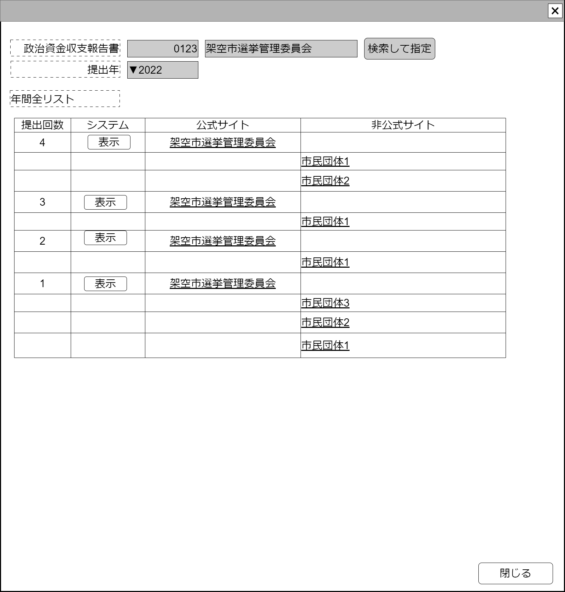

# 収支報告書履歴表示年単位【コンポーネント】設計書

## 状態：仕様未確定(実装不可)

## 1.目的

個指定した団体の政治資金収支報告書を年間すべてにアクセスできる手段を提供する

## 2. 構成コンポーネント

1. [政治資金収支報告書検索コンポーネント](./#)
2. 独自フィールド

### 2.1 繰り返し項目

なし

## 3. 画面イメージ

### 3.1 画面イメージ

### 3.2 画面イメージ(項番)

## 4. フィールド要素一覧

| 番号 |                論理名                |      タイプ      |   活性／表示   |                                                  内容                                                   |
| ---- | ------------------------------------ | ---------------- | -------------- | ------------------------------------------------------------------------------------------------------- |
| 1    | 政治資金収支報告書検索コンポーネント | コンポーネント   | 表示 非活性 | 指定された政治資金収支報告書を表示すること。                                                            |
| 1    | 提出年選択                           | セレクトボックス | 活性／非活性   | 指定された提出年を表示すること。提出年については活性にして選択できる可能性を排除しないこと              |
| 1    | 年間提出一覧テーブル                 | テーブル         | 表示           | 1年間で提出された、把握しているすべての提出された政治資金収支報告書へのアクセスへの一覧を表示すること。 |

### 4.1 年間提出一覧テーブル

| 番号 |     論理名     | タイプ | 活性／表示 |                                                      内容                                                      |
| ---- | -------------- | ------ | ---------- | -------------------------------------------------------------------------------------------------------------- |
| 1    | 提出回数       | ラベル | 表示       | 提出回数を表示すること。                                                                                       |
| 1    | システム表示   | ボタン | 活性       | 指定された提出年、提出回数で、システムに保存されたデータを表示するコンポーネントを起動すること                 |
| 1    | 公式サイト表示 | リンク | 活性       | 指定された提出年、提出回数で、公式に選挙管理委員会に提出された政治資金収支報告書への直接リンクを提供すること。 |
| 1    | 非公式公式表示 | リンク | 活性       | 指定された提出年、提出回数で、指摘サイトに複写された政治資金収支報告書への直接リンクを提供すること。           |

## 5. アクション一覧

| 番号 |    論理名    | タイプ | 活性／表示 |                                              内容                                              |
| ---- | ------------ | ------ | ---------- | ---------------------------------------------------------------------------------------------- |
| 1    | システム表示 | ボタン | 活性       | 指定された提出年、提出回数で、システムに保存されたデータを表示するコンポーネントを起動すること |
| 1    | 閉じる       | ボタン | 活性       | 押下時：自分自身を閉じること                                                                   |

## 6. 政治資金報告書年間一覧インターフェイス

[収支報告書参照設定](../../../invest_front/make_link_balancesheet/make_link_balancesheet.md)の配列`PoliticsBalancesheetHistoryLinkInterface[]`

## 7. 連携

親画面から政治資金報告書情報と報告年情報を引き継ぐこと
