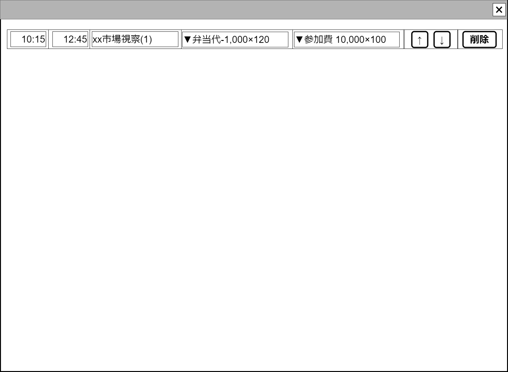

# 1日スケジュール表の行【コンポーネント】設計書

## 状態：仕様未確定(実装不可)

## 1. 目的

[1日スケジュール表設計書](./trace_event_oneday.md)におけるテーブル表行コンポーネント

## 2. 構成コンポーネント

なし

## 3. 画面イメージ

### 3.1 画面イメージ

### 3.2 画面イメージ(項番)

## 4. フィールド要素一覧

### 4.1 独自フィールド

| 番号 |    論理名    |          タイプ          | 活性／表示 |                                                内容                                                |
| ---- | ------------ | ------------------------ | ---------- | -------------------------------------------------------------------------------------------------- |
| 1    | 開始時間入力 | インプットテキスト(時刻) | 活性       | この行のイベントの開始時間の入力を受け付けること                                                   |
| 2    | 終了時間入力 | インプットテキスト(時刻) | 活性       | この行のイベントの終了時間の入力を受け付けること                                                   |
| 3    | イベント摘要 | インプットテキスト       | 活性       | この行のイベントを識別するわかりやすい摘要の入力を受け付けること                                   |
| 1    | 収入項目選択 | セレクトボタン(複数選択) | 活性       | この日にあったと申告された収入項目のうち、イベントに割り当てられていない項目を合わせて表示すること |
| 1    | 支出項目選択 | セレクトボタン(複数選択) | 活性       | この日にあったと申告された支出項目のうち、イベントに割り当てられていない項目を合わせて表示すること |
| 1    | 上へボタン   | ボタン                   | 活性       | アクションリスト参照                                                                               |
| 2    | 下へボタン   | ボタン                   | 活性       | アクションリスト参照                                                                               |
| 3    | 削除         | ボタン                   | 活性       | アクションリスト参照                                                                               |

## 5. アクション一覧

| 番号 |      論理名      |     タイプ     | 活性／表示 |                                         内容                                         |
| ---- | ---------------- | -------------- | ---------- | ------------------------------------------------------------------------------------ |
| 1    | 上へボタン       | ボタン         | 活性       | この行自身を一つ上に移動するボタンが押下されたことを親テーブルに通知`emit`すること   |
| 2    | 下へボタン       | ボタン         | 活性       | この行自身を一つ下に移動にするボタンが押下されたことを親テーブルに通知`emit`すること |
| 3    | 削除             | ボタン         | 活性       | この行自身を削除するボタンが押下されたことを親テーブルに通知`emit`すること           |
| 3    | 収入イベント選択 | セレクトボタン | 活性       | 親テーブルの未分類項目プールから選択された項目を増減するよう通知`emit`すること       |
| 3    | 支出イベント選択 | セレクトボタン | 活性       | 親テーブルの未分類項目プールから選択された項目を増減するよう通知`emit`すること       |

## 6. イベントスケジュール行インターフェイス

TableScheduleRowInterface

 |             論理名             |        論理名        |             型             |                        説明(例)                         |
 | ------------------------------ | -------------------- | -------------------------- | ------------------------------------------------------- |
 | イベント開始時間               | accrualTimeStart     | LocalDatetime              | このイベントが発生した開始日時                          |
 | イベント開始時間表示用         | accrualTimeStartText | String                     | このイベントが発生した開始日時HTML入出力用 例:「09:15」 |
 | イベント終了時間               | accrualTimeEnd       | LocalDatetime              | このイベントが発生した開始日時                          |
 | イベント終了時間表示用         | accrualTimeEndText   | String                     | このイベントが発生した開始日時HTML入出力用 例:「09:15」 |
 | イベント摘要                   | eventDigest          | String                     | このイベントの摘要                                      |
 | イベント収入項目               | incomeSelected       | List<String>               | 収入項目のうち選択された支出項目                        |
 | イベント収入項目選択候補リスト | listIncome           | List<EventDigestInterface> | 選択可能な収入項目リスト                                |
 | イベント支出項目               | outcomeSelected      | List<String>               | 支出項目のうち選択された支出項目                        |
 | イベント支出項目選択候補リスト | listOutcome          | List<EventDigestInterface> | 選択可能な支出項目リスト                                |

### 6.1 収支要約インターフェイス

EventDigestInterface
※セレクトボタンで使用するため、`SelectOptionInterface`を拡張していること

 |         論理名         |   論理名    |   型    |                                              説明(例)                                               |
 | ---------------------- | ----------- | ------- | --------------------------------------------------------------------------------------------------- |
 | セレクトボックスの値   | value       | String  | 未定                                                                                                |
 | イベント開始時間表示用 | text        | String  | イベント概要と収支区分に金額を乗算した値と該当件数を設定しすること。例「弁当代100人分-60000円10件」 |
 | イベント収支別区分     | shushiKbn   | Integer | イベントの収支区分。`収入:1`と`支出:-1`                                                             |
 | 取引金額               | eventAmount | Long    | 取引金額。　例：「60000」                                                                           |
 | 該当件数               | lineCount   | Long    | 該当収支項目件数。　例：「10」件                                                                    |
 | イベント概要           | eventDigest | String  | 発生イベントの概要。　例：「弁当代100人分」                                                         |

## 7. 連携

「上へボタン」が押された場合、そのイベントを`emit[sendTableLineUp(行番号)]`で通知すること
「下へボタン」が押された場合、そのイベントを`emit[sendTableLineDown(行番号)]`で通知すること
「削除」が押された場合、そのイベントを`emit[sendTableLineDelete(行番号)]`で通知すること
「収入イベント選択」が選択された場合、そのイベントを`emit[sendTableLineIncomeSelect(行番号,選択された値)]`で通知すること
「支出イベント選択」が選択された場合、そのイベントを`emit[sendTableLineOutcomeSelect(行番号,選択された値)]`で通知すること
