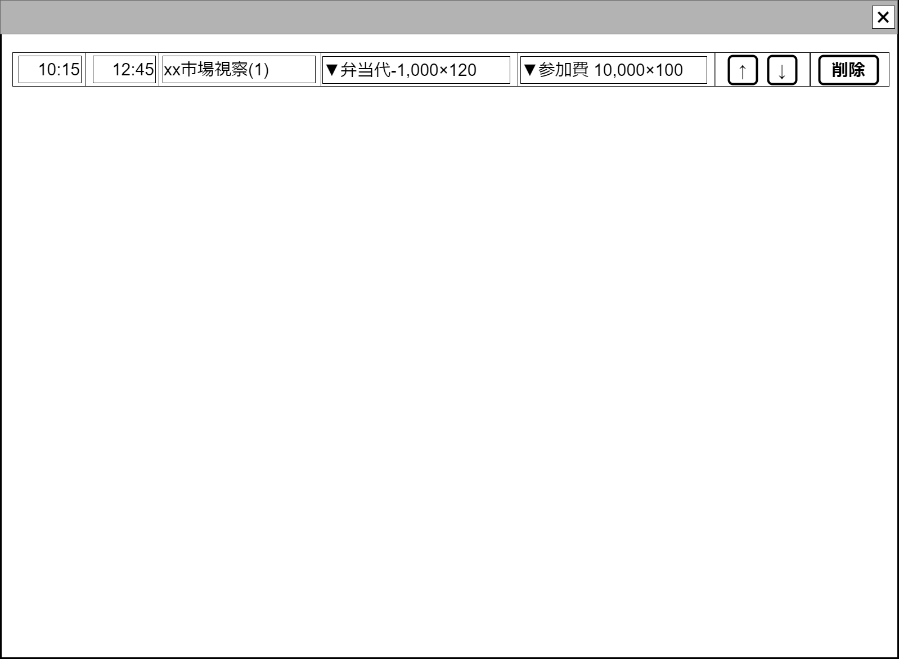

# 1日スケジュール表の行【コンポーネント】設計書

## 状態：仕様未確定(実装不可)

## 1. 目的

[1日スケジュール表設計書](./trace_event_oneday.md)におけるテーブル表行コンポーネント

## 2. 構成コンポーネント

なし

## 3. 画面イメージ

### 3.1 画面イメージ

### 3.2 画面イメージ(項番)

## 4. フィールド要素一覧

### 4.1 独自フィールド

| 番号 |    論理名    |          タイプ          | 活性／表示 |                                                内容                                                |
| ---- | ------------ | ------------------------ | ---------- | -------------------------------------------------------------------------------------------------- |
| 1    | 開始時間入力 | インプットテキスト(時刻) | 活性       | この行のイベントの開始時間を入力できるようにすること                                               |
| 2    | 終了時間入力 | インプットテキスト(時刻) | 活性       | この行のイベントの終了時間を入力できるようにすること                                               |
| 3    | イベント摘要 | インプットテキスト       | 活性       | この行のイベントを識別するわかりやすい摘要を入力できるようにすること                               |
| 1    | 収入項目選択 | セレクトボタン(複数選択) | 活性       | この日にあったと申告された収入項目のうち、イベントに割り当てられていない項目を合わせて表示すること |
| 1    | 支出項目選択 | セレクトボタン(複数選択) | 活性       | この日にあったと申告された支出項目のうち、イベントに割り当てられていない項目を合わせて表示すること |
| 1    | 上へボタン   | ボタン                   | 活性       | アクションリスト参照                                                                               |
| 2    | 下へボタン   | ボタン                   | 活性       | アクションリスト参照                                                                               |
| 3    | 削除         | ボタン                   | 活性       | アクションリスト参照                                                                               |

## 5. アクション一覧

| 番号 |      論理名      |     タイプ     | 活性／表示 |                                         内容                                         |
| ---- | ---------------- | -------------- | ---------- | ------------------------------------------------------------------------------------ |
| 1    | 上へボタン       | ボタン         | 活性       | この行自身を一つ上に移動するボタンが押下されたことを親テーブルに通知`emit`すること   |
| 2    | 下へボタン       | ボタン         | 活性       | この行自身を一つ下に移動にするボタンが押下されたことを親テーブルに通知`emit`すること |
| 3    | 削除             | ボタン         | 活性       | この行自身を削除するボタンが押下されたことを親テーブルに通知`emit`すること           |
| 3    | 収入イベント選択 | セレクトボタン | 活性       | 親テーブルの未分類項目プールから選択された項目を増減するよう通知`emit`すること       |
| 3    | 支出イベント選択 | セレクトボタン | 活性       | 親テーブルの未分類項目プールから選択された項目を増減するよう通知`emit`すること       |

## 6. サンプルテンプレートインターフェイス

TableScheduleRowInterface

 |  論理名  |  論理名  |  型  |         説明(例)         |
 | -------- | -------- | ---- | ------------------------ |
 | サンプル | sampleId | Long | 政治家を識別する一意のId |

## 7. 連携

入力内容が変更された都度、入力チェックを行い親画面に変更内容を通知する`emit[sendTableScheduleRowInterface(data,errorInfo)]`
