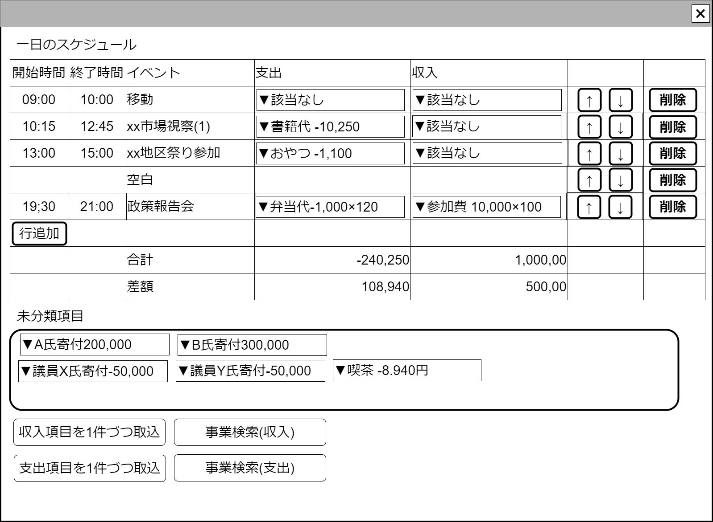

# 1日スケジュール表【コンポーネント】設計書

## 状態：仕様未確定(実装不可)

## 1. 目的

[1日イベント追跡調査表示画面](./trace_event_oneday.md)におけるテーブル表コンポーネント

## 2. 構成コンポーネント

### 2.1 構成

1. 独自フィールド
2. [スケジュール表の行コンポーネント](./schedule_row.md)
3. 独自フィールド
4. [収入項目選択コンポーネント](./#)
5. [事業選択(収入)コンポーネント](./#)
6. [支出項目選択コンポーネント](./#)
7. [事業選択(支出)コンポーネント](./#)

### 2.2 繰り返し項目

スケジュール表の行コンポーネントは、ユーザ操作で1.増減2.順序変更する

## 3.画面イメージ

### 3.1 画面イメージ

### 3.2 画面イメージ(項番)

## 4. フィールド要素一覧

### 4.1 独自フィールド

| 番号 |           論理名           |       タイプ       | 活性／表示 |                                          内容                                          |
| ---- | -------------------------- | ------------------ | ---------- | -------------------------------------------------------------------------------------- |
| 1    | スケジュール表             | テーブル           | 表示       | その日のイベントを時間単位で行表示すること                                             |
| 1    | 行追加                     | ボタン             | 活性       | 押下時：最下段に行を追加すること                                                       |
| 2    | テーブル内支出計           | インプットテキスト | 非活性     | スケジュールとして割り当てられた項目のうち収入の合計                                   |
| 3    | テーブル内収入計           | インプットテキスト | 非活性     | スケジュールとして割り当てられた項目のうち支出の合計                                   |
| 1    | 未決定イベントプール(収入) | ラベル(配列)       | 表示       | この日にあったと申告された収入のうち、イベントに割り当てられていない項目を表示すること |
| 1    | 未決定イベントプール(支出) | ラベル(配列)       | 表示       | この日にあったと申告された支出のうち、イベントに割り当てられていない項目を表示すること |
| 1    | 収入項目検索ボタン         | ボタン             | 活性       | 押下時：収入項目選択コンポーネントを表示すること                                       |
| 1    | 事業検索ボタン(収入)       | ボタン             | 活性       | 押下時：事業選択(収入)コンポーネントを表示すること                                     |
| 1    | 支出項目検索ボタン         | ボタン             | 活性       | 押下時：支出項目検索コンポーネントを表示すること                                       |
| 1    | 事業検索ボタン(支出)       | ボタン             | 活性       | 押下時：事業選択(収入)コンポーネントを表示すること                                     |

### 4.2 スケジュール表の行コンポーネント

[スケジュール表の行コンポーネント](./schedule_row.md)を参照

## 5. アクション一覧

| 番号 | 論理名 | タイプ | 活性／表示 |           内容           |
| ---- | ------ | ------ | ---------- | ------------------------ |
| 1    | 行追加 | ボタン | 活性       | 最下段に行を追加すること |

## 6. サンプルテンプレートインターフェイス

ScheduleTableInterface

 |          論理名          |    論理名    |                型                 |             説明(例)             |
 | ------------------------ | ------------ | --------------------------------- | -------------------------------- |
 | スケジュール表の行リスト | listEventRow | List\<TableScheduleRowInterface\> | 行コンポーネント用のデータ配列   |
 | 未選択イベント項目       | list         | List\<EventDigestInterface\>      | 未選択である収入・支出項目の要約 |

## 7. 連携

入力内容が変更された都度、入力チェックを行い親画面に変更内容を通知する`emit[sendScheduleTableOnedayInterface(data,errorInfo)]`
