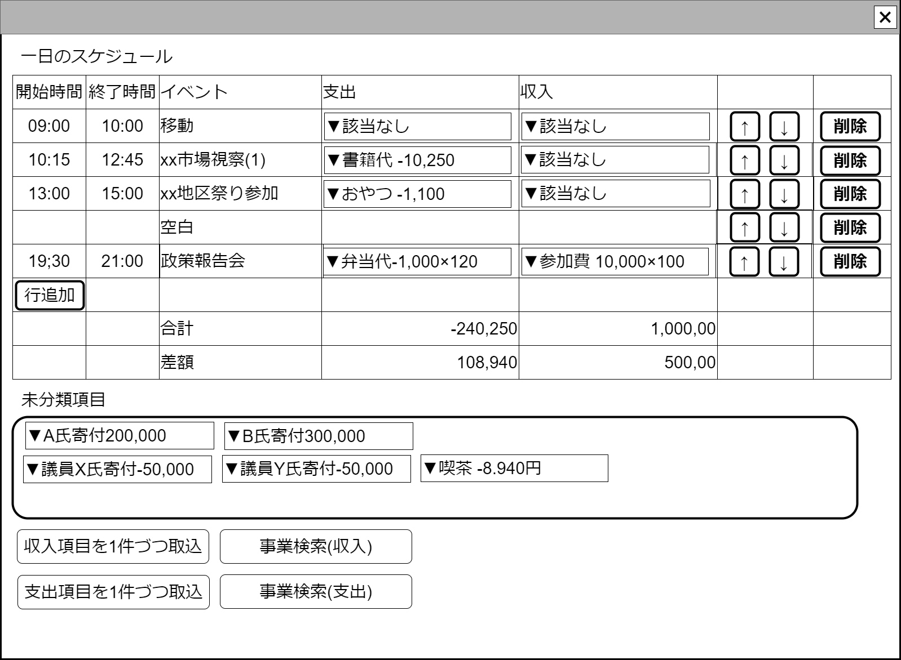

# 1日スケジュール表【コンポーネント】設計書

## 状態：仕様未確定(実装不可)

## 1. 目的

[1日イベント追跡調査表示画面](./trace_event_oneday.md)におけるテーブル表コンポーネント

## 2. 構成コンポーネント

### 2.1 構成

1. 独自フィールド
2. スケジュール表の行コンポーネント
3. 独自フィールド

### 2.2 繰り返し項目

スケジュール表の行コンポーネントは、ユーザ操作で1.増減2.順序変更する

## 3.画面イメージ

### 3.1 画面イメージ

### 3.2 画面イメージ(項番)

## 4. フィールド要素一覧

### 4.1 独自フィールド

| 番号 |        論理名        |       タイプ       | 活性／表示 |                                                 内容                                                 |
| ---- | -------------------- | ------------------ | ---------- | ---------------------------------------------------------------------------------------------------- |
| 1    | スケジュール表       | テーブル           | -          | その日のイベントを時間単位で行表示すること                                                           |
| 2    | テーブル内支出計     | インプットテキスト | 非活性     | スケジュールとして割り当てられた項目のうち収入の合計                                                 |
| 3    | テーブル内収入計     | インプットテキスト | 非活性     | スケジュールとして割り当てられた項目のうち支出の合計                                                 |
| 1    | 未決定イベントプール | -                  | -          | この日にあったと申告された収入、支出のうち、イベントに割り当てられていない項目を合わせて表示すること |

### 4.2 スケジュール表の行コンポーネント

[スケジュール表の行コンポーネント](./schedule_row_vue.md)を参照

## 5. アクション一覧

| 番号 | 論理名 | タイプ | 活性／表示 |           内容           |
| ---- | ------ | ------ | ---------- | ------------------------ |
| 1    | 行追加 | ボタン | 活性       | 最下段に行を追加すること |

## 6. サンプルテンプレートインターフェイス

ScheduleTableInterface

 |  論理名  |  論理名  |  型  |         説明(例)         |
 | -------- | -------- | ---- | ------------------------ |
 | サンプル | sampleId | Long | 政治家を識別する一意のId |

## 7. 連携

入力内容が変更された都度、入力チェックを行い親画面に変更内容を通知する`emit[sendScheduleTableInterface(data,errorInfo)]`
