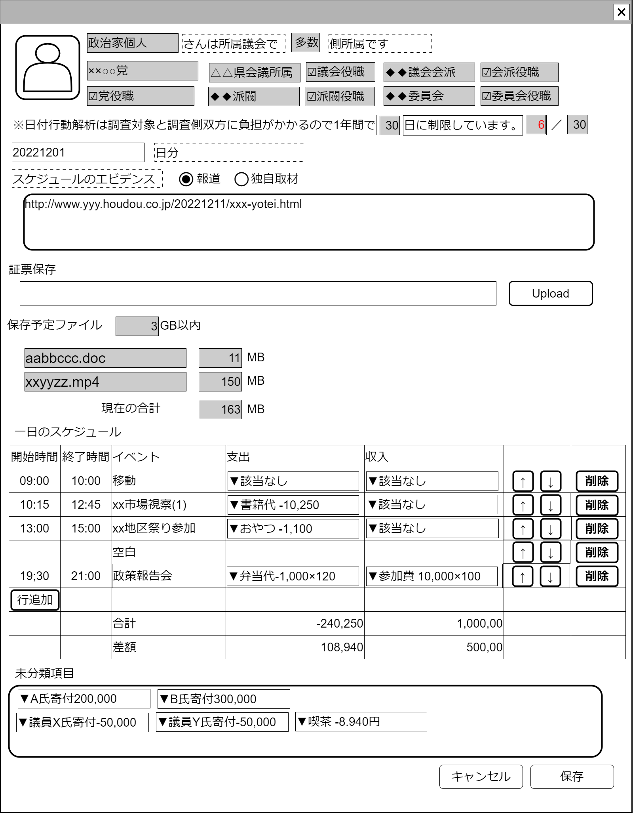

# 1日イベント追跡調査【表示画面】設計書

## 状態：仕様未確定(実装不可)

## 1. 目的

政治家の1日のイベントを書き出し、その日に収入・支出として報告された項目との整合性を確認する調査

## 2. 構成コンポーネント

### 2.1 コンポーネント構成

1. [政治家表示コンポーネント](../../common/front/politician/politician_view_vue.md)
2. 独自フィールド1
3. [ファイルアップロードコンポーネント](../../common/front/file_upload/file_upload.md)
4. [スケジュール表コンポーネント](./schedule_table.md)
4-a. [スケジュール表の行コンポーネント](./schedule_table.md)
5. 独自フィールド2

### 2.2 繰り返し項目

4-a.スケジュール表の行コンポーネントはユーザ操作で1.増減2.順序変更する

## 3.画面イメージ

### 3.1 画面イメージ

### 3.2 画面イメージ(項番)

## 4. フィールド要素一覧

### 4.1 政治家表示コンポーネント

[政治家表示コンポーネント](../../common/front/politician/politician_view_vue.md)を参照

### 4.2 独自フィールド

| 番号 |           論理名           |          タイプ          | 活性／表示 |                                      内容                                      |
| ---- | -------------------------- | ------------------------ | ---------- | ------------------------------------------------------------------------------ |
| 1    | 年間調査制限日数(1)        | インプットテキスト       | 非活性     | 調査制限日数を表示すること(システム変数)                                       |
| 2    | 年間調査実施日数           | インプットテキスト       | 非活性     | その年度に対象政治家に対して1日イベント追跡調査を行った回数                    |
| 3    | 年間調査制限日数(2)        | インプットテキスト       | 非活性     | 調査制限日数を表示すること(システム変数)                                       |
| 4    | 日付選択                   | インプットテキスト(日付) | 活性       | 1日のイベントを追跡する日付を指定できること                                    |
| 5    | スケジュールエビデンス選択 | ラジオボタン             | 活性       | 日程を調査した時のエビデンスを入手方法を指定する。報道または独自取材のいずれか |
| 6    | エビデンス詳細記述         | テキストエリア           | 活性       | 報道の場合はURL推奨。独自取材の場合は自由記載                                  |

### 4.3 ファイルアップロードコンポーネント

[ファイルアップロードコンポーネント](../../common/front/file_upload/file_upload.md)を参照

### 4.4 スケジュール表コンポーネント

[スケジュール表コンポーネント](./schedule_table.md)を参照

## 5. アクション一覧

| 番号 |   論理名   | タイプ | 活性／表示 |                      内容                      |
| ---- | ---------- | ------ | ---------- | ---------------------------------------------- |
| 1    | キャンセル | ボタン | 活性       | 押下時：入力内容を破棄してこの画面を閉じること |
| 2    | 保存       | ボタン | 活性       | 押下時：入力内容を保存してこの画面を閉じること |

## 6. サンプルテンプレートインターフェイス

TraceEventOneDayInterface

|            論理名            |     論理名      |           型           |                                     説明(例)                                      |
| ---------------------------- | --------------- | ---------------------- | --------------------------------------------------------------------------------- |
| 一日追跡調査Id               | traceEventId    | Long                   | 一日追跡調査Id                                                                    |
| 一日追跡調査同一識別コード   | traceEventCode  | Integer                | 変更履歴にかかわらず一日追跡調査を同一識別すコード                                |
| 調査実施日                   | traceEventDate  | LocalDate              | 調査対象日                                                                        |
| 調査実施ユーザId             | userId          | Long                   | 調査実施ユーザId                                                                  |
| 調査実施ユーザ同一識別コード | userCode        | Integer                | 変更履歴にかかわらずユーザを同一識別するコード                                    |
| 調査実施ユーザ名称           | userName        | String                 | 調査実施ユーザ氏名                                                                |
| 追跡対象政治家Id             | politicianId    | Long                   | 政治家Id                                                                          |
| 追跡対象政治家同一識別コード | politicianCode  | Integer                | 政治家コード                                                                      |
| 追跡対象政治家氏名           | politicianName  | String                 | 政治家氏名                                                                        |
| 追跡調査内容                 | investResult    | ScheduleTableInterface | 具体的な調査詳細                                                                  |
| 調査書証Idリスト             | listShoshouId   | List\<String\>         | 書証としてアップロードされたファイルに付加されたIdの配列                          |
| 記載エビデンスタイプ         | evidenceNoteKbn | Integer                | エビデンスとして記載された内容が`報道:0`または`独自取材:10`であるかどうか         |
| 記載エビデンス               | evidenceNote    | String                 | 調査エビデンス。エラーチェックはないが、報道の場合は参照Urlを記載するのが望ましい |

## 7. 連携

ファイルアップロード作業が成功されるたびにアップロード関連情報を`recieveStorageFileUploadInterface(未定)`で受信すること
子画面から`computed`を設定されたTraceEventOneDayInterfaceの変更状態を常に受信すること
