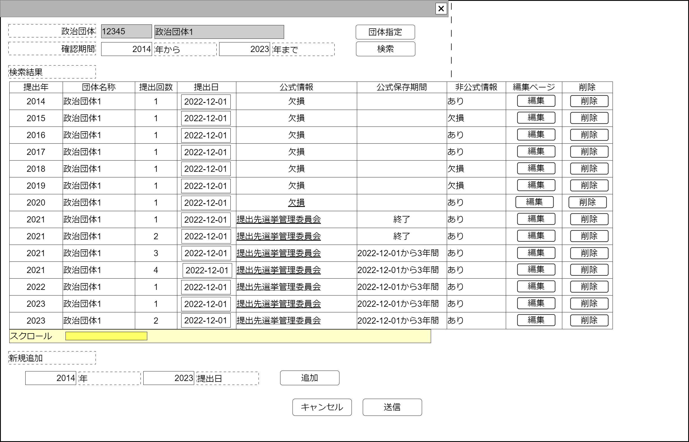

# 収支報告書欠損検出(版管理)【表示画面】設計書

## 状態：Mockデータを用いた一次実装完了

## 1.目的

政治資金収支報告書で公式・非公式かつ発行回数に応じて資料の欠損がないか、一覧し検出する

## 2. 構成コンポーネント

1. 独自フィールド
2.[政治団体検索コンポーネント](../../common/front/search_election_commission/search_election_commission.md)

### 2.1 繰り返し項目

なし

## 3. 画面イメージ

### 3.1 画面イメージ

### 3.2 画面イメージ(項番)

## 4. フィールド要素一覧

| 番号 |        論理名        |       タイプ       | 活性／表示 |                                           内容                                           |
| ---- | -------------------- | ------------------ | ---------- | ---------------------------------------------------------------------------------------- |
| 1    | 政治団体コード       | インプットテキスト | 非活性     | 政治団体コードを表示すること                                                             |
| 1    | 政治団体名称         | インプットテキスト | 非活性     | 政治団体名称を表示すること。                                                             |
| 1    | 政治団体指定ボタン   | ボタン             | 活性       | 押下時：政治団体を検索し、指定するコンポーネントを表示すること。                         |
| 1    | 確認期間開始年       | インプットテキスト | 活性       | 検索条件開始年の入力を受け付けること                                                     |
| 1    | 確認期間終了年       | インプットテキスト | 活性       | 検索条件終了年の入力を受け付けること                                                     |
| 1    | 検索ボタン           | ボタン             | 活性       | 押下時：政治団体と、指定期間に合致する政治資金収支報告書を閲覧できる手段を一覧すること。 |
| 1    | 検索結果表示テーブル | テーブル           | 表示       | 検索結果を表示すること                                                                   |
| 1    | 新規追加報告年       | インプットテキスト | 活性       | 新たに追加する提出回の報告年の入力を受け付けること                                       |
| 1    | 新規追加発行日       | インプットテキスト | 活性       | 新たに追加する提出回の発行日の入力を受け付けること                                       |
| 1    | 追加ボタン           | ボタン             | 活性       | 押下時：指定された発行年と発行日のデータの追加入力を受け付けること                       |

### 4.1 検索結果表示テーブル

| 番号 |          論理名          | タイプ |  活性／表示  |                                                                                                   内容                                                                                                    |
| ---- | ------------------------ | ------ | ------------ | --------------------------------------------------------------------------------------------------------------------------------------------------------------------------------------------------------- |
| 1    | 報告年                   | ボタン | 活性         | 報告年を表示すること                                                                                                                                                                                      |
| 1    | 政治団体名称             | ラベル | 表示         | 政治団体名称を表示すること                                                                                                                                                                                |
| 1    | 提出回数                 | ラベル | 表示         | 政治資金収支報告書の公式提出回数を表示すること                                                                                                                                                            |
| 1    | 発行日                   | ラベル | 表示         | 政治資金収支報告書の発行日の入力を受け付けること                                                                                                                                                          |
| 1    | 提出公式サイト登録リンク | リンク | 活性／非表示 | 提出された選挙管理委員会の名称を表示テキストとし、資料への直接リンクURLを表示すること。登録がない場合はラベルで`欠損`と表示すること                                                                       |
| 1    | 公式公表期間             | ラベル | 表示         | 該当の発行日の収支報告書が公開終了しリンク切れ入力がされている場合には「終了」と表示、そうでない場合は予定された掲載終了期間(3年)を考慮し`公開日から3年間`と表示すること                                  |
| 1    | 非公式情報の有無         | ラベル | 表示         | 該当発行日の非公式サイトのデータが存在する場合は`あり`、存在しない場合は`欠損`と表示すること                                                                                                              |
| 1    | 編集                     | ボタン | 活性／非活性 | 該当発行日の収支報告書に関する公式リンクの修正、非公式サイトへのリンク追加などの情報の編集作業ができるページへの遷移を提供すること。追加直後など公式、非公式データが1件も存在しない場合は非活性であること |
| 1    | 削除                     | ボタン | 活性         | 該当発行日の収支報告書が存在しないものとする作業を行うこと                                                                                                                                                |

## 5. アクション一覧

| 番号 |      論理名      | タイプ | 活性／表示 |                                                 内容                                                 |
| ---- | ---------------- | ------ | ---------- | ---------------------------------------------------------------------------------------------------- |
| 1    | キャンセル       | ボタン | 活性       | 押下時：入力内容を破棄すること                                                                       |
| 1    | 保存             | ボタン | 活性       | 押下時：入力内容を保存すること                                                                       |
| 1    | 検索             | ボタン | 活性       | 押下時：政治団体と、指定期間に合致する政治資金収支報告書を閲覧できる手段を一覧すること。             |
| 1    | 検索テーブル編集 | ボタン | 活性       | 該当発行日の収支報告書に関する公式リンクの修正、非公式サイトへのリンク追加などの情報の編集を行うこと |
| 1    | 検索テーブル削除 | ボタン | 活性       | 該当発行日の収支報告書が存在しないものとする作業を行うこと                                           |

## 6. インターフェイス

### 6.1 欠損検出検索条件インターフェイス

SearchConditionDetectDefectInterface

 |       論理名       |       論理名       |   型    |                       説明(例)                       |
 | ------------------ | ------------------ | ------- | ---------------------------------------------------- |
 | 団体Id             | orgnaizationId     | Long    | 政党または政治団体を識別する一意のId                 |
 | 団体同一識別コード | orgnaizationCode   | Long    | 履歴にかかわらず政党または政治団体を識別する一意のId |
 | 団体名称           | orgnaizationName   | String  | 政党または政治団体名称                               |
 | 検索条件開始年     | conditionStartYear | Integer | 検索条件として指定する開始西暦年                     |
 | 検索条件終了年     | conditionEndYear   | Integer | 検索条件として指定する終了西暦年                     |

### 6.2 収支報告書版管理インターフェイス

LinkBalancesheetVersionInterface

 |                論理名                |           論理名            |   型    |                                          説明(例)                                          |
 | ------------------------------------ | --------------------------- | ------- | ------------------------------------------------------------------------------------------ |
 | 収支報告書公開版番号Id               | linkBalancesheetVersionId   | Long    | 政治資金収支報告書管理項目Id                                                               |
 | 収支報告書公開版番号同一識別コード   | linkBalancesheetVersionCode | Long    | 政治資金収支報告書管理項目同一識別コード                                                   |
 | 政治団体Id                           | politicOrgnaizationId       | Long    | 政治団体を識別する一意のId                                                                 |
 | 政治団体同一識別コード               | politicOrgnaizationCode     | Integer | 履歴にかかわらず政治団体を識別する一意のId                                                 |
 | 政治団体名称                         | politicOrgnaizationName     | String  | 政治団体名称                                                                               |
 | 報告年                               | offeringYear                | Integer | 報告年                                                                                     |
 | 提出回数                             | offeringTimes               | Integer | 提出回数(永続化しない)                                                                     |
 | 報告日                               | offeringDate                | Date    | 報告日                                                                                     |
 | 公開日                               | publicationDate             | String  | 収支報告書公開日                                                                           |
 | 公式データセット該否                 | isDataSetFormal             | Boolean | 公式データが整備されている場合は`true`                                                     |
 | 非公式データセット該否               | isDataSetInformal           | Boolean | 非公式データが1件でも登録されている場合は`true`                                            |
 | 提出選挙管理委員会Id                 | electionCommitionId         | Long    | 政治資金収支報告書が提出された選挙管理委員会Id                                             |
 | 提出選挙管理委員会同一識別コード     | electionCommitionCode       | Integer | 政治資金収支報告書が提出された選挙管理委員会同一識別コード                                 |
 | 提出選挙管理委員会名称               | electionCommitionName       | String  | 政治資金収支報告書が提出された選挙管理委員会名称                                           |
 | 公式(選挙管理委員会)掲載リンク       | publicationLinkUrl          | String  | 政治資金収支報告書が提出された選挙管理委員会に存在する該当政治資金収支報告書への絶対リンク |
 | 公式政治資金収支報告書リンクId       | publicationFormalItemId     | String  | 指定された報告年、報告日データを一括で管理するためのId                                     |
 | 公式政治資金収支報告書同一識別コード | publicationFormalItemCode   | String  | 指定された報告年、報告日データを一括で管理するための同一識別コード                         |

## 7. 連携

検索テーブル編集ボタン押下時に[編集ページ](../make_link_balancesheet/make_link_balancesheet.md)への遷移を提供すること。同時に値`公式政治資金収支報告書リンクId:publicationFormalItemId`を引き渡すこと
TODO 政治団体検索コンポーネント
