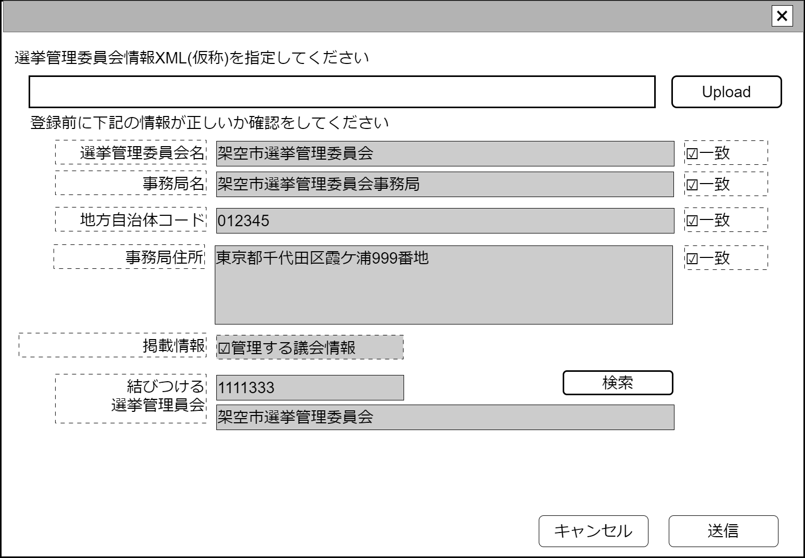

# 選挙管理委員会情報取込【表示画面】設計書

## 状態：仕様未確定(実装不可)

## 1.目的

選挙管理委員会情報の取込をおこなう。
将来的にはAPIによる自動更新に移行し、表示画面としては廃止予定

## 2. 構成コンポーネント

1. [汎用XMLアップロードコンポーネント](../../common/front/general_xml_upload/general_xml_upload.md)
2. 独自フィールド
3. [選挙管理委員会検索コンポーネント](./#)

### 2.1 繰り返し項目

なし

## 3. 画面イメージ

### 3.1 画面イメージ

### 3.2 画面イメージ(項番)

## 4. フィールド要素一覧

| 番号 |                論理名                |      タイプ      | 活性／表示 |                                                                    内容                                                                     |
| ---- | ------------------------------------ | ---------------- | ---------- | ------------------------------------------------------------------------------------------------------------------------------------------- |
| 1    | 読み取り選挙管理委員会名称           | ラベル           | 表示       | XMLに記載されている選挙管理委員会名称が表示されていること                                                                                   |
| 1    | 選挙管理委員会名称一致チェック       | チェックボックス | 活性       | これから結びつける選挙管理委員会名称と読み取り選挙管理委員会名称が一致していることの確認の入力を受け付けること。初期値は`false`             |
| 1    | 読み取り選挙管理委員会事務局名称     | ラベル           | 表示       | XMLに記載されている選挙管理員会事務局名称が表示されていること                                                                               |
| 1    | 選挙管理委員会事務局名称一致チェック | チェックボックス | 活性       | これから結びつける選挙管理委員会事務局名称と読み取り選挙管理委員会事務局名称が一致していることの確認の入力を受け付けること。初期値は`false` |
| 1    | 読み取り自治体コード                 | ラベル           | 表示       | XMLに記載されている地方自治体コードが表示されていること                                                                                     |
| 1    | 自治体コード一致チェック             | チェックボックス | 活性       | これから結びつける選挙管理委員会地方自治体コードと読み取り地方自治体コードが一致していることの確認の入力を受け付けること。初期値は`false`   |
| 1    | 読み取り事務局住所                   | ラベル           | 表示       | XMLに記載されている事務局事務所が表示されていること                                                                                         |
| 1    | 事務局住所一致チェック               | チェックボックス | 活性       | これから結びつける事務局住所と読み取り地方自治体コードが一致していることの確認の入力を受け付けること。初期値は`false`                       |
| 1    | 登録議会情報                         | チェックボックス | 表示       | XMLに議会情報が含まれている場合は`true`を表示すること                                                                                       |
| 1    | 結びつける選挙管理員会同一識別コード | ラベル           | 表示       | 結びつける選挙管理員会同一識別コードが表示されていること                                                                                    |
| 1    | 結びつける選挙管理員会同一識別名称   | ラベル           | 表示       | 結びつける選挙管理員会名称が表示されていること                                                                                              |

## 5. アクション一覧

| 番号 |      論理名      | タイプ | 活性／表示 |                         内容                         |
| ---- | ---------------- | ------ | ---------- | ---------------------------------------------------- |
| 1    | XMLアップロード  | ボタン | 活性       | 押下時：登録したいXMLを指定すること                  |
| 1    | 選挙管理員会指定 | ボタン | 活性       | 押下時：選挙管理員会検索コンポーネントを表示すること |
| 1    | キャンセル       | ボタン | 活性       | 押下時：入力内容を破棄すること                       |
| 1    | 保存             | ボタン | 活性       | 押下時：入力内容を保存すること                       |

## 6. 選挙管理員会取り込み確認インターフェイス

CheckConmbinedElectionComissionInterface

|                論理名                |                  物理名                  |   型    |                           説明(例)                           |
| ------------------------------------ | ---------------------------------------- | ------- | ------------------------------------------------------------ |
| 結びつけ選挙管理員会Id               | electionCommissionId                     | Long    | 選挙管理員会を識別する一意のId                               |
| 結びつけ選挙管理員会同一識別コード   | electionCommissionCode                   | Integer | 変更にかかわらず選挙管理員会が同一であることを識別するコード |
| 結びつけ選挙管理員会名称             | electionCommissionName                   | String  | 選挙管理員会名称                                             |
| 取込み前確認・選挙管理員会名称       | isConfirmElectionCommissionName          | boolean | 選挙管理員会名称の一致を確認したら`true`                     |
| 取込み前確認・選挙管理員会事務局名称 | isConfirmElectionCommissionOfficeName    | boolean | 選挙管理員会事務局名称の一致を確認したら`true`               |
| 取込み前確認・選挙管理員会事務局住所 | isConfirmElectionCommissionOfficeAddress | boolean | 選挙管理員会事務局住所の一致を確認したら`true`               |
| 取込み前確認・地方自治体コード       | isConfirmLocalGovCode                    | boolean | 地方自治体コードの一致を確認したら`true`                     |
| 読み取り選挙管理員会読み取りデータ   | xmlDataString                            | String  | XMLデータ                                                    |

## 7. 連携

汎用XMLアップロードコンポーネントからのデータを関数`recieveGeneralUploadXmlInterface(data,errorInfo)]`で受信する
