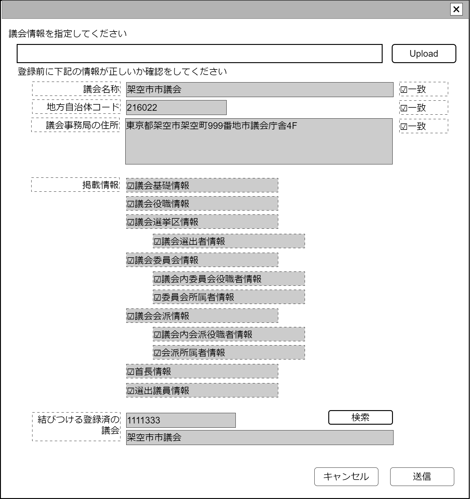

# 議会情報取込【表示画面】設計書

## 状態：仕様未確定(実装不可)

## 1.目的

議会情報取込を取り込む
将来はAPIによる自動更新を採用するため、廃止予定

## 2. 構成コンポーネント

1. [汎用XMLアップロードコンポーネント](../../common/front/general_xml_upload/general_xml_upload.md)
2. 独自フィールド
3. [議会検索コンポーネント](../../common/front/serach_paliament/serach_paliament.md)

### 2.1 繰り返し項目

なし

## 3. 画面イメージ

### 3.1 画面イメージ

### 3.2 画面イメージ(項番)

## 4. フィールド要素一覧

| 番号 |              論理名               |      タイプ      | 活性／表示 |                                                                   内容                                                                    |
| ---- | --------------------------------- | ---------------- | ---------- | ----------------------------------------------------------------------------------------------------------------------------------------- |
| 1    | 汎用XMLアップロードコンポーネント | コンポーネント   | 表示       | 取込する議会選挙区情報XMLを指定すること                                                                                                   |
| 1    | 読み取り議会名称                  | ラベル           | 表示       | XMLに記載されている議会名称が表示されていること                                                                                           |
| 1    | 議会名称一致チェック              | チェックボックス | 活性       | これから結びつける議会名称と読み取り議会名称が一致していることの確認の入力を受け付けること。初期値は`false`                               |
| 1    | 読み取り自治体コード              | ラベル           | 表示       | XMLに記載されている地方自治体コードが表示されていること                                                                                   |
| 1    | 自治体コード一致チェック          | チェックボックス | 活性       | これから結びつける議会が存在する地方自治体コードと読み取り地方自治体コードが一致していることの確認の入力を受け付けること。初期値は`false` |
| 1    | 読み取り議会住所                  | ラベル           | 表示       | XMLに記載されている議会住所が表示されていること                                                                                           |
| 1    | 議会住所一致チェック              | チェックボックス | 活性       | これから結びつける議会住所と読み取り議会住所が一致していることの確認の入力を受け付けること。初期値は`false`                               |
| 1    | 議会基礎情報有無                  | チェックボックス | 非活性     | XMLに議会基礎情報が含まれている場合は`true`を表示すること                                                                                 |
| 1    | 議会役職情報有無                  | チェックボックス | 非活性     | XMLに議会役職情報が含まれている場合は`true`を表示すること                                                                                 |
| 1    | 議会選挙区情報有無                | チェックボックス | 非活性     | XMLに議会選挙区情報が含まれている場合は`true`を表示すること                                                                               |
| 1    | 議会選挙区選出者情報有無          | チェックボックス | 非活性     | XMLに議会選挙区選出者情報が含まれている場合は`true`を表示すること                                                                         |
| 1    | 議会委員会情報有無                | チェックボックス | 非活性     | XMLに議会委員会情報情報が含まれている場合は`true`を表示すること                                                                           |
| 1    | 議会委員会役職情報有無            | チェックボックス | 非活性     | XMLに議会委員会役職情報情報が含まれている場合は`true`を表示すること                                                                       |
| 1    | 議会委員会所属議員情報有無        | チェックボックス | 非活性     | XMLに議会委員会所属議員情報が含まれている場合は`true`を表示すること                                                                       |
| 1    | 議会会派情報有無                  | チェックボックス | 非活性     | XMLに議会会派情報情報が含まれている場合は`true`を表示すること                                                                             |
| 1    | 議会会派役職情報有無              | チェックボックス | 非活性     | XMLに議会会派役職情報情報が含まれている場合は`true`を表示すること                                                                         |
| 1    | 議会会派所属議員情報有無          | チェックボックス | 非活性     | XMLに議会会派所属議員情報が含まれている場合は`true`を表示すること                                                                         |
| 1    | 議会首長情報有無                  | チェックボックス | 非活性     | XMLに議会首長情報が含まれている場合は`true`を表示すること                                                                                 |
| 1    | 結びつける議会コード              | ラベル           | 表示       | 結びつける議会識別コードが表示されていること                                                                                              |
| 1    | 結びつける議会名称                | ラベル           | 表示       | 結びつける議会名称が表示されていること                                                                                                    |

## 5.アクション一覧

| 番号 |     論理名      | タイプ | 活性／表示 |                        内容                        |
| ---- | --------------- | ------ | ---------- | -------------------------------------------------- |
| 1    | XMLアップロード | ボタン | 活性       | 押下時：登録したいXMLを指定すること                |
| 1    | 議会指定        | ボタン | 活性       | 押下時：議会選挙区検索コンポーネントを表示すること |
| 1    | キャンセル      | ボタン | 活性       | 押下時：入力内容を破棄すること                     |
| 1    | 保存            | ボタン | 活性       | 押下時：入力内容を保存すること                     |

## 6. 議会情報取込インターフェイス

CheckConmbinedParliamentInterface

|             論理名             |          物理名           |   型    |                          説明(例)                          |
| ------------------------------ | ------------------------- | ------- | ---------------------------------------------------------- |
| 結びつけ議会Id                 | parliamentId              | Long    | 議会選挙区を識別する一意のId                               |
| 結びつけ議会同一識別コード     | parliamentCode            | Long    | 変更にかかわらず議会選挙区が同一であることを識別するコード |
| 結びつけ議会名称               | parliamentName            | String  | 議会選挙区名称                                             |
| 取込み前確認・議会名称         | isConfirmElectionDistrict | boolean | 議会名称の一致を確認したら`true`                           |
| 取込み前確認・地方自治体コード | isConfirmLocalGovCode     | boolean | 地方自治体コードの一致を確認したら`true`                   |
| 取込み前確認・議会住所         | isConfirmPaliamentName    | boolean | 議会住所の一致を確認したら`true`                           |
| 読み取り議会選挙区データ       | xmlDataString             | String  | XMLデータ                                                  |

## 7. 連携

汎用XMLアップロードコンポーネントからのデータを関数`recieveGeneralUploadXmlInterface(data,errorInfo)]`で受信する
