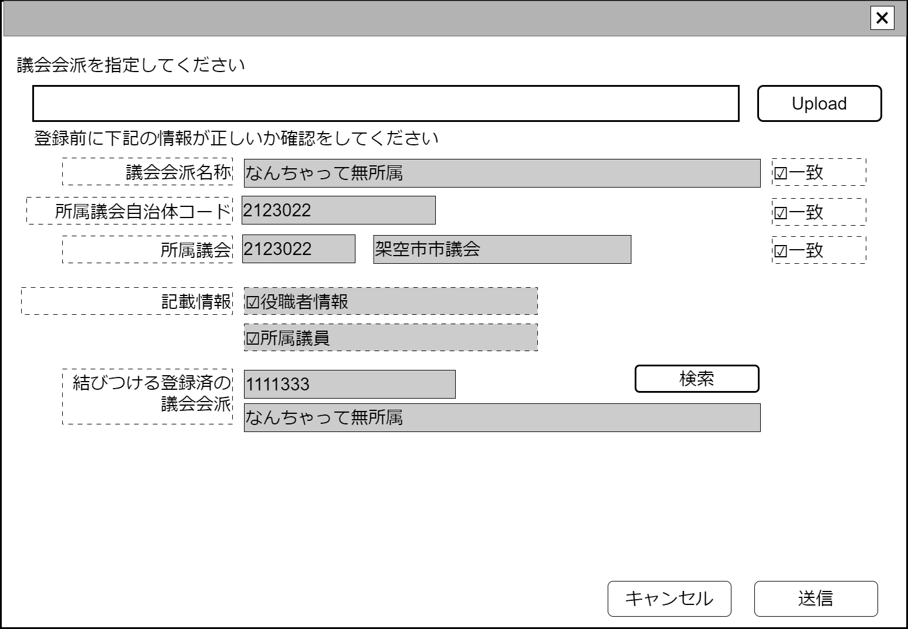

# 議会会派取込【表示画面】設計書

## 状態：仕様未確定(実装不可)

## 1.目的

議会会派情報取込を行う
APIによる自動更新を行うため画面は将来廃止予定

## 2. 構成コンポーネント

1. [汎用XMLアップロードコンポーネント](../../common/front/general_xml_upload/general_xml_upload.md)
2. 独自フィールド
3. [議会会派検索コンポーネント](./#)

### 2.1 繰り返し項目

なし

## 3. 画面イメージ

### 3.1 画面イメージ

### 3.2 画面イメージ(項番)

## 4. フィールド要素一覧

| 番号 |              論理名               |      タイプ      | 活性／表示 |                                                                内容                                                                 |
| ---- | --------------------------------- | ---------------- | ---------- | ----------------------------------------------------------------------------------------------------------------------------------- |
| 1    | 汎用XMLアップロードコンポーネント | コンポーネント   | 表示       | 取込する議会内会派情報XMLを指定すること                                                                                             |
| 1    | 読み取り議会内会派名称            | ラベル           | 表示       | XMLに記載されている議会内会派名称が表示されていること                                                                               |
| 1    | 議会内会派名称一致チェック        | チェックボックス | 活性       | これから結びつける議会内会派名称と読み取り議会内会派が一致していることの確認の入力を受け付けること。初期値は`false`                 |
| 1    | 読み取り所属議会自治体コード      | ラベル           | 表示       | XMLに記載されている議会地方自治体コードが表示されていること                                                                         |
| 1    | 所属議会自治体コード一致チェック  | チェックボックス | 活性       | これから結びつける議会地方自治体コードと読み取り議会地方自治体コードが一致していることの確認の入力を受け付けること。初期値は`false` |
| 1    | 読み取り議会名称                  | ラベル           | 表示       | XMLに記載されている議会名称が表示されていること                                                                                     |
| 1    | 議会名称一致チェック              | チェックボックス | 活性       | これから結びつける議会名称と読み取り議会名称が一致していることの確認の入力を受け付けること。初期値は`false`                         |
| 1    | 役職者情報有無                    | チェックボックス | 表示       | XMLに議会内会派の役職者情報が含まれている場合は`true`を表示すること                                                                 |
| 1    | 所属議員情報有無                  | チェックボックス | 表示       | XMLに議会内会派の所属議員情報が含まれている場合は`true`を表示すること                                                               |
| 1    | 結びつける議会内会派コード        | ラベル           | 表示       | 結びつける議会内会派一識別コードが表示されていること                                                                                |
| 1    | 結びつける議会内会派名称          | ラベル           | 表示       | 結びつける議会内会派が表示されていること                                                                                            |

## 5. アクション一覧

| 番号 |     論理名      | タイプ | 活性／表示 |                         内容                         |
| ---- | --------------- | ------ | ---------- | ---------------------------------------------------- |
| 1    | XMLアップロード | ボタン | 活性       | 押下時：登録したいXMLを指定すること                  |
| 1    | 議会内会派指定  | ボタン | 活性       | 押下時：議会内委員会検索コンポーネントを表示すること |
| 1    | キャンセル      | ボタン | 活性       | 押下時：入力内容を破棄すること                       |
| 1    | 保存            | ボタン | 活性       | 押下時：入力内容を保存すること                       |

## 6. 議会内会派情報取込インターフェイス

CheckConmbinedPaliamentFactionInterface

|                 論理名                 |            物理名            |   型    |                           説明(例)                           |
| -------------------------------------- | ---------------------------- | ------- | ------------------------------------------------------------ |
| 結びつけ議会内会派Id                   | parliamentCommisionId        | Long    | 議会内委員会を識別する一意のId                               |
| 結びつけ議会内会派同一識別コード       | parliamentCommisionCode      | Integer | 変更にかかわらず議会内委員会が同一であることを識別するコード |
| 結びつけ議会内会派名称                 | parliamentCommisionName      | String  | 議会内委員会名称                                             |
| 取込み前確認・議会内会派名称           | isConfirmParliamentCommision | boolean | 議会内委員会の一致を確認したら`true`                         |
| 取込み前確認・所属議会地方自治体コード | isConfirmLoaclGovCode        | boolean | 地方自治体コードの一致を確認したら`true`                     |
| 取込み前確認・所属議会名称             | isConfirmPaliamentName       | boolean | 議会名称の一致を確認したら`true`                             |
| 読み取り議会内会派データ               | xmlDataString                | String  | XMLデータ                                                    |

## 7. 連携

汎用XMLアップロードコンポーネントからのデータを関数`recieveGeneralUploadXmlInterface(data,errorInfo)]`で受信する
