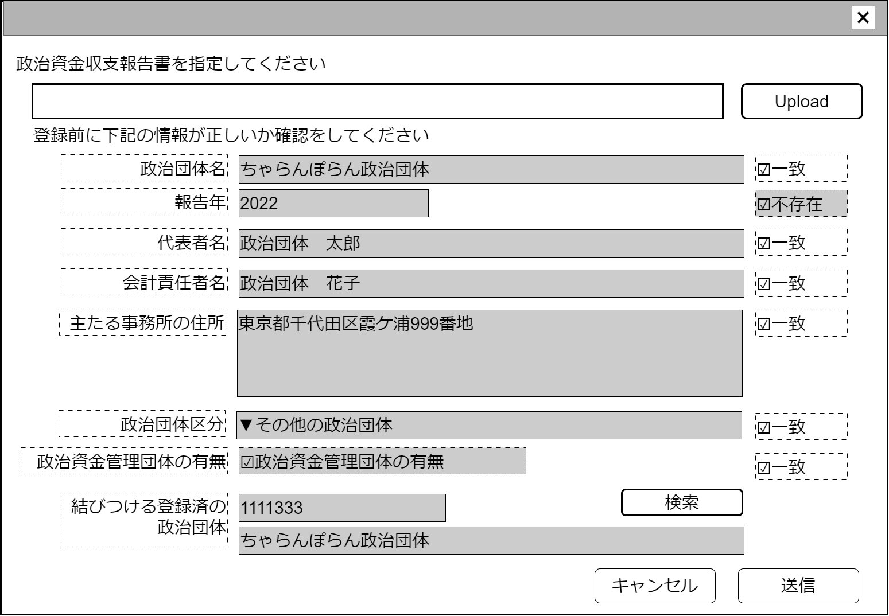

# 政治資金収支報告書取込【表示画面】設計書

## 状態：仕様未確定(実装不可)

## 1.目的

政治資金収支報告書XMLを取込する

## 2. 構成コンポーネント

1. [政治資金収支報告書XMLデータアップロードコンポーネント](../../common/front/balancesheet_xml_upload/balancesheet_xml_upload.md)
2. 独自フィールド
3. [政治団体検索コンポーネント](../#)

### 2.1 繰り返し項目

なし

## 3. 画面イメージ

### 3.1 画面イメージ

### 3.2 画面イメージ(項番)

## 4. フィールド要素一覧

| 番号 |                        論理名                         |       タイプ       | 活性／表示 |                                                                                                                 内容                                                                                                                  |
| ---- | ----------------------------------------------------- | ------------------ | ---------- | ------------------------------------------------------------------------------------------------------------------------------------------------------------------------------------------------------------------------------------- |
| 1    | 政治資金収支報告書XMLデータアップロードコンポーネント | コンポーネント     | 表示       | 取込する政治資金収支報告書データをアップロードすること                                                                                                                                                                                |
| 1    | 政治団体名                                            | インプットテキスト | 非活性     | XMLから読みとられた政治団体名を表示すること                                                                                                                                                                                           |
| 1    | 報告年                                                | インプットテキスト | 非活性     | XMLから読みとられた政治団体名を表示すること                                                                                                                                                                                           |
| 1    | 代表者名                                              | インプットテキスト | 非活性     | XMLから読みとられた代表者名を表示すること                                                                                                                                                                                             |
| 1    | 会計責任者名                                          | インプットテキスト | 非活性     | XMLから読みとられた会計責任者名を表示すること                                                                                                                                                                                         |
| 1    | 主たる事務所の住所                                    | インプットテキスト | 非活性     | XMLから読みとられた主たる事務所の住所を表示すること                                                                                                                                                                                   |
| 1    | 政治団体区分                                          | セレクトボックス   | 非活性     | XMLから読みとられた政治団体区分を表示すること                                                                                                                                                                                         |
| 1    | 政治資金管理団体の有無                                | チェックボックス   | 非活性     | XMLから読みとられた政治資金管理団体の有無を表示すること                                                                                                                                                                               |
| 1    | 紐づけ政治団体との団体名称一致チェック                | チェックボックス   | 活性       | XMLから読みとられた政治団体名と、紐づけしようとする政治団体の名称が一致していることを確認出来たことの入力を受け付けること。変更があり、表面上一致していなくても変更の事実が確認できているのであればチェックする                       |
| 1    | 紐づけ政治団体との報告年不存在チェック                | チェックボックス   | 非活性     | XMLから読みとられた報告年のデータが、紐づけしようとする政治団体データが不存在であることを表示する                                                                                                                                     |
| 1    | 紐づけ政治団体との代表者一致チェック                  | チェックボックス   | 活性       | XMLから読みとられた代表者氏名と、紐づけしようとする政治団体の代表者氏名が一致していることを確認出来たことの入力を受け付けること。変更があり、表面上一致していなくても変更の事実が確認できているのであればチェックする                 |
| 1    | 紐づけ政治団体との会計責任者名一致チェック            | チェックボックス   | 活性       | XMLから読みとられた会計責任者氏名と、紐づけしようとする政治団体の会計責任者氏名が一致していることを確認出来たことの入力を受け付けること。変更があり、表面上一致していなくても変更の事実が確認できているのであればチェックする         |
| 1    | 紐づけ政治団体との主たる事務所一致チェック            | チェックボックス   | 活性       | XMLから読みとられた主たる事務所住所と、紐づけしようとする政治団体の主たる事務所の住所が一致していることを確認出来たことの入力を受け付けること。変更があり、表面上一致していなくても変更の事実が確認できているのであればチェックする   |
| 1    | 紐づけ政治団体との政治団体区分一致チェック            | チェックボックス   | 活性       | XMLから読みとられた政治団体区分と、紐づけしようとする政治団体の政治団体区分が一致していることを確認出来たことの入力を受け付けること。変更があり、表面上一致していなくても変更の事実が確認できているのであればチェックする             |
| 1    | 紐づけ政治団体との政治資金管理団体の有無チェック      | チェックボックス   | 活性       | XMLから読みとられた資金管理団体の有無と、紐づけしようとする政治団体の資金管理団体の有無が一致していることを確認出来たことの入力を受け付けること。変更があり、表面上一致していなくても変更の事実が確認できているのであればチェックする |
| 1    | 政治団体検索ボタン                                    | ボタン             | 活性       | 政治団体検索コンポーネントを表示する                                                                                                                                                                                                  |
| 1    | 紐づけ政治団体同一識別コード                          | インプットテキスト | 非活性     | 政治資金収支報告書を取込し、紐づけしようとする政治団体同一識別コードを表示すること                                                                                                                                                    |
| 1    | 紐づけ政治団体名                                      | インプットテキスト | 非活性     | 紐づけしようとする政治団体名称を表示すること                                                                                                                                                                                          |

※同じ報告年のデータが存在する場合は、このページではアップロードせず[政治資金収支報告書バージョン管理機能](../#)を利用すること

## 5.アクション一覧

| 番号 |   論理名   | タイプ |  活性／表示  |                                                        内容                                                         |
| ---- | ---------- | ------ | ------------ | ------------------------------------------------------------------------------------------------------------------- |
| 1    | キャンセル | ボタン | 活性         | 押下時：入力内容を破棄すること                                                                                      |
| 1    | 保存       | ボタン | 活性／非活性 | 押下時：入力内容を保存すること。紐づけ政治団体との報告年不存在チェックが`false`の場合は非活性、そうでない場合は活性 |

## 6. 政治資金収支報告書取り込み確認インターフェイス

CheckConmbinedBalancesheetInterface

|               論理名               |             物理名              |   型    |                        説明(例)                        |
| ---------------------------------- | ------------------------------- | ------- | ------------------------------------------------------ |
| 政治団体Id                         | politicianOrganizationId        | Long    | 政治団体を識別する一意のId                             |
| 政治団体同一識別コード             | politicianOrganizationCode      | Long    | 変更にかかわらず政治団体同一であることを識別するコード |
| 政治団体名称                       | politicianOrganizationName      | Long    | 政治団体名称                                           |
| 報告年                             | submisshonYear                  | Integer | 報告年                                                 |
| 取込み前確認・政治団体名称         | isConfirmPoliticianOrganization | boolean | 政治団体名称の一致を確認したら`true`                   |
| 取込み前確認・報告年               | isConfirmYear                   | boolean | 指定報告年のデータが不存在なら`true`                   |
| 取込み前確認・代表者名             | isConfirmDelegate               | boolean | 団体責任者の一致を確認したら`true`                     |
| 取込み前確認・会計責任者名         | isConfirmAccountOfiicerName     | boolean | 会計責任者の一致を確認したら`true`                     |
| 取込み前確認・主たる事務所の住所   | isConfirmOfficeAddress          | boolean | 主たる事務所の住所の一致を確認したら`true`             |
| 取込み前確認・政治団体区分         | isConfirmRepresentName          | boolean | 政治団体区分の一致を確認したら`true`                   |
| 取込み前確認・政治資金団体の有無   | isConfirmHasOtherOrg            | boolean | 政治資金団体の有無の一致を確認したら`true`             |
| 読み取り選挙管理員会読み取りデータ | xmlDataString                   | String  | XMLデータ                                              |

## 7. 連携

汎用XMLアップロードコンポーネントからのデータを関数`recieveGeneralUploadXmlInterface(data,errorInfo)]`で受信する
