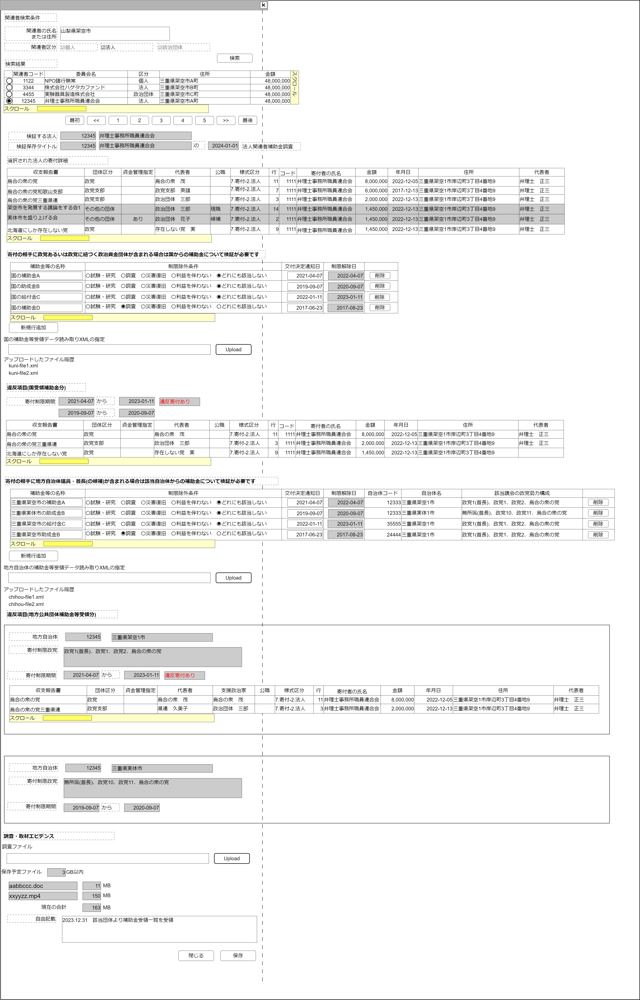

# 補助金等受領寄付制限検証【表示画面】設計書

## 状態：仕様未確定(実装不可)

NOTE: 補助金、助成金の受領状況は100%公開情報ではないため、完全な調査を行うためには 

- 国、地方公共団体から**すべての補助金、助成金等の受領団体のリスト**を(情報公開請求等で)入手し、登録し、調査委対象団体でフィルタリングする
- **調査対象団体が受領している補助金等リスト**を調査している側に**自律的に正確に提供**する

の2件のいずれかが必要になる。
仮に補助金等の給付審査段階で、政党への寄付の有無を確認して、門前払いしていれば調査自体が不要になるが、
ある種の政党支持調査=思想確認に近いのでしているはずもなく。
少し考えただけでも、膨大または調査対象団体の善意に依存する条件が、調査の条件に並んでいるので、
この**調査実効性に極めて乏しい機能は仕様の確定状況と関係なく最も後回しで実装**を行うこと 。
ほどほどの規模で、ほどほどの難易度なので実装エンジニアには「アドレナリンが出て実装したくなる」機能だと思いますが…
…で、この条件を考えた方は調査実務にどう落としこむか考えたのか??

## 1.目的

法人が政党に寄付できる条件を満たし適格かどうかを検証する

## 2. 構成コンポーネント

1. [関連者検索コンポーネント](./#)
2. 独自フィールド
3. [汎用XMLアップロードコンポーネント](../../common/front/general_xml_upload/general_xml_upload.md)
4. 独自フィールド
5. [汎用XMLアップロードコンポーネント](../../common/front/general_xml_upload/general_xml_upload.md)
6. 独自フィールド
7. [ファイルアップロードコンポーネント](../../common/front/file_upload/file_upload.md)

### 2.1 繰り返し項目

地方公共団体からの受領補助金等寄付制限リストと判定結果リスト

## 3. 画面イメージ

### 3.1 画面イメージ

### 3.2 画面イメージ(項番)

## 4. フィールド要素一覧

| 番号 |                            論理名                            |       タイプ       | 活性／表示 |                                            内容                                             |
| ---- | ------------------------------------------------------------ | ------------------ | ---------- | ------------------------------------------------------------------------------------------- |
| 1    | 関連者検索コンポーネント                                     | コンポーネント     | 表示       | 関連者検索コンポーネントを表示すること。                                                    |
| 1    | 検証対象法人同一識別コード                                   | インプットテキスト | 非活性     | 検証対象である関連者(法人)同一識別コードを表示すること。                                    |
| 1    | 検証対象法人名称                                             | インプットテキスト | 非活性     | 検証対象である関連者(法人)名称を表示すること。                                              |
| 1    | 検証タイトル名称                                             | インプットテキスト | 非活性     | 検証対象である関連者(法人)名称を表示すること。                                              |
| 1    | 検証タイトル日付                                             | インプットテキスト | 非活性     | この検証を行った日付(当日)を表示すること。                                                  |
| 1    | 検証対象法人寄付一覧                                         | テーブル           | 表示       | 選択された法人が行った寄付項目を一覧するテーブルを表示していること                          |
| 1    | 検証対象法人国からの受領補助金等一覧                         | テーブル           | 表示       | 選択された法人が国から受領した補助金、助成金を一覧するテーブルを表示していること            |
| 1    | 国からの受領補助金等一覧行追加ボタン                         | ボタン             | 活性       | 検証対象法人国からの受領補助金等一覧の最終行に行を追加すること                              |
| 1    | 汎用XMLアップロードコンポーネント(国補助金等用)              | コンポーネント     | 表示       | 国からの補助金等リストファイル(XML)の読み取りを行うコンポーネントを表示すること。           |
| 1    | 寄付制限期間リスト                                           | リスト             | 表示       | 国からの補助金等受領状況から算出した、寄付ができない期間が表示されていること                |
| 1    | 違反寄付項目一覧(国補助金分)                                 | テーブル           | 表示       | 算出された寄付禁止比較に該当する寄付項目詳細を抽出して一覧表示する                          |
| 1    | 検証対象法人地方からの受領補助金等一覧                       | テーブル           | 表示       | 選択された法人が地方公共団体から受領した補助金、助成金を一覧するテーブルを表示していること  |
| 1    | 地方公共団体からの受領補助金等一覧行追加ボタン               | ボタン             | 活性       | 地方公共団体からの受領補助金等一覧の最終行に行を追加すること                                |
| 1    | 汎用XMLアップロードコンポーネント(地方公共団体補助金等用)    | コンポーネント     | 表示       | 地方公共団体からの補助金等リストファイル(XML)の読み取りを行うコンポーネントを表示すること。 |
| 1    | 地方公共団体からの受領補助金等寄付制限リストと判定結果リスト | リスト             | 表示       | 受領した補助金等のうち地方公共団体ごとに算出した寄付制限とその判定を表示すること            |

### 4.1 選択された関連者法人の寄付項目詳細

| 番号 |     論理名     | タイプ | 活性／表示 |                                                             内容                                                             |
| ---- | -------------- | ------ | ---------- | ---------------------------------------------------------------------------------------------------------------------------- |
| 1    | 収支報告書名称 | ラベル | 表示       | 寄付項目と紐づく収支報告書が表示されていること                                                                               |
| 1    | 団体区分名称   | ラベル | 表示       | 寄付を行った政治団体の政治団体体区分名称が表示されていること                                                                 |
| 1    | 資金管理指定   | ラベル | 表示       | 寄付を行った政治団体の政治団体の資金管理指定が表示されていること                                                             |
| 1    | 代表者         | ラベル | 表示       | 寄付を行った政治団体の代表者が表示されていること                                                                             |
| 1    | 公職           | ラベル | 表示       | 代表者が現職なのか候補者なのかを表示すること                                                                                 |
| 1    | 様式区分       | ラベル | 表示       | この寄付項目の様式区分を表示すること。表記は「様式名称-様式枝区分名称」とし、ページ機能からすべて「7.寄付-2.法人」であること |
| 1    | 行             | ラベル | 表示       | この寄付項目が表示されている行数が表示されていること                                                                         |
| 1    | 寄付者氏名     | ラベル | 表示       | この寄付項目を行った寄付者(法人)の名称が表示されていること                                                                   |
| 1    | 寄付金額       | ラベル | 表示       | この寄付項目の金額が表示されていること                                                                                       |
| 1    | 寄付日付       | ラベル | 表示       | この寄付項目を行った日付が表示されていること                                                                                 |
| 1    | 寄付者住所     | ラベル | 表示       | この寄付項目を行った寄付者(法人)の住所が表示されていること                                                                   |
| 1    | 法人代表者氏名 | ラベル | 表示       | この寄付項目を行った寄付者(法人)の代表者氏名が表示されていること                                                             |

※判定で使用しない団体区分が政党・政党支部・政治資金団体以外であるデータは背景をグレーにして、判定に使用しないことを明示すること。最初から行を排除して表示していて、「表示漏れがある？」と疑念を抱かせないこと

### 4.2 国から受領する補助金等入力リスト

| 番号 |                    論理名                    |          タイプ          | 活性／表示 |                                                        内容                                                        |
| ---- | -------------------------------------------- | ------------------------ | ---------- | ------------------------------------------------------------------------------------------------------------------ |
| 1    | 補助金等名称                                 | インプットテキスト       | 活性       | 補助金等の名称の入力を受け付けること                                                                               |
| 1    | 補助金等制限除外条件選択(試験・研究)         | ラジオボタン             | 活性       | 補助金等に定義された補助金等の性質が、試験・研究である場合、その入力を受け付けること                               |
| 1    | 補助金等制限除外条件選択(調査)               | ラジオボタン             | 活性       | 補助金等に定義された助金等の性質が、調査である場合、その入力を受け付けること                                       |
| 1    | 補助金等制限除外条件選択(災害復旧)           | ラジオボタン             | 活性       | 補助金等に定義された助金等の性質が、災害復旧である場合、その入力を受け付けること                                   |
| 1    | 補助金等制限除外条件選択(利益を伴わない)     | ラジオボタン             | 活性       | 補助金等に定義された助金等の性質が、利益を伴わないものである場合、その入力を受け付けること                         |
| 1    | 補助金等制限除外条件選択(どれにも該当しない) | ラジオボタン             | 活性       | 補助金等に定義された助金等の性質が、上記すべてに当てはまらない場合、制限対象であるとして、その入力を受け付けること |
| 1    | 交付決定日                                   | インプットテキスト(日付) | 活性       | 補助金等支給決定日の入力を受け付けること                                                                           |
| 1    | 制限解除日                                   | インプットテキスト(日付) | 非活性     | 補助金等支給決定日から1年後(寄付制限終了日)が表示されていること                                                    |
| 1    | 削除ボタン                                   | ボタン                   | 活性       | 押下時：ボタンを押下された行が削除されること                                                                       |

### 4.2.1 補助金等の性質(属性)区分

 |       論理名       |  値  | 表示テキスト |
 | ------------------ | ---: | ------------ |
 | 試験・研究         |    1 | 論理名に同じ |
 | 調査               |    2 | 論理名に同じ |
 | 災害復旧           |    3 | 論理名に同じ |
 | 利益を伴わない     |    4 | 論理名に同じ |
 | どれにも該当しない |    5 | 論理名に同じ |

### 4.3 違反と判定されたの寄付項目詳細(国補助金等分)

テーブル項目は 4.1 選択された関連者法人の寄付項目詳細 に同じ

### 4.4 地方公共団体から受領する補助金等入力リスト

| 番号 |                    論理名                    |          タイプ          | 活性／表示 |                                                        内容                                                        |
| ---- | -------------------------------------------- | ------------------------ | ---------- | ------------------------------------------------------------------------------------------------------------------ |
| 1    | 補助金等名称                                 | インプットテキスト       | 活性       | 補助金等の名称の入力を受け付けること                                                                               |
| 1    | 補助金等制限除外条件選択(試験・研究)         | ラジオボタン             | 活性       | 補助金等に定義された補助金等の性質が、試験・研究である場合、その入力を受け付けること                               |
| 1    | 補助金等制限除外条件選択(調査)               | ラジオボタン             | 活性       | 補助金等に定義された助金等の性質が、調査である場合、その入力を受け付けること                                       |
| 1    | 補助金等制限除外条件選択(災害復旧)           | ラジオボタン             | 活性       | 補助金等に定義された助金等の性質が、災害復旧である場合、その入力を受け付けること                                   |
| 1    | 補助金等制限除外条件選択(利益を伴わない)     | ラジオボタン             | 活性       | 補助金等に定義された助金等の性質が、利益を伴わないものである場合、その入力を受け付けること                         |
| 1    | 補助金等制限除外条件選択(どれにも該当しない) | ラジオボタン             | 活性       | 補助金等に定義された助金等の性質が、上記すべてに当てはまらない場合、制限対象であるとして、その入力を受け付けること |
| 1    | 交付決定日                                   | インプットテキスト(日付) | 活性       | 補助金等支給決定日の入力を受け付けること                                                                           |
| 1    | 制限解除日                                   | インプットテキスト(日付) | 非活性     | 補助金等支給決定日から1年後(寄付制限終了日)が表示されていること                                                    |
| 1    | 自治体コード                                 | ラベル                   | 表示       | 補助金等を支給した地方自治体の自治体コードが表示されていること                                                     |
| 1    | 自治体名称                                   | ラベル                   | 表示       | 補助金等を支給した地方自治体名称が表示されていること                                                               |
| 1    | 該当議会の構成政党                           | ラベル                   | 表示       | 補助金等を支給した地方自治体の首長、議員の所属政党が読点区切りで表示されていること                                 |
| 1    | 削除ボタン                                   | ボタン                   | 活性       | 押下時：ボタンを押下された行が削除されること                                                                       |

### 4.5 地方公共団体からの受領補助金等寄付制限リストと判定結果リスト

| 番号 |                 論理名                 |       タイプ       | 活性／表示 |                                       内容                                       |
| ---- | -------------------------------------- | ------------------ | ---------- | -------------------------------------------------------------------------------- |
| 1    | 該当自治体コード                       | インプットテキスト | 非活性     | これから違反判定しようとする地方自治体の自治体コードが表示されていること         |
| 1    | 該当自治体名称                         | インプットテキスト | 非活性     | これから違反判定しようとする地方自治体の名称が表示されていること                 |
| 1    | 寄付制限政党リスト                     | リストテキスト     | 表示       | 地方公共団体からの補助金等受領状況から算出した、寄付禁止期間が表示されていること |
| 1    | 寄付制限期間リスト                     | リスト             | 表示       | 地方公共団体からの補助金等受領状況から算出した、寄付禁止政党が表示されていること |
| 1    | 違反寄付項目一覧(地方公共団体補助金分) | テーブル           | 表示       | 算出された寄付禁止比較に該当する寄付項目詳細を抽出して一覧表示する               |

#### 4.5.1 違反と判定されたの寄付項目詳細(地方自治体補助金等分)

テーブル項目は 4.1 選択された関連者法人の寄付項目詳細 に同じ

## 5. アクション一覧

| 番号 |                         論理名                         |  タイプ  | 活性／表示 |                                   内容                                   |
| ---- | ------------------------------------------------------ | -------- | ---------- | ------------------------------------------------------------------------ |
| 1    | 国からの受領補助金等一覧情報更新                       | イベント | －         | 更新時：国からの受領補助金等一覧情報に基づく違反判定を行うこと。         |
| 1    | 地方自治体からの受領補助金等一覧情報更新               | イベント | －         | 更新時：地方自治体からの受領補助金等一覧情報に基づく違反判定を行うこと。 |
| 1    | 国からの受領補助金等一覧行追加ボタン                   | ボタン   | 活性       | 検証対象法人国からの受領補助金等一覧の最終行に行を追加すること           |
| 1    | 削除ボタン(国から受領する補助金等入力リスト)           | ボタン   | 活性       | 押下時：ボタンを押下された行が削除されること                             |
| 1    | 地方公共団体からの受領補助金等一覧行追加ボタン         | ボタン   | 活性       | 地方公共団体からの受領補助金等一覧の最終行に行を追加すること             |
| 1    | 削除ボタン(地方公共団体から受領する補助金等入力リスト) | ボタン   | 活性       | 押下時：ボタンを押下された行が削除されること                             |
| 1    | キャンセル                                             | ボタン   | 活性       | 押下時：入力内容を破棄すること                                           |
| 1    | 保存                                                   | ボタン   | 活性       | 押下時：入力内容を保存すること                                           |

### 5.1 国からの受領補助金等一覧違反判定

国からの補助金等を受領している場合、すべての政党に対して寄付ができないので寄付制限リスト内に、寄付日が含まれているかを判定する

※基本的にサンプル画面画像のデータは嘘データだが、この違反判定基準の項は整合性があるよう作成しているので参照の事

1. 寄付制限期間リストを作成する
    - 国の補助金Aは属性が「いずれにも該当しない」であり、制限条件に合致するため、制限期間に開始日2021-04-07、終了日2022-04-07を追加する
    - 国の助成金Bは属性が「いずれにも該当しない」であり、制限条件に合致し、すでに存在する制限期間外であるので、制限期間に開始日2019-09-07、終了日2020-09-07を追加する
    - 国の給付金Cは属性が「いずれにも該当しない」であり、制限条件に合致し、すでに存在する制限期間開始日2021-04-07、終了日2022-04-07の間に開始日(支給通知日)があるので、終了日を伸ばすことで制限期間を適正に修正する
    - 国の補助金Dは属性が「調査」であり、寄付可能条件であるので、制限期間を追加しない
2. 抽出されたすべての寄付詳細項目のうち、政治団体区分が政党、政党支部、政治資金団体である項目の取引発生日が寄付制限期間内にあるかどうか確認し、制限期間内で違反と判定されたら、そのデータを違反寄付項目一覧(国補助金分)に追加する
    - 「烏合の衆の党」宛は団体区分が「政党」かつ寄付発生日が制限期間中であるため違反と判定される
    - 「烏合の衆の党和歌山支部」宛は団体区分が「政党支部」であるが、寄付発生日が制限期間中でないため違反と判定されない
    - 「烏合の衆の党三重県連」宛は団体区分が「政党支部」かつ寄付発生日が制限期間中であるため違反と判定される
    - 「北海道にしか存在しない党」宛は団体区分が「政党」かつ寄付発生日が制限期間中であるため違反と判定される

### 5.2 地方公共団体からの受領補助金等一覧違反判定

地方公共団体からの補助金等を受領している場合、1.寄付制限リスト内に、寄付日が含まれているかどうか2.該当地方自治体の議会の議決に参加しない政党は制限外という条件で判定する

1. 寄付制限期間リストを作成する(架空1市用)
    - 三重県架空市の補助金Aは属性が「いずれにも該当しない」であり、制限条件に合致するため、制限期間に開始日2021-04-07、終了日2022-04-07を追加する
    - 三重県架空市の給付金Cは属性が「いずれにも該当しない」であり、制限条件に合致し、すでに存在する制限期間開始日2021-04-07、終了日2022-04-07の間に開始日(支給通知日2022-01-11)があるので、終了日を伸ばすことで制限期間を適正に修正する
    - 三重県架空市助成金Bは属性が「調査」であり、寄付可能条件であるので、制限期間を追加しない

2. 寄付制限期間リストを作成する(実体1市用)
    - 三重県実体市の助成金Bは属性が「いずれにも該当しない」であり、制限条件に合致し、制限期間に開始日2019-09-07、終了日2020-09-07を追加する

3. 寄付制限政党名リストを作成する(架空1市用)
    - 三重県架空市の補助金Aは属性が「いずれにも該当しない」であり、制限条件に合致するため、制限政党に議会構成政党「政党1(首長)、政党1、政党2、烏合の衆の党」を設定する(どれか1項目でよい。なぜなら同じ地方自治体議会についての条件であるので)

4. 寄付制限政党名リストを作成する(実体1市用)
    - 三重県実体市の助成金Bは属性が「いずれにも該当しない」であり、制限条件に合致するため、制限政党に議会構成政党「無所属(首長)、政党10、政党11、烏合の衆の党」を設定する(どれか1項目でよい。なぜなら同じ地方自治体議会についての条件であるので)

5. 抽出されたすべての寄付詳細項目のうち、政治団体区分が政党、政党支部、政治資金団体である項目の、1.取引発生日が寄付制限期間内にあるか、2.寄付制限該当政党でどうか確認し、違反と判定されたら、そのデータを違反寄付項目一覧(地方自治体補助金分)に追加する(架空1市)
    - 「烏合の衆の党」宛は団体区分が「政党」かつ寄付制限政党で、かつ寄付発生日が制限期間中であるため違反と判定される
    - 「烏合の衆の党和歌山支部」宛は団体区分が「政党支部」でかつ、制限寄付政党であるが、発生日が制限期間中でないため違反と判定されない
    - 「烏合の衆の党三重県連」宛は団体区分が「政党支部」かつ、寄付制限政党で、かつ寄付発生日が制限期間中であるため違反と判定される
    - 「北海道にしか存在しない党」宛は団体区分が「政党」かつ寄付発生日が制限期間中であるが、寄付制限政党に含まれないため違反と判定されない

6. 抽出されたすべての寄付詳細項目のうち、政治団体区分が政党、政党支部、政治資金団体である項目の、1.取引発生日が寄付制限期間内にあるか、2.寄付制限該当政党でどうか確認し、違反と判定されたら、そのデータを違反寄付項目一覧(地方自治体補助金分)に追加する(架空1市)

    - 「烏合の衆の党」宛は団体区分が「政党」かつ寄付制限政党であるが、発生日が制限期間中でないため違反と判定されない
    - 「烏合の衆の党和歌山支部」宛は団体区分が「政党支部」でかつ、制限寄付政党であるが、発生日が制限期間中でないため違反と判定されない
    - 「烏合の衆の党三重県連」宛は団体区分が「政党支部」かつ、寄付制限政党であるが、発生日が制限期間中でないため違反と判定されない
    - 「北海道にしか存在しない党」宛は団体区分が「政党」であるが、寄付発生日が制限期間中でなく、寄付制限政党に含まれないため違反と判定されない

## 6. 法人補助金等受領適格検証結果保存インターフェイス

CheckProhibitDonationPaertyInterface

|                         論理名                         |                論理名                 |                      型                      |                             説明(例)                             |
| ------------------------------------------------------ | ------------------------------------- | -------------------------------------------- | ---------------------------------------------------------------- |
| 寄付適格検証Id                                         | checkProhibitDonationPaertyId         | Long                                         | 寄付適格検証を識別する一意のId                                   |
| 寄付適格同一識別コード                                 | checkProhibitDonationPaertyCode       | Integer                                      | 変更にかかわらず、同一と認識するための寄付適格検証同一識別コード |
| 対象関連者Id                                           | relationPersonId                      | Long                                         | 関連者Id                                                         |
| 対象関連者同一識別コード                               | relationPersonId                      | Long                                         | 変更にかかわらず、同一と認識するための関連者同一識別コード       |
| 対象関連者名称                                         | relationPersonId                      | Long                                         | 関連者名称                                                       |
| 検証日付                                               | checkDoDate                           | Long                                         | 寄付適格検証を行った日付                                         |
| 検証回数                                               | checkTimes                            | Integer                                      | 寄付適格検証を同一日に複数回行った場合の回数(番目)               |
| 調査エビデンス自由記述                                 | researchEvidenceContents              | String                                       | 聞き取り調査内容など調査内容に関する自由記述                     |
| 調査エビデンス書証リスト                               | listEvidenceDocumentId                | List\<String\>                               | ストレージ保存した書証Idのリスト                                 |
| 寄付検証寄付項目詳細全リスト                           | listDonateContentsAll                 | List\<CheckOverBalancesheetIncomeInterface\> | 判定する対象として抽出された寄付項目リスト                       |
| 国補助金等受領にともなう違反寄付項目詳細リスト         | listVolationDonateContentsFromGov     | List\<CheckOverBalancesheetIncomeInterface\> | 国からの補助金等受領に関して違反と判定された寄付項目リスト       |
| 地方自治体補助金等受領にともなう違反寄付項目詳細リスト | listVolationDonateContentsFromLoalGov | List\<CheckOverBalancesheetIncomeInterface\> | 国からの補助金等受領に関して違反と判定された寄付項目リスト       |

### 6.1 補助金等受領関連制限情報インターフェイス

|           論理名           |             論理名              |               型                |                             説明(例)                             |
| -------------------------- | ------------------------------- | ------------------------------- | ---------------------------------------------------------------- |
| 補助金等Id                 | subsidiaryId                    | Long                            | 補助金等(事業)を識別するId                                       |
| 寄付適格同一識別コード     | checkProhibitDonationPaertyCode | Integer                         | 変更にかかわらず、同一と認識するための寄付適格検証同一識別コード |
| 補助金等名称               | subsidiaryName                  | Long                            | 補助金等(事業)名称                                               |
| 判定グループ               | checkResultGroupCode            | Integer                         | 同一の判定をグループ化するコード                                 |
| 補助金等の性質             | subsidiaryAttributeKbn          | Integer                         | 補助金等(事業)がどのような性質のものかを表す区分コード           |
| 補助金寄付禁止期間リスト   | listProhibitPeriod              | List\<ProhibitPeriodInterface\> | 寄付禁止期間リスト                                               |
| 禁止対象政党リストテキスト | prohibitPoliticalPartyText      | String                          | 寄付禁止期間中に寄付できない政党を示すテキスト                   |

### 6.2 (寄付)禁止期間インターフェイス

 ProhibitPeriodInterface

 |       論理名       |      論理名       |  型  |                       説明(例)                        |
 | ------------------ | ----------------- | ---- | ----------------------------------------------------- |
 | 寄付禁止期間開始日 | prohibitDateStart | Date | 寄付禁止期間開始日すなわち補助金等交付通知日          |
 | 寄付禁止期間終了日 | prohibitDateStart | Date | 寄付禁止期間終了日すなわち寄付禁止期間開始日から1年後 |

## 7. 連携

入力内容が変更された都度、入力チェックを行い親画面に変更内容を通知する`emit[sendSampleTemplateInterface(data,errorInfo)]`
