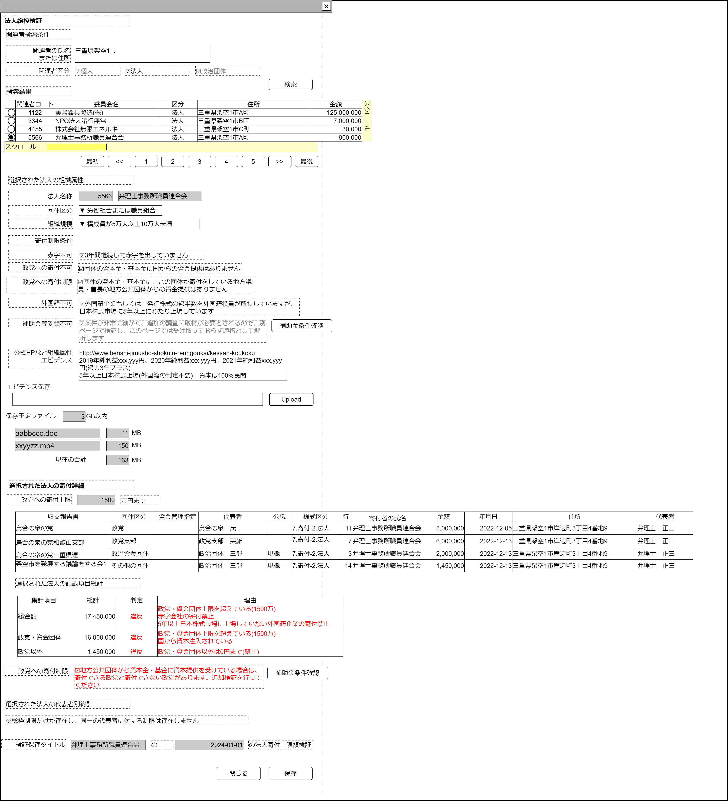

# 法人寄付上限制限確認【表示画面】設計書

## 状態：仕様未確定(実装不可)

## 1.目的

法人が寄付を行った場合、不可制限、制限額上限に達していないか確認作業を行う

## 2. 構成コンポーネント

1. [関連者検索コンポーネント](./#)
2. 独自フィールド
3. [ファイルアップロードコンポーネント](../../common/front/file_upload/file_upload.md)

### 2.1 繰り返し項目

なし

## 3. 画面イメージ

### 3.1 画面イメージ

### 3.2 画面イメージ(項番)

## 4. フィールド要素一覧

| 番号 |                論理名                |          タイプ          |      活性／表示      |                                                                                                                                                内容                                                                                                                                                |
| ---- | ------------------------------------ | ------------------------ | -------------------- | -------------------------------------------------------------------------------------------------------------------------------------------------------------------------------------------------------------------------------------------------------------------------------------------------- |
| 1    | 関連者検索コンポーネント             | コンポーネント           | 表示                 | 関連者検索コンポーネントを表示すること。                                                                                                                                                                                                                                                           |
| 1    | 関連者同一識別コード(法人)           | インプットテキスト       | 非活性               | 選択された関連者の関連者同一識別コード(法人)を表示すること。                                                                                                                                                                                                                                       |
| 1    | 関連者名称                           | インプットテキスト       | 非活性               | 選択された関連者名称を表示すること。                                                                                                                                                                                                                                                               |
| 1    | 団体区分セレクトボックス             | セレクトボックス         | 活性                 | 団体区分を表示すること。詳細は団体区分一覧を参照。選択時：組織規模セレクトボックスの項目を再構成すること                                                                                                                                                                                           |
| 1    | 組織規模セレクトボックス             | セレクトボックス         | 活性                 | 組織規模を表示すること。詳細は組織規模一覧を参照                                                                                                                                                                                                                                                   |
| 1    | 3年赤字チェックボックス              | チェックボックス         | 活性                 | 初期値：非選択であること。表記は：3年間継続して赤字を出していません                                                                                                                                                                                                                                |
| 1    | 政党への寄付不可チェックボックス     | チェックボックス         | 活性                 | 初期値：非選択であること。表示テキスト：団体の資本金・基本金に国からの資金提供はありません                                                                                                                                                                                                         |
| 1    | 政党への寄付制限チェックボックス     | チェックボックス         | 活性                 | 初期値：非選択であること。表示テキスト：団体の資本金・基本金に、この団体が寄付をしている地方議員・首長の地方公共団体からの資金提供はありません                                                                                                                                                     |
| 1    | 外国籍団体チェックボックス           | チェックボックス         | 活性                 | 初期値：非選択であること。表示テキスト：外国籍企業もしくは、発行株式の過半数を外国籍役員が所持していますが、日本株式市場に5年以上にわたり上場しています                                                                                                                                            |
| 1    | 補助金受領チェックボックス           | チェックボックス         | 非活性               | 初期値：選択であること。表示テキスト：条件が非常に細かく、追加の調査・取材が必要とされるので、別ページで検証し、このページでは受け取っておらず適格として解析します                                                                                                                                 |
| 1    | 補助金受領確認ページ起動ボタン1      | ボタン                   | 活性                 | 押下時：法人補助金等受領確認登録画面を別タブで表示すること                                                                                                                                                                                                                                         |
| 1    | エビデンス自由記載エリア             | テキストエリア           | 活性                 | エビデンスについての自由記述の入力を受け付けること                                                                                                                                                                                                                                                 |
| 1    | ファイルアップロードコンポーネント   | コンポーネント           | 表示                 | ファイルアップロードコンポーネントを表示すること。タイトルは「エビデンス保存とし」エビデンスのファイルのアップロードを受け付けること                                                                                                                                                               |
| 1    | 寄付総額上限値                       | インプットテキスト       | 非活性               | 組織規模セレクトボックスの値が複写されていること                                                                                                                                                                                                                                                   |
| 1    | 選択法人寄付一覧                     | テーブル                 | 表示                 | 選択された法人が行った寄付項目を一覧するテーブルを表示していること                                                                                                                                                                                                                                 |
| 1    | 選択法人記載項目団体別総計           | テーブル                 | 表示                 | 選択法人寄付一覧で表示された金額を、受け取った相手の政治団体区分ごとに集計したテーブルを表示していること                                                                                                                                                                                           |
| 1    | 政党寄付制限該当表示チェックボックス | テーブル                 | 非活性               | 補助金受領チェックボックスの反対の値が常にコピーされていること。表示テキスト：地方公共団体から資本金・基金に資本提供を受けている場合は、寄付できる政党と寄付できない政党があります。追加検証を行ってください。値が`true`の場合補助金受領確認ページ起動ボタン2を表示、`false`の場合非表示とすること |
| 1    | 補助金受領確認ページ起動ボタン2      | ボタン                   | 活性 表示／非表示 | 押下時：法人補助金等受領確認登録画面を別タブで表示すること                                                                                                                                                                                                                                         |
| 1    | 選択法人記載項目代表者別総計         | ラベル                   | 表示                 | 「※総枠制限だけが存在し、同一の代表者に対する制限は存在しません」と表示されていること。調査ルーティンに基づき、チェック不要であることを明記しているという役割があるので、不要としてページからの記載削除は絶対にしないこと                                                                         |
| 1    | 検証タイトル関連者名称               | インプットテキスト       | 非活性               | 関連者名称が表示されていること                                                                                                                                                                                                                                                                     |
| 1    | 検証タイトル当日日付                 | インプットテキスト(日付) | 非活性               | 本日の日付が表示されていること                                                                                                                                                                                                                                                                     |

### 4.1 選択された関連者法人の寄付項目詳細

| 番号 |     論理名     | タイプ | 活性／表示 |                                                             内容                                                             |
| ---- | -------------- | ------ | ---------- | ---------------------------------------------------------------------------------------------------------------------------- |
| 1    | 収支報告書名称 | ラベル | 表示       | 寄付項目と紐づく収支報告書が表示されていること                                                                               |
| 1    | 団体区分名称   | ラベル | 表示       | 寄付を行った政治団体の政治団体体区分名称が表示されていること                                                                 |
| 1    | 資金管理指定   | ラベル | 表示       | 寄付を行った政治団体の政治団体の資金管理指定が表示されていること                                                             |
| 1    | 代表者         | ラベル | 表示       | 寄付を行った政治団体の代表者が表示されていること                                                                             |
| 1    | 公職           | ラベル | 表示       | 代表者が現職なのか候補者なのかを表示すること                                                                                 |
| 1    | 様式区分       | ラベル | 表示       | この寄付項目の様式区分を表示すること。表記は「様式名称-様式枝区分名称」とし、ページ機能からすべて「7.寄付-2.法人」であること |
| 1    | 行             | ラベル | 表示       | この寄付項目が表示されている行数が表示されていること                                                                         |
| 1    | 寄付者氏名     | ラベル | 表示       | この寄付項目を行った寄付者(法人)の名称が表示されていること                                                                   |
| 1    | 寄付金額       | ラベル | 表示       | この寄付項目の金額が表示されていること                                                                                       |
| 1    | 寄付日付       | ラベル | 表示       | この寄付項目を行った日付が表示されていること                                                                                 |
| 1    | 寄付者住所     | ラベル | 表示       | この寄付項目を行った寄付者(法人)の住所が表示されていること                                                                   |
| 1    | 法人代表者氏名 | ラベル | 表示       | この寄付項目を行った寄付者(法人)の代表者氏名が表示されていること                                                             |

### 4.2 記載項目総計

| 番号 |  論理名  | タイプ | 活性／表示 |                                      内容                                      |
| ---- | -------- | ------ | ---------- | ------------------------------------------------------------------------------ |
| 1    | 集計項目 | ラベル | 表示       | 集計条件を表示すること                                                         |
| 1    | 金額     | ラベル | 表示       | 集計項目を条件とし、寄付金の集計が行われていること                             |
| 1    | 判定     | ラベル | 表示       | 理由が空白の場合、空白であること。理由が空白でないときは「違反」と表示すること |
| 1    | 理由     | ラベル | 表示       | アクションで示された内容と連動した内容が表示されていること                     |

## 4.3 団体区分セレクトボックス

 |             論理名             |  値  | 表示テキスト |
 | ------------------------------ | ---: | ------------ |
 | 会社                           |    1 | 論理名に同じ |
 | 労働組合または職員団体         |    2 | 論理名に同じ |
 | 会社または職員組合外の民間団体 |    3 | 論理名に同じ |

## 5. アクション一覧

| 番号 |                論理名                |      タイプ      | 活性／表示 |                                                                     内容                                                                      |
| ---- | ------------------------------------ | ---------------- | ---------- | --------------------------------------------------------------------------------------------------------------------------------------------- |
| 1    | 団体区分セレクトボックス             | セレクトボックス | 活性       | 下記参照                                                                                                                                      |
| 1    | 組織規模セレクトボックス             | セレクトボックス | 活性       | 選択時：選択された項目の値を寄付総額上限値に複写すること                                                                                      |
| 1    | 3年赤字チェックボックス              | チェックボックス | 活性       | `false:非選択`時、集計項目が総額の「理由」欄に「赤字会社の寄付禁止」と表示されること(選択時は空文字表示)                                      |
| 1    | 政党への寄付不可チェックボックス     | チェックボックス | 活性       | `false:非選択`時、集計項目が政党の「理由」欄に「国から資本注入されている場合の政党への寄付禁止」と表示されること(選択時は空文字表示)          |
| 1    | 政党への寄付制限チェックボックス     | チェックボックス | 活性       | 選択動作時：選択された値と反対の値を政党寄付制限該当表示チェックボックスに複写すること                                                        |
| 1    | 外国籍団体チェックボックス           | チェックボックス | 活性       | `false:非選択`時、集計項目が総額の「理由」欄に「5年以上日本株式市場に上場していない外国籍企業の寄付禁止」と表示されること(選択時は空文字表示) |
| 1    | 補助金受領確認ページ起動ボタン1      | ボタン           | 活性       | 押下時：法人補助金等受領確認登録画面を別タブで表示すること                                                                                    |
| 1    | 政党寄付制限該当表示チェックボックス | テーブル         | 非活性     | 値が`true`の場合補助金受領確認ページ起動ボタン2を表示、`false`の場合非表示とすること                                                          |
| 1    | 補助金受領確認ページ起動ボタン2      | ボタン           | 活性       | 押下時：法人補助金等受領確認登録画面を別タブで表示すること                                                                                    |
| 1    | 寄付総額上限値                       | チェックボックス | 非活性     | 値変更時：上限制限計算を行うこと。下記参照                                                                                                    |
| 1    | (記載項目総計テーブル)判定           | ラベル           | 表示       | (記載項目総計テーブル)理由が空白の場合、空白であること。理由が空白でないときは「違反」と表示すること                                          |
| 1    | キャンセル                           | ボタン           | 活性       | 押下時：入力内容を破棄すること                                                                                                                |
| 1    | 保存                                 | ボタン           | 活性       | 押下時：入力内容を保存すること                                                                                                                |

### 5.1 団体区分セレクトボックス

- `1:会社`選択時、組織規模セレクトボックスのオプション項目を「会社寄付上限値テーブル」の内容とすること
- `2:労働組合または職員団体`選択時、組織規模セレクトボックスのオプション項目を「労働組合または職員団体の寄付上限値テーブル」の内容とすること
- `3:会社または職員組合外の民間団体`選択時、組織規模セレクトボックスのオプション項目を「会社または職員組合外の民間団体の寄付上限値テーブル」の内容とすること

#### 5.1.1 会社寄付上限値

 |              論理名              |  値   | 表示テキスト |
 | -------------------------------- | ----: | ------------ |
 | 資本金が10億円未満               |   750 | 論理名に同じ |
 | 資本金が10億円以上50億円未満     |  1500 | 論理名に同じ |
 | 資本金が50億円以上100億円未満    |  3000 | 論理名に同じ |
 | 資本金が100億円以上150億円未満   |  3500 | 論理名に同じ |
 | 資本金が150億円以上200億円未満   |  4000 | 論理名に同じ |
 | 資本金が200億円以上250億円未満   |  4500 | 論理名に同じ |
 | 資本金が250億円以上300億円未満   |  5000 | 論理名に同じ |
 | 資本金が300億円以上350億円未満   |  5500 | 論理名に同じ |
 | 資本金が350億円以上400億円未満   |  6000 | 論理名に同じ |
 | 資本金が400億円以上450億円未満   |  6300 | 論理名に同じ |
 | 資本金が450億円以上500億円未満   |  6600 | 論理名に同じ |
 | 資本金が500億円以上550億円未満   |  6900 | 論理名に同じ |
 | 資本金が550億円以上600億円未満   |  7200 | 論理名に同じ |
 | 資本金が600億円以上650億円未満   |  7500 | 論理名に同じ |
 | 資本金が650億円以上700億円未満   |  7800 | 論理名に同じ |
 | 資本金が700億円以上750億円未満   |  8100 | 論理名に同じ |
 | 資本金が750億円以上800億円未満   |  8400 | 論理名に同じ |
 | 資本金が800億円以上850億円未満   |  8700 | 論理名に同じ |
 | 資本金が850億円以上900億円未満   |  9000 | 論理名に同じ |
 | 資本金が900億円以上950億円未満   |  9300 | 論理名に同じ |
 | 資本金が950億円以上1000億円未満  |  9600 | 論理名に同じ |
 | 資本金が1000億円以上1050億円未満 |  9900 | 論理名に同じ |
 | 資本金が1050億円以上             | 10000 | 論理名に同じ |

#### 5.1.2 労働組合または職員団体の寄付上限値

 |             論理名             |  値   | 表示テキスト |
 | ------------------------------ | ----: | ------------ |
 | 構成員が5万人未満              |   750 | 論理名に同じ |
 | 構成員が5万人以上10万人未満    |  1500 | 論理名に同じ |
 | 構成員が10万人以上15万人未満   |  3000 | 論理名に同じ |
 | 構成員が15万人以上20万人未満   |  3500 | 論理名に同じ |
 | 構成員が20万人以上25万人未満   |  4000 | 論理名に同じ |
 | 構成員が25万人以上30万人未満   |  4500 | 論理名に同じ |
 | 構成員が30万人以上35万人未満   |  5000 | 論理名に同じ |
 | 構成員が35万人以上40万人未満   |  5500 | 論理名に同じ |
 | 構成員が40万人以上45万人未満   |  6000 | 論理名に同じ |
 | 構成員が45万人以上50万人未満   |  6300 | 論理名に同じ |
 | 構成員が50万人以上55万人未満   |  6600 | 論理名に同じ |
 | 構成員が55万人以上60万人未満   |  6900 | 論理名に同じ |
 | 構成員が60万人以上65万人未満   |  7200 | 論理名に同じ |
 | 構成員が65万人以上70万人未満   |  7500 | 論理名に同じ |
 | 構成員が70万人以上75万人未満   |  7800 | 論理名に同じ |
 | 構成員が75万人以上80万人未満   |  8100 | 論理名に同じ |
 | 構成員が80万人以上85万人未満   |  8400 | 論理名に同じ |
 | 構成員が85万人以上90万人未満   |  8700 | 論理名に同じ |
 | 構成員が90万人以上95万人未満   |  9000 | 論理名に同じ |
 | 構成員が95万人以上100万人未満  |  9300 | 論理名に同じ |
 | 構成員が100万人以上105万人未満 |  9600 | 論理名に同じ |
 | 構成員が105万人以上110万人未満 |  9900 | 論理名に同じ |
 | 構成員が110万人以上            | 10000 | 論理名に同じ |

#### 5.1.3 会社または職員組合外の民間団体の寄付上限値

 |                     論理名                     |  値   | 表示テキスト |
 | ---------------------------------------------- | ----: | ------------ |
 | 前年の年間経費が2000万円未満                   |   750 | 論理名に同じ |
 | 前年の年間経費が2000万円以上6000万円未満       |  1500 | 論理dに同じ  |
 | 前年の年間経費が6000万円以上8000万円未満       |  3000 | 論理名に同じ |
 | 前年の年間経費が8000万円以上1億円未満          |  3500 | 論理名に同じ |
 | 前年の年間経費が1億円以上億2000万円未満        |  4000 | 論理名に同じ |
 | 前年の年間経費が1億2000万円以上1億4000万円未満 |  4500 | 論理名に同じ |
 | 前年の年間経費が1億4000万円以上1億6000万円未満 |  5000 | 論理名に同じ |
 | 前年の年間経費が1億6000万円以上1億8000万円未満 |  5500 | 論理名に同じ |
 | 前年の年間経費が1億8000万円以上2億未満         |  6000 | 論理名に同じ |
 | 前年の年間経費が2億以上2億2000万円未満         |  6300 | 論理名に同じ |
 | 前年の年間経費が2億2000万円以上2億4000万円未満 |  6600 | 論理名に同じ |
 | 前年の年間経費が2億4000万円以上2億6000万円未満 |  6900 | 論理名に同じ |
 | 前年の年間経費が2億6000万円以上2億8000万円未満 |  7200 | 論理名に同じ |
 | 前年の年間経費が2億8000万円以上3億円未満       |  7500 | 論理名に同じ |
 | 前年の年間経費が3億以上3億2000万円未満         |  7800 | 論理名に同じ |
 | 前年の年間経費が3億2000万円以上3億4000万円未満 |  8100 | 論理名に同じ |
 | 前年の年間経費が3億4000万円以上3億6000万円未満 |  8400 | 論理名に同じ |
 | 前年の年間経費が3億6000万円以上3億8000万円未満 |  8700 | 論理名に同じ |
 | 前年の年間経費が3億8000万円以上4億円未満       |  9000 | 論理名に同じ |
 | 前年の年間経費が4億円以上4億2000万円未満       |  9300 | 論理名に同じ |
 | 前年の年間経費が4億2000万円以上4億4000万円未満 |  9600 | 論理名に同じ |
 | 前年の年間経費が4億4000万円以上4億6000万円未満 |  9900 | 論理名に同じ |
 | 前年の年間経費が4億6000万円以上                | 10000 | 論理名に同じ |

### 5.2 寄付総額上限値

値変更時には各集計条件の総額と比較して判定を変更すること

- 総合計：すべての寄付金を総計すること。画像の例であれば8,000,000+6,000,000+2,000,000+1,450,000=17,450,000これを1500*10,000と比較し(17,450,000>15,000,000)、大きい場合は、記載項目総計テーブルの集計項目が総額の「理由」欄に「<b>政党・資金団体上限を超えている(`総額上限値`万)</b>」と表記する
- 政党：政党・政党支部・政治資金団体に寄付された寄付金を総計すること。画像の例であれば8,000,000+6,000,000+2,000,000=16,000,000これを1500*10,000と比較し(16,000,000>15,000,000)、大きい場合は記載項目総計テーブルの集計項目が政党の「理由」欄に「<b>政党・資金団体上限を超えている(`総額上限値`万)</b>」と表記する
- 政党以外：すべての寄付金を総計から政党への寄付総計を差し引いた金額。画像の例であれば17,450,000-16,000,000=1,450,000。この金額が0より大きい場合は、記載項目総計テーブルの集計項目が「政党以外」の「理由」欄に「<b>政党・資金団体以外は0円まで(禁止)</b>」と表記する

## 6. 法人寄付上限検証結果保存インターフェイス

CheckLimitAmountOverOrganizationInterface

|                論理名                |                論理名                |                      型                      |                                   説明(例)                                   |
| ------------------------------------ | ------------------------------------ | -------------------------------------------- | ---------------------------------------------------------------------------- |
| 寄付上限検証Id                       | checkLimitAmountOverOrganizationId   | Long                                         | 寄付上限検証を識別する一意のId                                               |
| 寄付上限検証同一識別コード           | checkLimitAmountOverOrganizationCode | Integer                                      | 変更にかかわらず、同一と認識するための寄付上限検証同一識別コード             |
| 対象関連者Id                         | relationPersonId                     | Long                                         | 関連者Id                                                                     |
| 対象関連者同一識別コード             | relationPersonId                     | Long                                         | 変更にかかわらず、同一と認識するための関連者同一識別コード                   |
| 対象関連者名称                       | relationPersonId                     | Long                                         | 関連者名称                                                                   |
| 検証日付                             | checkDoDate                          | Long                                         | 寄付上限検証を行った日付                                                     |
| 検証回数                             | checkTimes                           | Integer                                      | 寄付上限検証を同一日に複数回行った場合の回数(番目)                           |
| 寄付法人区分                         | donationOrganizationKbn              | Integer                                      | 寄付を行った法人の区分。入る値は団体区分セレクトボックスのオプション項目の値 |
| 寄付上限値                           | donationLimitAmount                  | Integer                                      | 法人が寄付できる上限値(万円)。組織規模セレクトボックスのオプション項目の値   |
| 赤字会社チェック                     | isDeficitOrg                         | Boolean                                      | 法人が直近3年で赤字を出している場合は`true:選択`                             |
| 国からの資本金注入チェック           | isCaptitalInjection                  | Boolean                                      | 国から資本金注入がある場合は`true:選択`                                      |
| 地方公共団体からの資本金注入チェック | isCaptitalInjectionLocalGov          | Boolean                                      | 地方政府から資本金注入がある場合は`true:選択`                                |
| 外国籍会社チェック                   | isForeignCorp                        | Boolean                                      | 禁止事項である外国籍企業に該当する場合は`true:選択`                          |
| 調査エビデンス自由記述               | researchEvidenceContents             | String                                       | (決算報告のURLなどの)調査内容に関する自由記述                                |
| 調査エビデンス書証リスト             | listEvidenceDocumentId               | List\<String\>                               | ストレージ保存した書証Idのリスト                                             |
| 寄付上限検証寄付項目詳細リスト       | listDonateContents                   | List\<CheckOverBalancesheetIncomeInterface\> | 判定対象として抽出された寄付項目リスト                                       |
| 判定結果リスト                       | listCheckResult                      | List\<CheckLimitAmountOverResultInterface\>  | 判定結果項目                                                                 |

### 6.1 寄付上限検証寄付項目詳細インターフェイス

CheckOverBalancesheetIncomeInterface

BalancesheetIncomeInterfaceを継承する

|               論理名               |            論理名             |   型    |                 説明(例)                 |
| ---------------------------------- | ----------------------------- | ------- | ---------------------------------------- |
| 寄付上限検証寄付項目詳細Id         | checkOverBalancesheetIncomeId | Long    | 寄付上限検証時寄付項目を識別する一意のId |
| 政治団体Id                         | politicsOrganizationId        | Long    | 政治団体名称                             |
| 政治団体同一識別コード             | politicsOrganizationCode      | Long    | 政治団体名称                             |
| 政治団体名称                       | politicsOrganizationName      | Long    | 政治団体名称                             |
| 政治団体区分表示テキスト           | dantaiKbnText                 | String  | 政治団体区分に紐づく名称                 |
| 政治団体区分                       | dantaiKbn                     | Integer | 政治団体区分                             |
| 資金管理団体指定の有無表示テキスト | umuShikinKanrenDantaiText     | String  | 政治団体区分に紐づく名称                 |
| 資金管理団体指定の有無             | umuShikinKanrenDantai         | Integer | 政治団体区分                             |
| 代表者姓名                         | daihyoushaName                | String  | 政治団体代表者姓名                       |
| 代表者姓                           | daihyoushaNameLast            | String  | 政治団体代表者姓名の姓                   |
| 代表者名                           | daihyoushaNameFirst           | String  | 政治団体代表者姓名の名                   |
| 現職・候補の別表示テキスト         | koushokuGenKouhoText          | String  | 現職・候補の別に紐づく名称               |
| 現職・候補の別                     | koushokuGenKouho              | String  | 現職・候補の別                           |

TODO この位置にBalancesheetIncomeInterfaceの具体的項目を追加する

### 6.2 寄付上限検証結果保存インターフェイス

|           論理名           |                論理名                |   型    |                                              説明(例)                                              |
| -------------------------- | ------------------------------------ | ------- | -------------------------------------------------------------------------------------------------- |
| 判定項目Id                 | checkResultId                        | Long    | 判定を識別する一意のId                                                                             |
| 寄付上限検証同一識別コード | checkLimitAmountOverOrganizationCode | Integer | 変更にかかわらず、同一と認識するための寄付上限検証同一識別コード                                   |
| 集計項目名称               | aggregationItem                      | String  | 総計を算出する集計項目。全総額、政党・政治資金団体、政党・政治資金団体以外、代表者(の具体的な氏名) |
| 総計                       | aggregationSumAmount                 | Long    | 集計項目条件を合計した金額                                                                         |
| 判定                       | resultText                           | String  | 判定の結果。空文字、「違反」、「違反?」のいずれか                                                  |
| 判定の根拠理由             | reasonText                           | String  | 判定の根拠 (理由)                                                                                  |

## 7. 連携

入力内容が変更された都度、入力チェックを行い親画面に変更内容を通知する`emit[sendSampleTemplateInterface(data,errorInfo)]`
