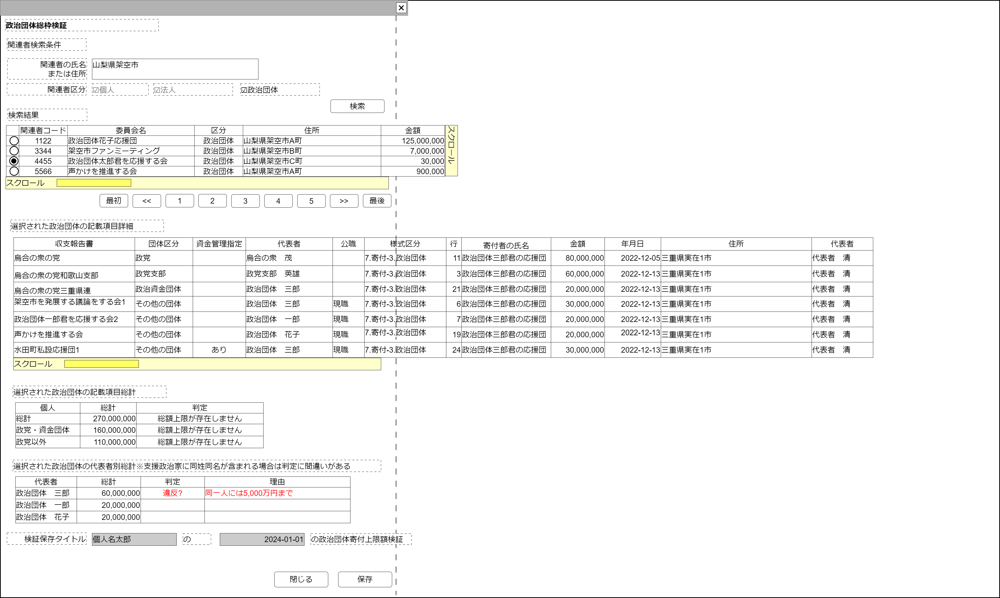

# 政治団体寄付上限制限【表示画面】設計書

## 状態：仕様未確定(実装不可)

## 1.目的

政治団体が寄付を行った場合、不可制限、制限額上限に達していないか確認作業を行う

## 2. 構成コンポーネント

1. [関連者検索コンポーネント](./#)
2. 独自フィールド

### 2.1 繰り返し項目

なし

## 3. 画面イメージ

### 3.1 画面イメージ

### 3.2 画面イメージ(項番)

## 4. フィールド要素一覧

| 番号 |              論理名              |          タイプ          | 活性／表示 |                                                     内容                                                     |
| ---- | -------------------------------- | ------------------------ | ---------- | ------------------------------------------------------------------------------------------------------------ |
| 1    | 関連者検索コンポーネント         | コンポーネント           | 表示       | 関連者検索コンポーネントを表示すること。                                                                     |
| 1    | 関連者同一識別コード(政治団体)   | インプットテキスト       | 非活性     | 選択された関連者の関連者同一識別コード(政治団体)を表示すること。                                             |
| 1    | 関連者名称                       | インプットテキスト       | 非活性     | 選択された関連者名称を表示すること。                                                                         |
| 1    | 選択政治団体寄付一覧             | テーブル                 | 表示       | 選択された政治団体が行った寄付項目を一覧するテーブルを表示していること                                       |
| 1    | 選択政治団体記載項目団体別総計   | テーブル                 | 表示       | 選択政治団体寄付一覧で表示された金額を、受け取った相手の政治団体区分ごとに集計したテーブルを表示していること |
| 1    | 選択政治団体記載項目代表者別総計 | ラベル                   | 表示       | 選択政治団体寄付一覧で表示された金額を、受け取った相手の代表者氏名ごとに集計したテーブルを表示していること   |
| 1    | 検証タイトル関連者名称           | インプットテキスト       | 非活性     | 関連者名称が表示されていること                                                                               |
| 1    | 検証タイトル当日日付             | インプットテキスト(日付) | 非活性     | 本日の日付が表示されていること                                                                               |

### 4.1 選択された関連者(政治団体)の寄付項目詳細

| 番号 |       論理名       | タイプ | 活性／表示 |                                                               内容                                                               |
| ---- | ------------------ | ------ | ---------- | -------------------------------------------------------------------------------------------------------------------------------- |
| 1    | 収支報告書名称     | ラベル | 表示       | 寄付項目と紐づく収支報告書が表示されていること                                                                                   |
| 1    | 団体区分名称       | ラベル | 表示       | 寄付を行った政治団体の政治団体体区分名称が表示されていること                                                                     |
| 1    | 資金管理指定       | ラベル | 表示       | 寄付を行った政治団体の政治団体の資金管理指定が表示されていること                                                                 |
| 1    | 代表者             | ラベル | 表示       | 寄付を行った政治団体の代表者が表示されていること                                                                                 |
| 1    | 公職               | ラベル | 表示       | 代表者が現職なのか候補者なのかを表示すること                                                                                     |
| 1    | 様式区分           | ラベル | 表示       | この寄付項目の様式区分を表示すること。表記は「様式名称-様式枝区分名称」とし、ページ機能からすべて「7.寄付-3.政治団体」であること |
| 1    | 行                 | ラベル | 表示       | この寄付項目が表示されている行数が表示されていること                                                                             |
| 1    | 寄付者氏名         | ラベル | 表示       | この寄付項目を行った寄付者(政治団体)の名称が表示されていること                                                                   |
| 1    | 寄付金額           | ラベル | 表示       | この寄付項目の金額が表示されていること                                                                                           |
| 1    | 寄付日付           | ラベル | 表示       | この寄付項目を行った日付が表示されていること                                                                                     |
| 1    | 寄付者住所         | ラベル | 表示       | この寄付項目を行った寄付者(政治団体)の住所が表示されていること                                                                   |
| 1    | 政治団体代表者氏名 | ラベル | 表示       | この寄付項目を行った寄付者(政治団体)の代表者氏名が表示されていること                                                             |

## 5. アクション一覧

| 番号 |       論理名       |  タイプ  | 活性／表示 |                     内容                     |
| ---- | ------------------ | -------- | ---------- | -------------------------------------------- |
| 1    | (検証対象個人選択) | イベント | 表示       | 必要なデータの表示と判定を行うこと。下記参照 |
| 1    | キャンセル         | ボタン   | 活性       | 押下時：入力内容を破棄すること               |
| 1    | 保存               | ボタン   | 活性       | 押下時：入力内容を保存すること               |

### 5.1 寄付総額上限値

総務省：政治資金規正法のあらまし p20 寄付の量的制限別表1をもとに作られる
[https://www.soumu.go.jp/main_content/000174716.pdf](https://www.soumu.go.jp/main_content/000174716.pdf)

- すべて1年あたりの金額であること
- 団体同士のやり取りは無制限であること(団体区分集計については総額算出のみで、違反判定はない)
- 同一の相手方(候補者)に対する寄付は5,000万円を超えないこと

※基本的にサンプル画面画像のデータは嘘データだが、この違反判定基準の項は整合性があるよう作成しているので参照の事

 |      集計項目      | 制限金額 |  合計金額   |                                計算式                                 |
 | ------------------ | -------: | ----------: | --------------------------------------------------------------------- |
 | 総額               |     なし | 270,000,000 | 8,000,000+6,000,000+2,000,000+3,000,000+2,000,000+2,000,000+3,000,000 |
 | 政党・資金団体     |     なし | 160,000,000 | 8,000,000(政党)+6,000,000(政党支部)+6,000,000(政治資金団体)           |
 | 政党・資金団体以外 |     なし | 110,000,000 | 総計-政党・資金団体分                                                 |

 |    集計項目    |  制限金額  |  合計金額  |                                計算式                                 |
 | -------------- | ---------: | ---------: | --------------------------------------------------------------------- |
 | 政治団体　一郎 | 50,000,000 | 60,000,000 | 20,000,000(政治団体一郎君を応援する会2分)                             |
 | 政治団体　三郎 | 50,000,000 | 20,000,000 | 3,000,000(架空市を発展する議論をする会1)+3,000,000(水田町私設応援団1) |
 | 政治団体　花子 | 50,000,000 | 20,000,000 | 20,000,000(声かけを推進をする会分)                                    |

## 6. 個人・政治団体寄付上限検証結果保存インターフェイス

CheckLimitAmountOverInterface

|                 論理名                 |          論理名           |                      型                      |                             説明(例)                             |
| -------------------------------------- | ------------------------- | -------------------------------------------- | ---------------------------------------------------------------- |
| 寄付上限検証Id                         | checkLimitAmountOverId    | Long                                         | 寄付上限検証を識別する一意のId                                   |
| 寄付上限検証同一識別コード             | checkLimitAmountOverCode  | Integer                                      | 変更にかかわらず、同一と認識するための寄付上限検証同一識別コード |
| 対象関連者Id                           | relationPersonId          | Long                                         | 関連者Id                                                         |
| 対象関連者同一識別コード               | relationPersonId          | Long                                         | 変更にかかわらず、同一と認識するための関連者同一識別コード       |
| 対象関連者名称                         | relationPersonId          | Long                                         | 関連者名称                                                       |
| 検証日付                               | checkDoDate               | Long                                         | 寄付上限検証を行った日付                                         |
| 検証回数                               | checkTimes                | Integer                                      | 寄付上限検証を同一日に複数回行った場合の回数(番目)               |
| 寄付上限検証寄付項目詳細リスト         | listDonateContents        | List\<CheckOverBalancesheetIncomeInterface\> | 抽象対象となった寄付項目リスト                                   |
| 寄付上限検証寄付項目詳細リスト遺贈     | listDonateContentsBequest | List\<CheckOverBalancesheetIncomeInterface\> | 抽象対象となった寄付項目リスト                                   |
| 寄付上限検証寄付項目詳細リスト特定寄付 | listDonateContentsHimself | List\<CheckOverBalancesheetIncomeInterface\> | 抽象対象となった寄付項目リスト                                   |
| 判定結果リスト                         | listCheckResult           | List\<CheckLimitAmountOverResultInterface\>  | 判定結果項目                                                     |

### 6.1 寄付上限検証寄付項目詳細インターフェイス

CheckOverBalancesheetIncomeInterface

BalancesheetIncomeInterfaceを継承する

|               論理名               |            論理名             |   型    |                 説明(例)                 |
| ---------------------------------- | ----------------------------- | ------- | ---------------------------------------- |
| 寄付上限検証寄付項目詳細Id         | checkOverBalancesheetIncomeId | Long    | 寄付上限検証時寄付項目を識別する一意のId |
| 政治団体Id                         | politicsOrganizationId        | Long    | 政治団体名称                             |
| 政治団体同一識別コード             | politicsOrganizationCode      | Long    | 政治団体名称                             |
| 政治団体名称                       | politicsOrganizationName      | Long    | 政治団体名称                             |
| 政治団体区分表示テキスト           | dantaiKbnText                 | String  | 政治団体区分に紐づく名称                 |
| 政治団体区分                       | dantaiKbn                     | Integer | 政治団体区分                             |
| 資金管理団体指定の有無表示テキスト | umuShikinKanrenDantaiText     | String  | 政治団体区分に紐づく名称                 |
| 資金管理団体指定の有無             | umuShikinKanrenDantai         | Integer | 政治団体区分                             |
| 代表者姓名                         | daihyoushaName                | String  | 政治団体代表者姓名                       |
| 代表者姓                           | daihyoushaNameLast            | String  | 政治団体代表者姓名の姓                   |
| 代表者名                           | daihyoushaNameFirst           | String  | 政治団体代表者姓名の名                   |
| 現職・候補の別表示テキスト         | koushokuGenKouhoText          | String  | 現職・候補の別に紐づく名称               |
| 現職・候補の別                     | koushokuGenKouho              | String  | 現職・候補の別                           |

TODO この位置にBalancesheetIncomeInterfaceの具体的項目を追加する

### 6.2 寄付上限検証結果保存インターフェイス

 |     論理名     |        論理名        |   型    |                                              説明(例)                                              |
 | -------------- | -------------------- | ------- | -------------------------------------------------------------------------------------------------- |
 | 判定項目Id     | checkResultId        | Long    | 判定を識別する一意のId                                                                             |
 | 判定グループ   | checkResultGroupCode | Integer | 同一の判定をグループ化するコード                                                                   |
 | 集計項目名称   | aggregationItem      | String  | 総計を算出する集計項目。全総額、政党・政治資金団体、政党・政治資金団体以外、代表者(の具体的な氏名) |
 | 総計           | aggregationSumAmount | Long    | 集計項目条件を合計した金額                                                                         |
 | 判定           | resultText           | String  | 判定の結果。空文字、「違反」、「違反?」のいずれか                                                  |
 | 判定の根拠理由 | reasonText           | String  | 判定の根拠 (理由)                                                                                  |

## 7. 連携

入力内容が変更された都度、入力チェックを行い親画面に変更内容を通知する`emit[sendSampleTemplateInterface(data,errorInfo)]`
