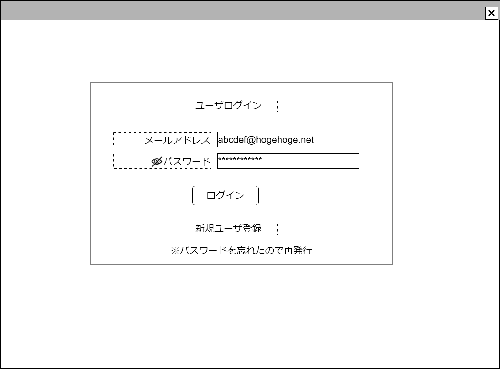

# ログイン【表示画面】設計書

## 状態：Mockデータによる仮実装

## 1.目的

ユーザログイン処理を行う

## 2. 構成コンポーネント

1. 独自フィールド

### 2.1 繰り返し項目

なし

## 3. 画面イメージ

### 3.1 画面イメージ

### 3.2 画面イメージ(項番)

## 4. フィールド要素一覧

| 番号 |      論理名      |              タイプ              |     活性／表示     |                                                      内容                                                      |
| ---- | ---------------- | -------------------------------- | ------------------ | -------------------------------------------------------------------------------------------------------------- |
| 1    | 遷移先Path       | URLクエリ                        | 非表示             | 遷移先ページのルータパスを指定すること                                                                         |
| 1    | メールアドレス   | インプットメール                 | 活性               | メールアドレス(アカウント)の入力を受け付けること                                                               |
| 1    | パスワード遮蔽   | イメージ                         | 活性・表示／非表示 | 押下時：パスワード入力のタイプを`text`にすること。パスワード遮蔽を非表示にし、パスワード開示を表示すること     |
| 1    | パスワード開示   | イメージ                         | 活性・表示／非表示 | 押下時：パスワード入力のタイプを`password`にすること。パスワード開示を非表示にし、パスワード遮蔽を表示すること |
| 1    | パスワード入力   | インプット(テキスト／パスワード) | 活性               | パスワードの入力を受け付けること                                                                               |
| 1    | 新規ユーザ登録   | リンク                           | 活性               | 押下時： [新規ユーザ登録ページ](../_regist_user/regist_user_account.md)に遷移すること                          |
| 1    | パスワード再発行 | リンク                           | 活性               | 押下時：[パスワード再発行のページ](../_reset_password/propse_reset_password.md)に遷移すること                  |

## 5.アクション一覧

| 番号 |      論理名      |  タイプ  |     活性／表示     |                                                      内容                                                      |
| ---- | ---------------- | -------- | ------------------ | -------------------------------------------------------------------------------------------------------------- |
| 1    | ログイン         | ボタン   | 活性               | 押下時：ログイン処理を行うこと。ログインができた場合は遷移先Pathクエリで指定されたページに遷移すること         |
| 1    | パスワード遮蔽   | イメージ | 活性・表示／非表示 | 押下時：パスワード入力のタイプを`text`にすること。パスワード遮蔽を非表示にし、パスワード開示を表示すること     |
| 1    | パスワード開示   | イメージ | 活性・表示／非表示 | 押下時：パスワード入力のタイプを`password`にすること。パスワード開示を非表示にし、パスワード遮蔽を表示すること |
| 1    | 新規ユーザ登録   | リンク   | 活性               | 押下時： [新規ユーザ登録ページ](../regist_user/regist_user_account.md)に遷移すること                           |
| 1    | パスワード再発行 | リンク   | 活性               | 押下時：[パスワード再発行のページ](../reset_password/propse_reset_password.md)に遷移すること                   |

## 6.1 セキュリティ確認インターフェイス

CheckSecurityInterface

TODO 仕様が決定次第修正する

 |            論理名            |    論理名     |  型  |                            説明(例)                            |
 | ---------------------------- | ------------- | ---- | -------------------------------------------------------------- |
 | ログインユーザId             | loginUserId   | Long | ログインユーザを識別する一意のId                               |
 | ログインユーザ同一識別コード | loginUserCode | Long | ログインユーザが変更にかかわらず同一であることを識別するコード |

## 6.2 権限確認インターフェイス

CheckPrivilegeInterface

TODO 仕様が決定次第修正する

 |            論理名            |    論理名     |   型   |                            説明(例)                            |
 | ---------------------------- | ------------- | ------ | -------------------------------------------------------------- |
 | ログインユーザId             | loginUserId   | Long   | ログインユーザを識別する一意のId                               |
 | ログインユーザ同一識別コード | loginUserCode | Long   | ログインユーザが変更にかかわらず同一であることを識別するコード |
 | ログインユーザ氏名           | loginUserName | String | ログインユーザ氏名                                             |

## 7. 連携

なし
