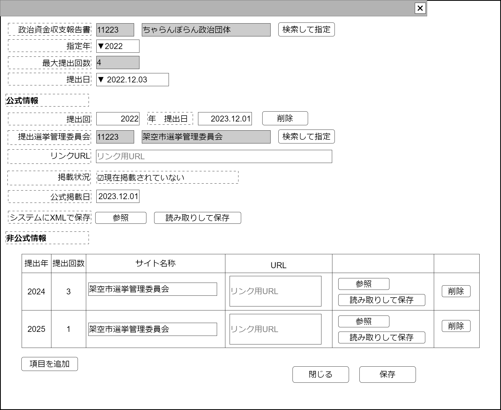

# 収支報告書参照設定【表示画面】設計書

## 状態：仕様未確定(実装不可)

## 1.目的

政治資金収支報告書のバージョンと非公式サイト保存の履歴管理を行う

## 2. 構成コンポーネント

1. [政治資金収支報告書検索コンポーネント](./#)
2. 独自フィールド
3. [選挙管理委員会検索コンポーネント](./#)
4. [非公式サイト直接リンクコンポーネント](./not_official_site_direct_link.md)

### 2.1 繰り返し項目

非公式サイト直接リンクコンポーネントはユーザ操作で増減する

## 3. 画面イメージ

### 3.1 画面イメージ

### 3.2 画面イメージ(項番)

## 4. フィールド要素一覧

| 番号 |                論理名                |          タイプ          | 活性／表示 |                                                                 内容                                                                 |
| ---- | ------------------------------------ | ------------------------ | ---------- | ------------------------------------------------------------------------------------------------------------------------------------ |
| 1    | 政治資金収支報告書同一識別コード     | インプットテキスト       | 非活性     | 選択された政治資金収支報告書同一識別コードを表示すること。                                                                           |
| 1    | 政治資金収支報告書名称               | インプットテキスト       | 非活性     | 選択された政治資金収支報告名称を表示すること。                                                                                       |
| 1    | 政治資金収支報告書検索ボタン         | ボタン                   | 活性       | 押下時：政治資金収支報告書をコンポーネントを表示すること                                                                             |
| 1    | 指定年選択                           | セレクトボックス         | 活性       | 存在する提出年の選択を受け付けること。                                                                                               |
| 1    | システムデータ閲覧ボタン             | ボタン                   | 活性       | 選択された政治資金収支報告書と提出年、提出回数に紐づくシステムに登録された政治資金収支報告書を表示するコンポーネントを表示すること。 |
| 1    | 提出回数選択                         | セレクトボックス         | 活性       | 提出回数の選択を受け付けること。                                                                                                     |
| 1    | 提出回数変更インプット               | インプットテキスト(数字) | 活性       | 提出回数の最大値を受け付けること。                                                                                                   |
| 1    | 選挙管理委員会同一識別コード         | インプットテキスト       | 非活性     | 選択された選挙管理委員会同一識別コードを表示すること。                                                                               |
| 1    | 選挙管理委員会名称                   | インプットテキスト       | 非活性     | 選択された選挙管理委員会名称を表示すること。                                                                                         |
| 1    | 選挙管理委員会直接リンクURL          | インプットテキスト       | 活性       | 公式である選挙管理委員会内の該当政治資金収支報告書への直接リンクの入力を受け付けること。                                             |
| 1    | 選挙管理委員会検索ボタン             | ボタン                   | 活性       | 押下時：選挙管理委員会検索コンポーネントを表示すること                                                                               |
| 1    | 非公式サイト直接リンクコンポーネント | コンポーネント           | 表示       | 非公式に該当政治資金収支報告書を保存している場合の情報入力を受け付けること                                                           |

## 5. アクション一覧

| 番号 |                   論理名                   |          タイプ          | 活性／表示 |                               内容                               |
| ---- | ------------------------------------------ | ------------------------ | ---------- | ---------------------------------------------------------------- |
| 1    | 報告年選択                                 | セレクトボックス         | 活性       | 選択時：下記に詳細を記述                                         |
| 1    | 提出回数選択                               | セレクトボックス         | 活性       | 選択時：下記に詳細を記述                                         |
| 1    | 提出回数変更インプット                     | インプットテキスト(数字) | 活性       | 下記に詳細を記述                                                 |
| 1    | 政治資金収支報告書検索ボタン               | ボタン                   | 活性       | 押下時：政治資金収支報告書検索コンポーネントを表示すること       |
| 1    | 選挙管理委員会検索ボタン                   | ボタン                   | 活性       | 押下時：選挙管理委員会検索コンポーネントを表示すること           |
| 1    | (非公式リンクコンポーネント)削除ボタン     | ボタン                   | 活性       | 押下時：押下された自身のコンポーネントを削除するよう通知すること |
| 1    | (非公式リンクコンポーネント)項目追加ボタン | ボタン                   | 活性       | 押下時：非公式サイト直接リンクコンポーネントを追加すること       |
| 1    | キャンセル                                 | ボタン                   | 活性       | 押下時：入力内容を破棄すること                                   |
| 1    | 保存                                       | ボタン                   | 活性       | 押下時：入力内容を保存すること                                   |

### 5.1報告年選択

- 提出回数選択セレクトボックスを現在の最大提出回数まで選択できるように更新すること
- 提出回数選択セレクトボックスの選択を最新(最大)提出回数とし、データ表示を行うこと

### 5.2 提出回数選択

選択された提出回目の公式へのリンク、非公式サイトへのデータを表示すること

### 5.3 提出回数変更インプット

- 入力された値が、最大提出回数を下回る場合、入力をリジェクト(元の数値に戻す)し、リジェクトしたメッセージを表示すること
- 入力された値が、最大提出回数を上回る場合、選択をそのままにしたままで、提出回数選択肢の選択肢のみ増加させること

## 6. 政治資金収支報告書変更履歴インターフェイス

PoliticsBalancesheetHistoryLinkInterface

 |                  論理名                  |          論理名          |                            型                             |                                                                                                説明(例)                                                                                                 |
 | ---------------------------------------- | ------------------------ | --------------------------------------------------------- | ------------------------------------------------------------------------------------------------------------------------------------------------------------------------------------------------------- |
 | 政治資金収支報告書Id                     | politicsBalancesheetId   | Long                                                      | 政治資金収支報告書を識別する一意のId                                                                                                                                                                    |
 | 政治資金収支報告書同一識別コード         | politicsBalancesheetCode | Integer                                                   | 変更履歴にかかわらず政治資金収支報告書を識別する一意のId                                                                                                                                                |
 | 政治資金収支報告書名称                   | politicsBalancesheetName | String                                                    | 政治資金収支報告書名称                                                                                                                                                                                  |
 | 政治資金収支報告書Idリスト               | mapBalacesheetId         | Map<Integer,Map<Integer,String>>                          | このシステムに保存された政治資金収支報告書Idを.提出年、2.提出回数をキーとして呼び出すことができるようMapに格納                                                                                          |
 | 選挙管理委員会提出収支報告書データリスト | mapSubmissionPublish     | Map<Integer,Map<Integer,PublishDirectLinkInterface>>      | 公式サイト(提出選挙管理委員会)の政治資金収支報告書へのリンク情報を1.提出年、2.提出回数をキーとして呼び出すことができるようMapに格納。格納される情報は掲載されたページタイトルとリンクの組み合わせリスト |
 | 非公式データリスト                       | mapNotOfiicialSiteLink   | Map<Integer,Map<Integer,List<PublishDirectLinkInterface>> | 非公式サイトへのリンク情報を1.提出年、2.提出回数をキーとして呼び出すことができるようMapに格納。掲載されたページタイトルとリンクの組み合わせリスト                                                       |

PublishDirectLinkInterfaceは[収支報告書欠損検出](../detect_balancesheet_defect/detect_balancesheet_defect.md)を参照すること

## 7. 連携

汎用XMLアップロードからのデータを関数`recieveSampleTemplateInterface(data,errorInfo)`で受信する
