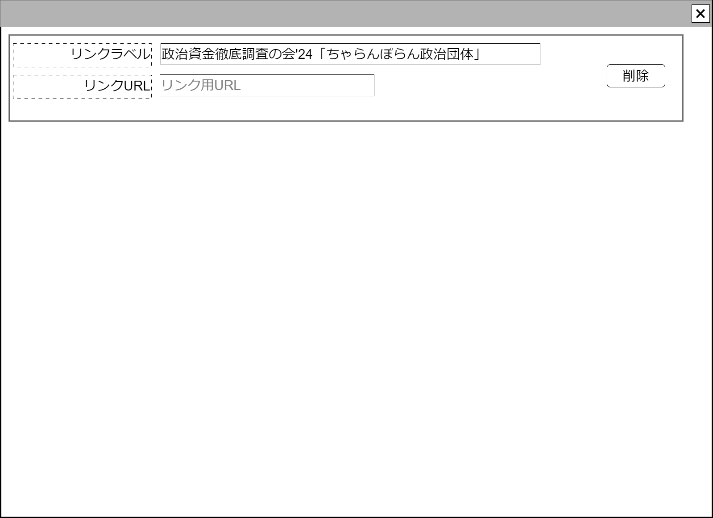

# 非公式サイト直接リンク【コンポーネント】設計書

## 状態：仕様未確定(実装不可)

## 1.目的

個別の仕分けに対して監査意見を付記する(収入項目)

## 2. 構成コンポーネント

1. 独自フィールド

### 2.1 繰り返し項目

なし

## 3. 画面イメージ

### 3.1 画面イメージ

### 3.2 画面イメージ(項番)

## 4. フィールド要素一覧

| 番号 |    論理名    |       タイプ       | 活性／表示 |                                      内容                                      |
| ---- | ------------ | ------------------ | ---------- | ------------------------------------------------------------------------------ |
| 1    | リンクラベル | インプットテキスト | 活性       | リンクURLの説明(ラベル)を表示すること                                          |
| 1    | アクセスURL  | インプットテキスト | 活性       | 非公式サイト(選管以外)の政治資金収支報告書への直接リンクの入力を受け付けること |
| 1    | 削除ボタン   | ボタン             | 活性       | このコンポーネントを削除することを親画面に通知すること                         |

## 5. アクション一覧

フィールド要素に記載済

## 6. 発行物直接リンクInterface

PublishDirectLinkInterfaceは[収支報告書欠損検出](../detect_balancesheet_defect/detect_balancesheet_defect.md)を参照すること

## 7. 連携

親画面から`props{notOfficialLinkData:PublishDirectLinkInterface}`を受け取り、`computed`を設定することで変更状態を常に親画面に通知すること
