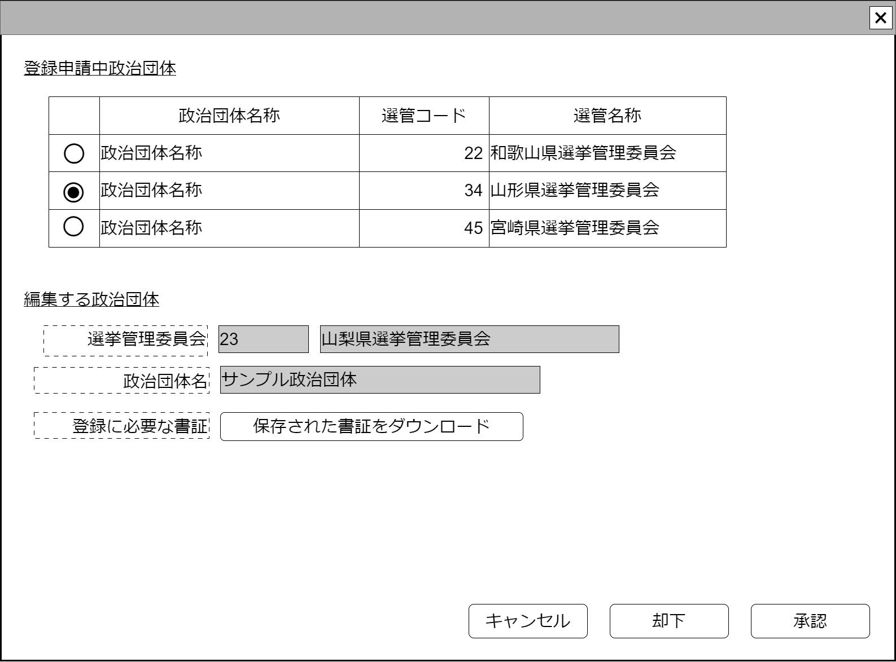

# 未未登録政治団体申請承認【表示画面】設計書

## 状態：Mockデータによる仮実装

## 1.目的

このシステムに未登録の政治団体を登録するよう申請する

## 2. 構成コンポーネント

1. [一般ファイルダウンロード](../../common/front/download_general_file/download_general_file.md)コンポーネント
2. 独自フィールド
3. [却下理由入力コンポーネント](./#)

### 2.1 繰り返し項目

なし

## 3. 画面イメージ

### 3.1 画面イメージ

### 3.2 画面イメージ(項番)

## 4. フィールド要素一覧

| 番号 |               論理名               |       タイプ       | 活性／表示 |                         内容                         |
| ---- | ---------------------------------- | ------------------ | ---------- | ---------------------------------------------------- |
| 1    | 未登録政治団体登録申請一覧         | テーブル           | 表示       | 登録を希望する、申請された未登録政治団体一覧         |
| 1    | (編集)選挙管理委員会同一識別コード | インプットテキスト | 非活性     | 選挙管理委員会同一識別コードを表示すること           |
| 1    | (編集)選挙管理委員会名称           | インプットテキスト | 非活性     | 選挙管理委員会名称を表示すること。                   |
| 1    | (編集)政治団体名称                 | インプットテキスト | 非活性     | 政治団体名称を表示すること                           |
| 1    | (編集)一般ファイルダウンロード     | コンポーネント     | 表示       | 一般ファイルアップロードコンポーネントを表示すること |

### 4.1 未登録政治団体登録申請一覧

| 番号 |            論理名            |    タイプ    | 活性／表示 |                                         内容                                         |
| ---- | ---------------------------- | ------------ | ---------- | ------------------------------------------------------------------------------------ |
| 1    | 編集対象選択                 | ラジオボタン | 活性       | 押下時：選択されたラジオボタンの行のデータが編集対として編集データ欄で参照できること |
| 1    | 選挙管理委員会同一識別コード | ラベル       | 表示       | 選挙管理委員会同一識別コードを表示すること                                           |
| 1    | 選挙管理委員会名称           | ラベル       | 表示       | 選挙管理委員会名称を表示すること。                                                   |
| 1    | 政治団体名称                 | ラベル       | 表示       | 政治団体名称を表示すること                                                           |

## 5.アクション一覧

| 番号 |   論理名   | タイプ | 活性／表示 |                       内容                       |
| ---- | ---------- | ------ | ---------- | ------------------------------------------------ |
| 1    | キャンセル | ボタン | 活性       | 押下時：入力内容を破棄すること                   |
| 1    | 却下       | ボタン | 活性       | 押下時：却下理由入力コンポーネントを表示すること |
| 1    | 更新       | ボタン | 活性       | 押下時：申請承認を登録すること                   |

## 6. 未登録団体登録申請インターフェイス

NotRegistOrganizaionInterface

 |              論理名              |           論理名           |                型                |             説明(例)             |
 | -------------------------------- | -------------------------- | -------------------------------- | -------------------------------- |
 | 未登録団体登録申請Id             | notRegistOrganizaionId     | Long                             | 未登録団体登録申請Id             |
 | 未登録団体登録申請同一識別コード | notRegistOrganizaionCode   | Integer                          | 未登録団体登録申請同一識別コード |
 | 選挙管理委員会最小限情報         | electionCommissionLeastDto | ElectionCommissionLeastInterface | 申請選挙管理委員会情報           |
 | 書証情報                         | saveStorageResultDto       | SaveStorageResultInterface       | 保存済書証情報                   |
 | 政治団体名称                     | politiclOrganizationName   | String                           | 登録申請する政治団体名           |

## 7. 連携

一般ファイルダウンロードコンポーネントには、編集中として選択されたデータのSaveStorageResultDtoを`props::save-storage-result-dto="editDto.saveStorageResultDto"`で引き渡すこと
