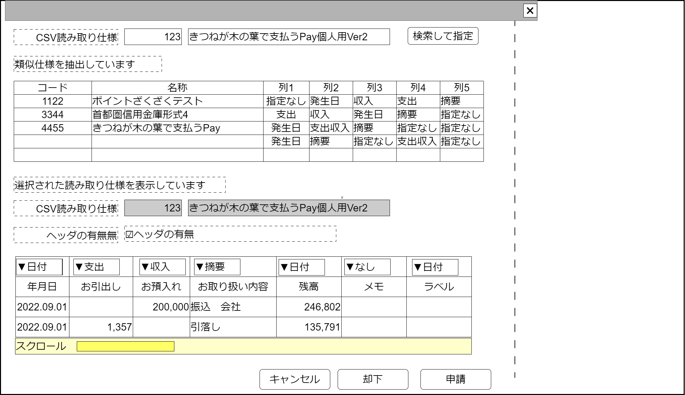
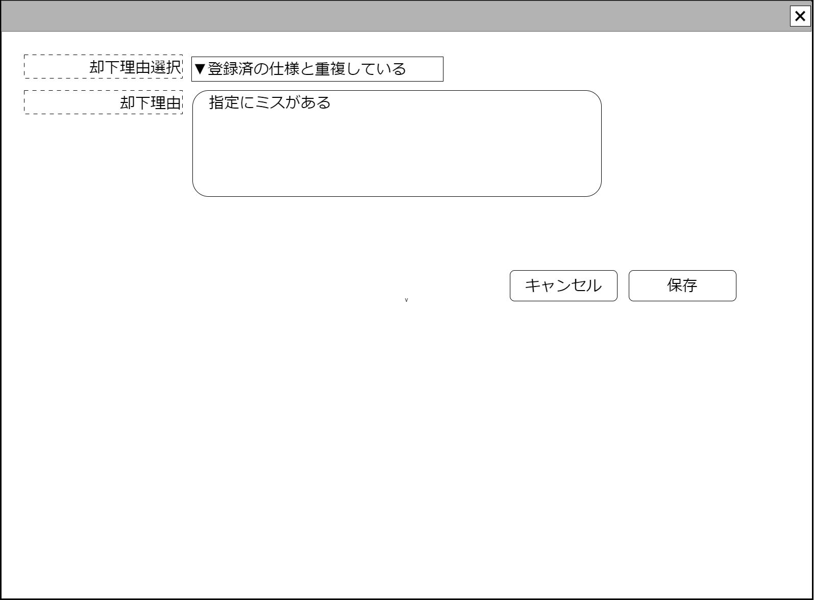

# CSV読み取り仕様申請【表示画面】設計書

## 状態：仮実装完了(申請パターン見本)

## 1.目的

作成側から使用申請のあったCSV読み取り仕様の内容を確認し、受理または却下を決定する

## 2. 構成コンポーネント

1. 申請中CSV読み取り仕様検索コンポーネント
2. 独自フィールド

### 2.1 繰り返し項目

なし

## 3. 画面イメージ

### 3.1 画面イメージ

### 3.2 画面イメージ(項番)

## 4. フィールド要素一覧

| 番号 |               論理名                |       タイプ       | 活性／表示 |                              内容                               |
| ---- | ----------------------------------- | ------------------ | ---------- | --------------------------------------------------------------- |
| 1    | 申請済CSV読み取り仕様同一識別コード | インプットテキスト | 非活性     | 申請済CSV読み取り仕様同一識別コードを表示すること               |
| 1    | 申請済CSV読み取り仕様名称           | インプットテキスト | 非活性     | 申請済CSV読み取り仕様名称を表示すること。                       |
| 1    | CSV読み取り仕様検索ボタン           | ボタン             | 活性       | 押下時：申請中CSV読み取り仕様検索コンポーネントを表示すること。 |
| 1    | 類似使用一覧テーブル                | テーブル           | 表示       | 類似したCSV読み取り仕様を一覧して表示すること。                 |
| 1    | 申請済CSV読み取り仕様名称           | インプットテキスト | 非活性     | 申請済CSV読み取り仕様名称を表示すること。                       |
| 1    | ヘッダ有無                          | チェックボックス   | 活性       | 押下時：ヘッダ有無を切り替えできること                          |
| 1    | 読み取りcsv結びつけテーブル        | テーブル           | 表示       | 各列にcsv読み取りの仕様を結びつけることができること             |

## 4.1 類似使用一覧テーブル

| 番号 |               論理名                | タイプ | 活性／表示 |                                                                      内容                                                                      |
| ---- | ----------------------------------- | ------ | ---------- | ---------------------------------------------------------------------------------------------------------------------------------------------- |
| 1    | 申請済CSV読み取り仕様同一識別コード | ラベル | 表示       | 申請済CSV読み取り仕様同一識別コードを表示すること                                                                                              |
| 1    | 申請済CSV読み取り仕様名称           | ラベル | 表示       | 申請済CSV読み取り仕様名称を表示すること。                                                                                                      |
| 1    | 各列の結びつけした仕様              | ラベル | 表示       | 各列に結びつけられた項目名称を表示すること。名称は「指定なし」、「取引金額支出」、「取引金額収入」、「取引金額増減兼用」、「発生日」、「摘要」 |

## 4.2 読み取りcsv結びつけテーブル

| 番号 |         論理名         |      タイプ      | 活性／表示 |                    内容                    |
| ---- | ---------------------- | ---------------- | ---------- | ------------------------------------------ |
| 1    | 各列の結びつけした仕様 | セレクトボックス | 活性       | すでに設定された結びつき項目を表示すること |
| 1    | 各列の結びつけした仕様 | ラベル           | 表示       | 申請時に用いられたCSVを表示すること        |

## 5. アクション一覧

| 番号 |   論理名   | タイプ | 活性／表示 |                     内容                     |
| ---- | ---------- | ------ | ---------- | -------------------------------------------- |
| 1    | キャンセル | ボタン | 活性       | 押下時：入力内容を破棄すること               |
| 1    | 却下       | ボタン | 活性       | 押下時：却下処理を保存するこ。詳細は下記参照 |
| 1    | 承認       | ボタン | 活性       | 押下時：承認処理を行うこと                   |

### 5.1 却下処理

1. 却下理由入力領域を表示すること
    - 代表的な入力をセレクトボックスで選ぶ音ができること
    - 選択された値は却下理由入力テキストエリアに追加されること
2. 却下処理の続行または中断ができること

## 6. サンプルテンプレートインターフェイス

ProposeCsvReadTemplateInterface

 |           論理名            |       論理名        |   型    |                            説明(例)                             |
 | --------------------------- | ------------------- | ------- | --------------------------------------------------------------- |
 | CSV読取り形式Id             | readCsvTemplateId   | Long    | csv読み取り形式を識別する一意のId                               |
 | CSV読取り形式同一識別コード | readCsvTemplateCode | Integer | 変更にかかわらず、csv読み取り形式を同一とする識別コード         |
 | CSV読取り形式名称           | readCsvTemplateName | String  | csv読み取り形式を識別する一意のId                               |
 | 最新区分                    | saishinKbn          | Integer | 最新データかどうか区分する値                                    |
 | 金融機関区分                | financialOrgKbn     | Integer | 仕様保持者が各種Payか全銀金融機関かを区分する値                 |
 | 金融機関Id                  | financialOrgId      | Long    | csv読み取り仕様保持者を一意に識別する一意のId                   |
 | 金融機関同一識別コード      | financialOrgCode    | Integer | 変更にかかわらず、cscsv読み取り仕様保持者を同一とする識別コード |
 | 金融機関名称                | financialOrgName    | String  | csv読み取り仕様保持者名称                                       |
 | 1行目ヘッダデータのフラグ   | hasHeader           | boolean | ヘッダの有無                                                    |
 | 配列項目数                  | arrayNumber         | Integer | 読み取り配列の項目数                                            |
 | 読み取り配列                | arrayTumber         | String  | 項目数分、読み取りする列指定データを格納したもの                |

## 7. 連携

### 7.1 申請中CSV読み取り仕様検索コンポーネント

- キャンセルイベント受信を`recieveCancelProposeReadCsvTemplate()`ですること
- 選択イベント受信を`recieveProposeReadCsvTemplateInterface(selectedDto)`ですること
- 編集許可フラグを`false`に設定し検索コンポーネントでの編集を禁止すること
