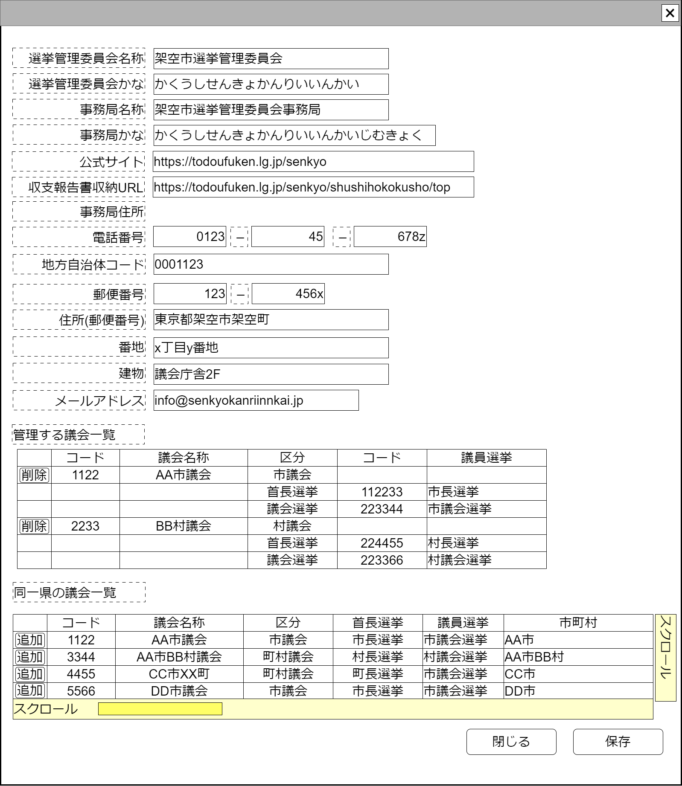

# 選挙管理委員会管理【表示画面】設計書

## 状態：仕様未確定(実装不可)

## 1.目的

選挙管理委員会に関する情報の登録管理を行う

## 2. 構成コンポーネント

1. 独自フィールド

### 2.1 繰り返し項目

なし

## 3. 画面イメージ

### 3.1 画面イメージ

### 3.2 画面イメージ(項番)

## 4. フィールド要素一覧

| 番号 |            論理名             |            タイプ            | 活性／表示 |                                                                      内容                                                                       |
| ---- | ----------------------------- | ---------------------------- | ---------- | ----------------------------------------------------------------------------------------------------------------------------------------------- |
| 1    | 選挙管理委員会同一識別コード  | インプットテキスト           | 非活性     | 選挙管理委員会同一識別コードを表示すること                                                                                                      |
| 1    | 選挙管理委員会名称            | インプットテキスト           | 活性       | 選挙管理委員会名称の入力を受け付けること                                                                                                        |
| 1    | 選挙管理委員会名称かな        | インプットテキスト           | 活性       | 選挙管理委員会名称かなの入力を受け付けること                                                                                                    |
| 1    | 地方自治体コード              | インプットテキスト           | 活性       | 選挙管理委員会が存在する都道府県・広域自治体(市まで)の地方自治体コードの入力を受け付けること                                                    |
| 1    | 事務局名称                    | インプットテキスト           | 活性       | 事務局名称の入力を受け付けること                                                                                                                |
| 1    | 事務局名称かな                | インプットテキスト           | 活性       | 事務局名称かなの入力を受け付けること                                                                                                            |
| 1    | 選挙管理委員会公式サイト      | インプットテキスト(数字記号) | 活性       | 委員会公式サイトトップページの入力を受け付けること                                                                                              |
| 1    | 収支報告書格納ページ最上位URL | インプットテキスト(数字記号) | 活性       | 委員会内の政治資金収支報告書が格納されているの最上位ページ(法律で公開が義務付けられている提出年すべてにアクセスできる)URLの入力を受け付けること |
| 1    | 事務局電話番号市外局番        | インプットテキスト           | 活性       | 事務局電話番号市外局番の入力を受け付けること                                                                                                    |
| 1    | 事務局電話番号局番            | インプットテキスト           | 活性       | 事務局電話番号局番の入力を受け付けること                                                                                                        |
| 1    | 事務局電話番号番号            | インプットテキスト           | 活性       | 事務局電話番号番号の入力を受け付けること                                                                                                        |
| 1    | 事務局郵便番号前              | インプットテキスト           | 活性       | 事務局郵便番号前3桁の入力を受け付けること                                                                                                       |
| 1    | 事務局郵便番号後              | インプットテキスト           | 活性       | 事務局郵便番号後4桁の入力を受け付けること                                                                                                       |
| 1    | 事務局住所(郵便番号)          | インプットテキスト           | 活性       | 事務局の住所で郵便番号が自動入力できるまでの住所の入力を受け付けること                                                                          |
| 1    | 事務局番地                    | インプットテキスト           | 活性       | 事務局住所の番地の入力を受け付けること                                                                                                          |
| 1    | 事務局建物                    | インプットテキスト           | 活性       | 事務局住所の建物の入力を受け付けること                                                                                                          |
| 1    | 事務局メールアドレス          | インプットテキスト(メール)   | 活性       | 事務局のメールアドレスの入力を受け付けること                                                                                                    |
| 1    | 管理する議会一覧テーブル      | テーブル                     | 表示       | 対象選挙管理委員会が選挙管理している登録済議会一覧を表示すること                                                                                |
| 1    | 所属地区議会一覧テーブル      | テーブル                     | 表示       | 所属地区(都道府県または国)で登録済の議会一覧を表示すること                                                                                      |

### 4.1 管理する議会一覧 フィールド要素一覧

| 番号 |       論理名       | タイプ | 活性／表示 |                                                                           内容                                                                           |
| ---- | ------------------ | ------ | ---------- | -------------------------------------------------------------------------------------------------------------------------------------------------------- |
| 1    | 削除ボタン         | ボタン | 活性       | 押下時：選択行を削除すること                                                                                                                             |
| 1    | 議会同一識別コード | ラベル | 表示       | 議会同一識別コードを表示すること                                                                                                                         |
| 1    | 議会名称           | ラベル | 表示       | 議会名称を表示すること                                                                                                                                   |
| 1    | 区分               | ラベル | 表示       | 議会を表示している行では国、都道府県、市町村いずれかのレベルの議会であるかを表示すること。選挙を表示している行では首長選挙／議員選挙の区分を表示すること |
| 1    | 選挙同一識別コード | ラベル | 表示       | 選挙同一識別コードを表示すること                                                                                                                         |
| 1    | 選挙名称           | ラベル | 表示       | 選挙同一識別名称を表示すること                                                                                                                           |

### 4.2 所属地区(都道府県)議会一覧 フィールド要素一覧

| 番号 |       論理名       | タイプ | 活性／表示 |                              内容                              |
| ---- | ------------------ | ------ | ---------- | -------------------------------------------------------------- |
| 1    | 追加ボタン         | ボタン | 活性       | 押下時：選択された議会を管理する議会一覧テーブルに追加すること |
| 1    | 議会同一識別コード | ラベル | 表示       | 議会同一識別コードを表示すること                               |
| 1    | 議会名称           | ラベル | 表示       | 議会名称を表示すること                                         |
| 1    | 議会区分           | ラベル | 表示       | 議会区分を表示すること                                         |
| 1    | 首長選挙           | ラベル | 表示       | 首長選挙名称を表示すること                                     |
| 1    | 議会選挙           | ラベル | 表示       | 議会選挙名称を表示すること                                     |
| 1    | 該当市町村         | ラベル | 表示       | 該当市町村名称を表示すること                                   |

## 5.アクション一覧

| 番号 |   論理名   | タイプ | 活性／表示 |               内容               |
| ---- | ---------- | ------ | ---------- | -------------------------------- |
| 1    | キャンセル | ボタン | 活性       | 押下時：入力内容を破棄すること。 |
| 1    | 保存       | ボタン | 活性       | 押下時：入力内容を保存すること。 |

## 6. 選挙管理委員会インターフェイス

ElectionCommissionInterface

|            論理名             |         物理名          |                  型                  |                                                         説明(例)                                                          |
| ----------------------------- | ----------------------- | ------------------------------------ | ------------------------------------------------------------------------------------------------------------------------- |
| 選挙管理委員会id              | electionCommissionId    | Long                                 | 選挙管理委員会同一識別Id                                                                                                  |
| 選挙管理委員会同一識別コード  | electionCommissionCode  | Long                                 | 選挙管理委員会同一識別コード                                                                                              |
| 選挙管理委員会名称            | electionCommissionName  | String                               | 選挙管理委員会名称                                                                                                        |
| 選挙管理委員会名称かな        | commissionNameKana      | String                               | 選挙管理委員会名称かな                                                                                                    |
| 地方自治体コード              | commissionLocalGovCode  | String                               | 選挙管理委員会が存在する都道府県・広域自治体(市まで)の地方自治体コード                                                    |
| 事務局公式サイト              | secretariatOfficialUrl  | String                               | 委員会公式サイトトップページ                                                                                              |
| 収支報告書格納ページ最上位URL | officialBalancesheetUrl | String                               | 委員会内の政治資金収支報告書が格納されているの最上位ページ(法律で公開が義務付けられている提出年すべてにアクセスできる)URL |
| 事務局名称                    | secretariatName         | String                               | 事務局名称                                                                                                                |
| 事務局名称かな                | secretariatNameKana     | String                               | 事務局名称かな                                                                                                            |
| 事務局電話番号市外局番        | secretariatTel1         | String                               | 事務局電話番号市外局番                                                                                                    |
| 事務局電話番号局番            | secretariatTel2         | String                               | 事務局電話番号局番                                                                                                        |
| 事務局電話番号番号            | secretariatTel3         | String                               | 事務局電話番号番号                                                                                                        |
| 事務局郵便番号前              | secretariatPostal1      | String                               | 事務局郵便番号前3桁                                                                                                       |
| 事務局郵便番号後              | secretariatPostal2      | String                               | 事務局郵便番号後4桁                                                                                                       |
| 事務局住所(郵便番号)          | secretariatAddress1     | String                               | 事務局の住所で郵便番号が自動入力できるまでの住所                                                                          |
| 事務局番地                    | secretariatAddress2     | String                               | 事務局住所の番地                                                                                                          |
| 事務局建物                    | secretariatAddress3     | String                               | 事務局住所の建物                                                                                                          |
| 事務局メールアドレス          | secretariatMail         | String                               | 事務局のメールアドレス                                                                                                    |
| 管理議会リスト                | listParliament          | List<ElectionHasParliamentInterface> | 選挙管理委員会が選挙管理する議会リスト                                                                                    |

## 6.1 議会選挙インターフェイス

ElectionHasParliamentInterface

|          論理名          |       物理名        |   型   |                                                                         説明(例)                                                                         |
| ------------------------ | ------------------- | ------ | -------------------------------------------------------------------------------------------------------------------------------------------------------- |
| 議会Id                   | parliamentId        | Long   | 議会を一意に識別するId。 表示用にコピーを用意しているため、このインターフェイスを用いて変更する手段を提供をしないこと                                 |
| 議会同一識別コード       | parliamentCode      | Long   | 議会にかかわらず首長選挙が同一であることを識別するコード 表示用にコピーを用意しているため、このインターフェイス用いてで変更する手段を提供をしないこと |
| 議会名称                 | parliamentName      | String | 議会名称 表示用にコピーを用意しているため、このインターフェイスを用いて変更する手段を提供をしないこと                                                 |
| 議会所属地方自治体コード | localGovCode        | String | 議会が所属する地方自治体コード                                                                                                                           |
| 議会所属地方自治体名称   | localGovName        | String | 地方自治体コードに紐づく地方自治体名称                                                                                                                   |
| 首長選挙Id               | chiefParliamentId   | Long   | 首長選挙を一意に識別するId                                                                                                                               |
| 首長選挙同一識別コード   | chiefParliamentCode | Long   | 変更にかかわらず首長選挙が同一であることを識別するコード                                                                                                 |
| 首長選挙名称             | chiefParliamentName | String | 首長選挙名称                                                                                                                                             |
| 議員選挙Id               | cheifParliamentId   | Long   | 議員選挙を一意に識別するId                                                                                                                               |
| 議員選挙同一識別コード   | cheifParliamentCode | Long   | 変更にかかわらず議員選挙が同一であることを識別するコード                                                                                                 |
| 議員選挙名称             | cheifParliamentName | String | 議員選挙名称                                                                                                                                             |

## 7. 連携

入力内容が変更された都度、入力チェックを行い親画面に変更内容を通知する`emit[sendSampleTemplateInterface(data,errorInfo)]`
