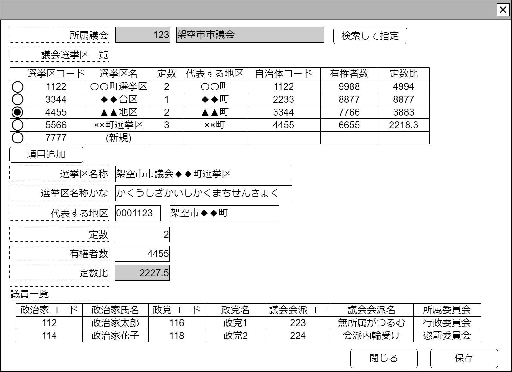

# 選挙区管理【表示画面】設計書

## 状態：仕様未確定(実装不可)

## 1.目的

個別の仕分けに対して監査意見を付記する(収入項目)

## 2. 構成コンポーネント

1. [議会選択コンポーネント](../../common/front/serach_paliament/serach_paliament.md)
2. 独自フィールド
3. [選挙区情報入力コンポーネント](../../common/front/input_election_district/input_election_district.md)

### 2.1 繰り返し項目

なし

## 3. 画面イメージ

### 3.1 画面イメージ

### 3.2 画面イメージ(項番)

## 4. フィールド要素一覧

| 番号 |            論理名            |       タイプ       | 活性／表示 |                                 内容                                 |
| ---- | ---------------------------- | ------------------ | ---------- | -------------------------------------------------------------------- |
| 1    | 議会選択コンポーネント       | コンポーネント     | 表示       | 編集対象となる議会を選択できること                                   |
| 1    | 議会同一識別コード           | インプットテキスト | 非活性     | 編集対象となる選挙区同一識別コードを表示すること。                   |
| 1    | 議会名称                     | インプットテキスト | 非活性活性 | 編集対象となる選挙区名称の入力を受け付けること                       |
| 1    | 議会選挙区入力コンポーネント | コンポーネント     | 表示       | 編集対象となる議会の入力を受け付けるコンポーネントを表示していること |

## 5.アクション一覧

| 番号 |   論理名   | タイプ | 活性／表示 |                      内容                      |
| ---- | ---------- | ------ | ---------- | ---------------------------------------------- |
| 1    | キャンセル | ボタン | 活性       | 押下時：入力内容を破棄すること。               |
| 1    | 保存       | ボタン | 活性       | 押下時：入力内容を保存すること。               |

## 6. 選挙区インターフェイス

選挙区インターフェイスElectionDistrictInterfaceは [選挙区情報入力コンポーネント](../../common/front/input_election_district/input_election_district.md)を参照すること

## 7. 連携

入力内容が変更された都度、入力チェックを行い親画面に変更内容を通知する`emit[sendSampleTemplateInterface(data,errorInfo)]`
