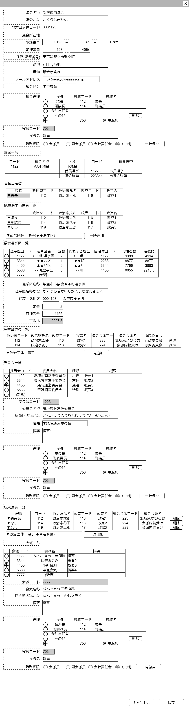

# 議会管理【表示画面】設計書

## 状態：仕様未確定(実装不可)

## 1.目的

議会情報の編集を行う

## 2. 構成コンポーネント

1 [議会検索コンポーネント](./#)
2. 独自フィールド
3. 議会用[組織役職登録コンポーネント](../../common/front/organization_post_input/organization_post_input.md)
4. [議会選挙編集コンポーネント](./#)
5. [議会選挙区編集コンポーネント](../../common/front/input_election_district/input_election_district.md)
6. [議会内委員会編集コンポーネント](../../common/front/input_parliament_comittee/input_parliament_comittee.md)
7. [議会内会派編集コンポーネント](../../common/front/input_parliament_faction/input_parliament_faction.md)

### 2.1 繰り返し項目

なし

## 3. 画面イメージ

### 3.1 画面イメージ

### 3.2 画面イメージ(項番)

## 4. フィールド要素一覧

| 番号 |             論理名             |       タイプ       | 活性／表示 |                                                         内容                                                         |
| ---- | ------------------------------ | ------------------ | ---------- | -------------------------------------------------------------------------------------------------------------------- |
| 1    | 新規確認ボタン                 | チェックボックス   | 活性       | 新規データなのか編集データなのかをの入力を受け付けること                                                             |
| 1    | 議会検索ボタン                 | ボタン             | 活性       | 押下時：議会検索コンポーネントを表示すること                                                                         |
| 1    | 議会同一識別コード             | インプットテキスト | 非活性     | 議会同一識別コードを表示すること                                                                                     |
| 1    | 議会名称                       | インプットテキスト | 活性       | 議会名称の入力を受け付けること                                                                                       |
| 1    | 議会名名称かな                 | インプットテキスト | 活性       | 議会名称かなの入力を受け付けること                                                                                   |
| 1    | 地方自治体コード               | インプットテキスト | 活性       | 地方自治体コードの入力を受け付けること                                                                               |
| 1    | 議会代表電話市外局番           | インプットテキスト | 活性       | 議会代表電話番号市外局番の入力を受け付けること                                                                       |
| 1    | 議会代表電話局番               | インプットテキスト | 活性       | 議会代表電話番号局番の入力を受け付けること                                                                           |
| 1    | 議会代表電話番号               | インプットテキスト | 活性       | 議会代表電話番号番号の入力を受け付けること                                                                           |
| 1    | 議会郵便番号1                  | インプットテキスト | 活性       | 議会代表郵便番号(前)の入力を受け付けること                                                                           |
| 1    | 議会郵便番号2                  | インプットテキスト | 活性       | 議会代表郵便番号(後)の入力を受け付けること                                                                           |
| 1    | 議会住所                       | インプットテキスト | 活性       | 議会住所郵便番号で呼び出されるところまでの入力を受け付けること                                                       |
| 1    | 議会住所番地                   | インプットテキスト | 活性       | 議会住所番地の入力を受け付けること                                                                                   |
| 1    | 議会住所建物                   | インプットテキスト | 活性       | 議会住所建物の入力を受け付けること                                                                                   |
| 1    | メールアドレス                 | インプットテキスト | 活性       | 議会代表メールアドレスの入力を受け付けること                                                                         |
| 1    | 議会区分                       | セレクトボックス   | 活性       | 議会区分の入力を受け付けること。選択肢は議会区分定数の**逆順**であること(最も区分選択の可能性が高いのが市議会だから) |
| 1    | 議会役職入力コンポーネント     | コンポーネント     | 表示       | 役職入力を受け付けるコンポーネントが表示されていること                                                               |
| 1    | 議会選挙編集コンポーネント     | コンポーネント     | 表示       | 選挙情報表示するコンポーネントが表示されていること                                                                   |
| 1    | 議会選挙区編集コンポーネント   | コンポーネント     | 表示       | 議会選挙区入力を受け付けるコンポーネントが表示されていること                                                         |
| 1    | 議会内委員会編集コンポーネント | コンポーネント     | 表示       | 議会内委員会入力を受け付けるコンポーネントが表示されていること                                                       |
| 1    | 議会内会派編集コンポーネント   | コンポーネント     | 表示       | 議会内会派入力を受け付けるコンポーネントが表示されていること                                                         |

### 4.1 議会区分定数

 |       論理名       |  値  |   テキスト   |
 | ------------------ | ---: | ------------ |
 | 衆議院             |    1 | 論理名に同じ |
 | 参議院             |    2 | 論理名に同じ |
 | 県議会             |   11 | 論理名に同じ |
 | 広域自治体議会(区) |   12 | 論理名に同じ |
 | 市議会             |   21 | 論理名に同じ |
 | 町村議会           |   31 | 論理名に同じ |

## 5. アクション一覧

| 番号 |     論理名     |      タイプ      | 活性／表示 |                                            内容                                            |
| ---- | -------------- | ---------------- | ---------- | ------------------------------------------------------------------------------------------ |
| 1    | 新規確認ボタン | チェックボックス | 活性       | `true`に変更時メッセージを出して了解後、現在の入力を破棄してすべてのデータを初期化すること |
| 1    | 議会検索ボタン | ボタン           | 活性       | 押下時：議会検索コンポーネントを表示すること                                               |
| 1    | キャンセル     | ボタン           | 活性       | 押下時：入力内容を破棄すること                                                             |
| 1    | 保存           | ボタン           | 活性       | 押下時：入力内容を保存すること                                                             |

## 6. 議会情報インターフェイス

PaliamentInterface

 |        論理名        |          論理名           |             型              |                    説明(例)                    |
 | -------------------- | ------------------------- | --------------------------- | ---------------------------------------------- |
 | 議会Id               | parliamentId              | Long                        | 議会を識別する一意のId                         |
 | 議会同一識別コード   | parliamentCode            | Integer                     | 変更履歴にかかわらず議会を同一と識別するコード |
 | 議会名称             | parliamentName            | String                      | 議会名称                                       |
 | 議会名称かな         | parliamentNameKana        | String                      | 議会名称かな                                   |
 | 地方自治体コード     | localGovCode              | String                      | 地方自治体コード                               |
 | 議会電話番号市外局番 | parliamentTel1            | String                      | 議会の電話番号市外局番                         |
 | 議会電話番号局番     | parliamentTel2            | String                      | 議会の電話番号局番                             |
 | 議会電話番号番号     | parliamentTel3            | String                      | 議会の電話番号番号                             |
 | 議会郵便番号1        | parliamentPostalcode1     | String                      | 議会郵便番号(前)                               |
 | 議会郵便番号2        | parliamentPostalcode2     | String                      | 議会郵便番号(後)                               |
 | 議会住所             | parliamentAddress         | String                      | 議会住所で郵便番号で読み出せるところ           |
 | 議会住所番地         | parliamentAddressBlock    | String                      | 議会住所で番地に相当する部分                   |
 | 議会住所建物         | parliamentAddressBuilding | String                      | 議会住所で建物                                 |
 | 議会住所建物         | parliamentMail            | String                      | 議会住所で建物                                 |
 | 議会区分             | parliamentKbn             | Integer                     | 議会区分定数                                   |
 | 議会選挙区情報       | electionDitrict           | ElectionDistrictInterface   | 議会選挙区情報情報                             |
 | 議会内委員会情報     | parliamentComittee        | ParliamentComitteeInterface | 議会内委員会情報                               |
 | 議会内会派情報       | parliamentFaction         | ParliamentFactionInterface  | 議会内会派情報                                 |

## 7. 連携

入力内容が変更された都度、入力チェックを行い親画面に変更内容を通知する`emit[sendSampleTemplateInterface(data,errorInfo)]`
