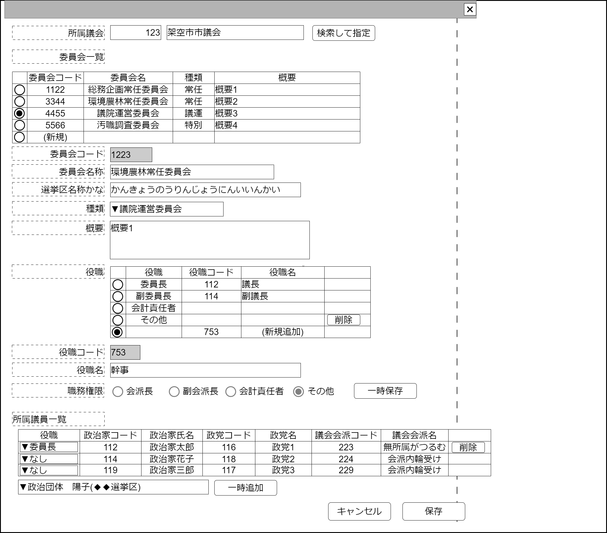

# 議会内委員会管理【表示画面】設計書

## 状態：仕様未確定(実装不可)

## 1.目的

議会に設置される法律に基づいて設置される委員会情報を管理する

## 2. 構成コンポーネント

1. [編集対象議会選択コンポーネント](../#)
2. [登録済委員会一覧テーブルコンポーネント](../#)
3. 独自フィールド
4. [組織役職登録コンポーネント](../../common/front/organization_post_input/organization_post_input.md)
5. [所属議論登録コンポーネント](../../common/front/organization_affiliation_input/organization_affiliation_input.md)

### 2.1 繰り返し項目

なし

## 3. 画面イメージ

### 3.1 画面イメージ

### 3.2 画面イメージ(項番)

## 4. フィールド要素一覧

| 番号 |          論理名           |       タイプ       | 活性／表示 |                         内容                         |
| ---- | ------------------------- | ------------------ | ---------- | ---------------------------------------------------- |
| 1    | 議会選択コンポーネント    | コンポーネント     | 表示       | 編集対象の議会を指定すること                         |
| 1    | 登録済委員会一覧テーブル  | テーブル           | 表示       | 登録済の委員会会派を表示すること                     |
| 1    | 新規委員会登録ボタン      | ボタン             | 活性       | 下記アクションリストを参照                           |
| 1    | 編集_委員会同一識別コード | インプットテキスト | 非活性     | 選択された対象の委員会同一識別コードを表示すること   |
| 1    | 編集_委員会名称           | インプットテキスト | 活性       | 選択された対象の委員会名称の入力を受け付けること     |
| 1    | 編集_委員会名称かな       | インプットテキスト | 活性       | 選択された対象の委員会名称かなの入力を受け付けること |
| 1    | 編集_委員会種別           | セレクトボックス   | 活性       | 選択された対象の委員会区分の入力を受け付けること     |
| 1    | 編集_委員会概要           | テキストエリア     | 活性       | 選択された対象の会派の概要の入力を受け付けること     |
| 1    | 組織役職コンポーネント    | コンポーネント     | 表示       | 編集対象の組織役職を表示・編集を行うこと             |
| 1    | 所属議員コンポーネント    | コンポーネント     | 表示       | 編集対象の所属議員の表示・編集を行うこと             |

## 5. アクション一覧

| 番号 |        論理名        | タイプ | 活性／表示 |                                  内容                                  |
| ---- | -------------------- | ------ | ---------- | ---------------------------------------------------------------------- |
| 1    | キャンセル           | ボタン | 活性       | 押下時：入力内容を破棄すること。                                       |
| 1    | 保存                 | ボタン | 活性       | 押下時：入力内容を保存すること。                                       |
| 1    | 新規委員会登録ボタン | ボタン | 活性       | 登録済委員会一覧テーブルに新しい行を追加し新しい行を選択状態にすること |

## 6. 議員内委員会インターフェイス

ParliamentComittieInterface

 |           論理名           |         論理名         |            型             |                    説明(例)                    |
 | -------------------------- | ---------------------- | ------------------------- | ---------------------------------------------- |
 | 議会内委員会Id             | parliamentComittieId   | Long                      | 委員会を識別する一意のId                       |
 | 議会内委員会同一識別コード | parliamentComittieCode | Long                      | 変更された委員会が同であることを識別するコード |
 | 委員会名称                 | comittieName           | String                    | 委員会名称                                     |
 | 委員会名称かな             | comittieNameKana       | String                    | 委員会名称かな                                 |
 | 委員会区分                 | comittieKbn            | Integer                   | 委員会区分                                     |
 | 委員会摘要                 | comittieExplain        | String                    | 委員会名称摘要                                 |
 | 委員会役職リスト           | 物理名                 | List\<組織役職Interface\> | 委員会に存在する役職リスト                     |
 | 委員会所属議員リスト       | 物理名                 | List\<所属議員Interface\> | 委員会に所属議員リスト                         |

### 6.1 委員会区分

委員会区分は地方自治法：「第百九条　普通地方公共団体の議会は、条例で、常任委員会、議会運営委員会及び特別委員会を置くことができる。」を参照している

|     論理名     |  値  |                 説明                 |
| -------------- | ---: | ------------------------------------ |
| 常任委員会     |    1 | 法律で規定される常任委員会を表す     |
| 議院運営委員会 |    2 | 法律で規定される議院運営委員会を表す |
| 特別委員会     |    3 | 法律で規定される特別委員会を表す     |

## 7. 連携

**TODO** コンポーネントからの変更内容を受信する
