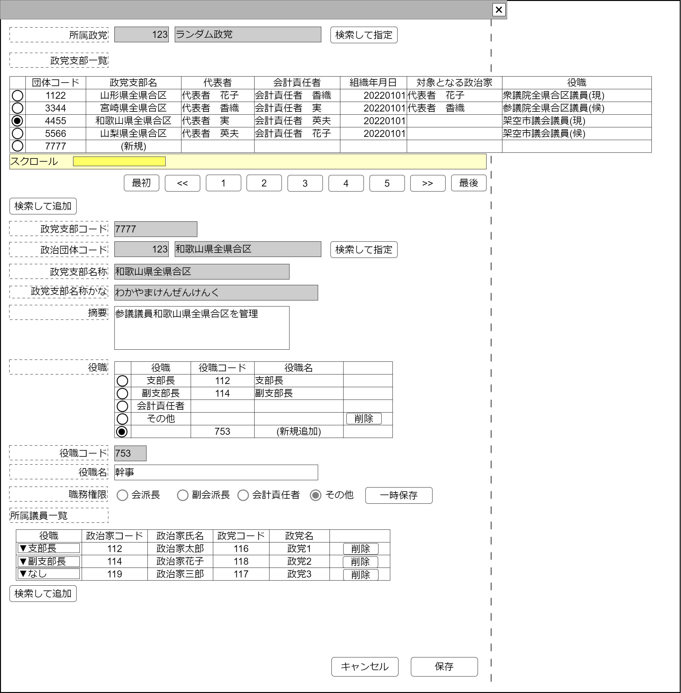

# 政党支部管理【表示画面】設計書

## 状態：仕様未確定(実装不可)

## 1.目的

政党に紐づく支部の登録編集を行う

## 2. 構成コンポーネント

1. [政党検索コンポーネント](../../common/front/search_politic_orgnization/search_politic_orgnization.md)
2. [政党支部検索コンポーネント](./#)
3. 独自フィールド
4. [役職入力コンポーネント](../../common/front/organization_post_input/organization_post_input.md)
5. [所属議員入力コンポーネント](../../common/front/organization_affiliation_input/organization_affiliation_input.md)

### 2.1 繰り返し項目

なし

## 3. 画面イメージ

### 3.1 画面イメージ

### 3.2 画面イメージ(項番)

## 4. フィールド要素一覧

| 番号 |             論理名             |       タイプ       | 活性／表示 |                             内容                             |
| ---- | ------------------------------ | ------------------ | ---------- | ------------------------------------------------------------ |
| 1    | 政党同一識別コード             | ラベル             | 表示       | 政党同一識別コードを表示すること                             |
| 1    | 政党名称                       | ラベル             | 表示       | 政党名称を表示すること                                       |
| 1    | 政党検索ボタン                 | ボタン             | 活性       | 押下時：政党検索コンポーネントを表示すること                 |
| 1    | 政党支部表示テーブル           | テーブル           | 表示       | 政党に紐づく政党支部一覧を表示すること                       |
| 1    | (政党支部を)検索して追加ボタン | ボタン             | 活性       | 押下時：政党支部検索コンポーネントを表示すること             |
| 1    | 編集_政党支部同一識別コード    | インプットテキスト | 非活性     | 編集中の政党支部同一識別コードを表示すること                 |
| 1    | 編集_政治団体同一識別コード    | インプットテキスト | 非活性     | 編集中の政党支部に紐づく政治団体同一識別コードを表示すること |
| 1    | 編集_政治団体名称              | インプットテキスト | 非活性     | 編集中の政党支部に紐づく政治団体名称を表示すること           |
| 1    | 政治団体検索ボタン             | ボタン             | 活性       | 押下時：政治団体検索コンポーネントを表示すること             |
| 1    | 編集_政治団体名称              | インプットテキスト | 非活性     | 編集中の政党支部名称を表示すること                           |
| 1    | 編集_政治団体名称かな          | インプットテキスト | 非活性     | 編集中の政党支部名称かなを表示すること                       |
| 1    | 編集_政党支部摘要              | テキストエリア     | 活性       | 政党支部摘要の入力を受け付けること                           |
| 1    | 組織役職入力コンポーネント     | コンポーネント     | 表示       | 組織役職入力コンポーネントを表示すること                     |
| 1    | 所属議員入力コンポーネント     | コンポーネント     | 表示       | 所属議員入力コンポーネントを表示すること                     |

### 4.1 政党支部表示テーブル フィールド要素一覧

| 番号 |         論理名         |    タイプ    | 活性／表示 |                                                 内容                                                  |
| ---- | ---------------------- | ------------ | ---------- | ----------------------------------------------------------------------------------------------------- |
| 1    | 行選択ラジオボタン     | ラジオボタン | 活性       | 押下時：この行のデータが選択状態であることの入力を受け付けること                                      |
| 1    | 政党支部同一識別コード | ラベル       | 表示       | 政党支部同一識別コードを表示すること                                                                  |
| 1    | 政党支部名称           | ラベル       | 表示       | 政党支部名称を表示すること                                                                            |
| 1    | 代表者                 | ラベル       | 表示       | 政党支部に紐づく政治団体の代表者を表示すること                                                        |
| 1    | 会計責任者             | ラベル       | 表示       | 政党支部に紐づく政治団体の会計責任者を表示すること                                                    |
| 1    | 組織創立日             | ラベル       | 表示       | 政党支部に紐づく政治団体の創立日を表示すること                                                        |
| 1    | 対象となる政治家       | ラベル       | 表示       | 政党支部に紐づく政治団体の支援対象の政治家を表示すること                                              |
| 1    | 政治家の役職           | ラベル       | 表示       | 政党支部に紐づく政治団体の支援対象の`政治家の立候補選挙区+"("+政治家の現職・候補の別+")"`表示すること |

## 5. アクション一覧

| 番号 |             論理名             | タイプ | 活性／表示 |                       内容                       |
| ---- | ------------------------------ | ------ | ---------- | ------------------------------------------------ |
| 1    | 政党検索ボタン                 | ボタン | 活性       | 押下時：政党検索コンポーネントを表示すること     |
| 1    | (政党支部を)検索して追加ボタン | ボタン | 活性       | 押下時：政党支部検索コンポーネントを表示すること |
| 1    | 政治団体検索ボタン             | ボタン | 活性       | 押下時：政治団体検索コンポーネントを表示すること |
| 1    | キャンセル                     | ボタン | 活性       | 押下時：入力内容を破棄すること                   |
| 1    | 保存                           | ボタン | 活性       | 押下時：入力内容を保存すること                   |

## 6. 政党支部インターフェイス

PoliticalPartySubdivisionInterface

|         論理名         |             論理名              |   型    |                     説明(例)                     |
| ---------------------- | ------------------------------- | ------- | ------------------------------------------------ |
| 政党支部Id             | poriticalPartySubdivisionId     | Long    | 政党支部を識別する一意のId                       |
| 政党支部同一識別コード | poriticalPartySubdivisionCode   | Integer | 変更履歴にかかわらず政党支部を同一識別するコード |
| 政党支部名称           | poriticalPartySubdivisionName   | Sring   | 政党支部名称。政治団体名称と同一であること       |
| 政党Id                 | poriticalPartyId                | Long    | 政党支部を識別する一意のId                       |
| 政党同一識別コード     | poriticalPartyCode              | Integer | 変更履歴にかかわらず政党支部を同一識別するコード |
| 政党名称               | poriticalPartyName              | Sring   | 政党支部名称                                     |
| 政治団体Id             | poriticalOrganizationId         | Long    | 政党支部を識別する一意のId                       |
| 政治団体同一識別コード | poriticalOrganizationCode       | Integer | 変更履歴にかかわらず政党支部を同一識別するコード |
| 政治団体名称           | poriticalOrganizationName       | Sring   | 政党支部名称                                     |
| 政党支部摘要           | poriticalPartySubdivisionDigest | Sring   | 政党支部の摘要                                   |

## 7. 連携

TODO 子画面とのデータ連携記載
